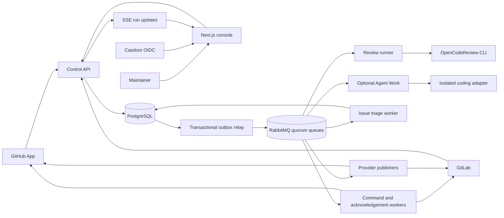

# Open Review Platform

Open Review Platform is a self-hostable control plane for AI-assisted code review on GitHub and GitLab. It turns pull requests, merge requests, and Issues into durable, auditable workflows: verify the event, select an immutable policy and revision, run analysis asynchronously, publish evidence at the relevant code lines, and report a merge-check result.

The review engine is the pinned [OpenCodeReview](https://github.com/alibaba/open-code-review) CLI. This repository supplies the surrounding product and operational layer—identity, tenant and repository boundaries, queues, policy governance, provider integration, a web console, and optional Agent Work. GitHub Actions is not required to run a review.

> **Project status:** Active development. Source-level tests and selected live GitHub/GitLab flows have been exercised, but this is not a blanket production-readiness claim. See the [core-flow acceptance matrix](docs/iter-01/24-core-flow-completion-matrix.md) for verified paths and remaining deployment evidence.

## Capabilities

| Area | What Open Review provides |
| --- | --- |
| PR and MR review | GitHub App and GitLab webhook/command admission, revision-pinned review jobs, focused file selection, inline findings, concise evidence reports, and provider checks or commit statuses. |
| Issue analysis | Analysis of user-authored Issues, configurable templates and response sections, repository-specific language, stable progress/result comments, and reaction feedback. |
| Review policy | Workspace defaults with repository overrides, versioned rules and bindings, immutable admission snapshots, dry-run/Test Lab evaluation, approvals, and time-bounded exceptions. |
| Merge decisions | A configurable severity threshold publishes a pass/fail review check. Actual blocking depends on GitHub branch protection or GitLab's required-pipeline settings. |
| Agent Work | Experimental, opt-in Issue-to-Draft-PR/MR workflow with classification, plan approval, bounded CLI execution, patch checks, and human review. It never auto-merges; live provider and deployment acceptance must be verified separately. |
| Operations | Multi-workspace console, run history and SSE status, audit trail, API/CLI keys, usage controls, and repository-routed DingTalk, Feishu, or HTTPS notifications. |

The console currently has English and Simplified Chinese interface text for its main review surfaces. PR review output can be configured per workspace or repository in English, Simplified Chinese, Japanese, or Spanish; the selected language is frozen with each admitted run. Issue reply language is configured separately. Secondary console pages are still being localized.

## Architecture



PostgreSQL is the authoritative store for tenants, installations, policies, jobs, findings, receipts, and audit events. The transactional outbox and consumer inbox make broker delivery retryable without treating RabbitMQ as the source of truth. In a full deployment, workers are separate processes so review execution, provider writes, notifications, and optional coding tasks can use different credentials and scale independently.

A normal review follows this sequence:

1. Verify the provider webhook or authenticated command, deduplicate it, and persist the event.
2. Check the installation, repository scope, revision, policy, and usage limits; freeze the effective configuration.
3. Execute OpenCodeReview against an isolated checkout at the admitted base and head commits.
4. Normalize findings and publish a summary, line comments, and the review check for that exact revision.
5. Keep the run, stage events, publication receipts, and failure/retry history available in the console.

A newer commit cannot inherit an older review verdict. Failed publication can resume from persisted evidence without necessarily running the model again. For the service boundaries and message contracts, see the [architecture](docs/iter-01/02-system-architecture.md) and [workflow](docs/iter-01/03-workflows-and-messaging.md) documents.

## Security boundaries

- The browser never receives GitHub App private keys, GitLab OAuth tokens, or provider write credentials. Provider-facing workers resolve short-lived or encrypted credentials when needed.
- Casdoor OIDC protects production console access; local development authentication is restricted to development mode.
- Repository content, Issue text, and PR comments are untrusted inputs. Policy, rule snapshots, model routes, and Agent permissions come from the control plane.
- Agent Work requires explicit repository policy and human approval. The coding adapter may create a Draft PR/MR but has no merge authority.
- A failing Open Review check blocks merging only when the corresponding check is required by the provider's branch or pipeline protection rules.

Read the [deployment and security guide](docs/deployment.md) and [provider integration contract](docs/providers.md) before connecting a real organization.

## Quick start

For a local UI/API development footprint, install Docker with Compose, copy the environment template, review its required values, then start the targeted stack:

```bash
cp .env.example .env
./scripts/local-stack.sh ui --build
```

This starts PostgreSQL, migrations, the Control API, and a hot-reload console. **It does not process live PR/Issue reviews.** For OAuth setup, real review workers, GitHub App key mounts, self-managed GitLab, or the smaller development-only compact bundle, use the [local development guide](docs/local-development.md). Production deployments should use the split-worker [deployment guide](docs/deployment.md), not the compact bundle.

For source-level checks:

```bash
go test ./...
corepack pnpm --dir apps/web run lint
corepack pnpm --dir apps/web run build
```

The Go module targets Go 1.25; the web app requires Node.js 22 or later. The runner image pins `@alibaba-group/open-code-review@1.12.5`. If running workers directly instead of using Docker, install the matching CLI and follow the [developer commands](docs/local-development.md#local-development).

## Repository layout

| Path | Purpose |
| --- | --- |
| `apps/web/` | Next.js console and browser-facing authentication/setup flows. |
| `cmd/` | Control API, CLI, migrations, and independently deployed workers. |
| `internal/` | Domain logic, review runner, provider adapters, persistence, policy, and Agent services. |
| `migrations/` | Versioned PostgreSQL schema. |
| `docs/` | Deployment, provider contracts, architecture, design, and acceptance evidence. |
| `scripts/` | Local stack and verification helpers. |

## Documentation

- [Local development and CLI](docs/local-development.md)
- [Deployment and security](docs/deployment.md)
- [Provider integration](docs/providers.md)
- [Cloudflare public ingress](docs/cloudflare.md)
- [Architecture and product design](docs/iter-01/README.md)
- [Current acceptance and known gaps](docs/iter-01/24-core-flow-completion-matrix.md)
- [Agent Work governance and acceptance boundary](docs/iter-01/26-agentic-issue-to-pr-governance.md)

## Contributing

Issues and pull requests are welcome. Please describe the observed behavior or proposed capability, the affected provider and deployment mode, and how to reproduce or verify it. Keep changes scoped, include tests for behavior changes, and do not commit credentials or real customer data. Changes to review policy, the runner, or provider publication should explain their effect on immutable revisions, retries, and merge checks.

## License

Open Review Platform is licensed under the [Apache License 2.0](LICENSE). OpenCodeReview is a separate upstream dependency; consult its repository for its own license and usage terms.
