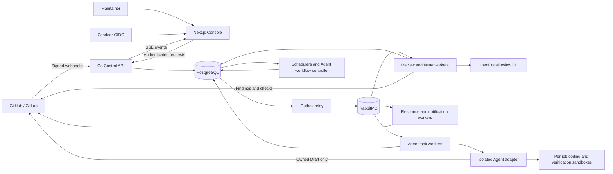
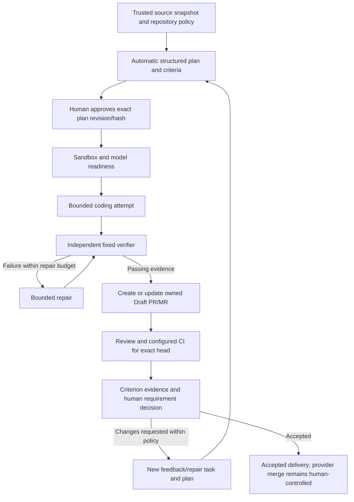

# Open Review Platform

**English** | [简体中文](README_CN.md)

Open Review Platform is an open-source, self-hostable control plane for AI-assisted code review and governed coding agents on GitHub and GitLab. It connects repository events, versioned rules, asynchronous execution, provider checks, and human acceptance in one auditable workflow.

Use it to review PRs/MRs, analyze Issues, manage your team's review policy, and optionally turn approved requirements into a verified Draft PR/MR. Private deployments can run the core workflows without a purchase or payment flow; you supply the infrastructure, identity service, and model access.

The review engine is the pinned [OpenCodeReview](https://github.com/alibaba/open-code-review) CLI. This repository adds the Console, authorization, repository integrations, policy governance, durable workers, and Agent Work. Reviews run in your own workers without requiring GitHub Actions.

> **Status:** Active development. Selected real-provider flows and source/database regressions have evidence. Final human acceptance, some failure-recovery scenarios, and deployment-specific checks remain open. See [validation status](#validation-status) before treating a deployment as production-ready.

## Capabilities

| Area | Current functionality |
| --- | --- |
| PR/MR review | Verified webhook and command admission, exact base/head snapshots, focused file selection, inline findings, evidence summaries, and GitHub checks or GitLab commit statuses. |
| Issue analysis | Configurable analysis templates, separate output language, progress/result comments, revision-aware retries, and reaction feedback. |
| Rule governance | Workspace defaults and repository overrides, immutable rule versions and bindings, approval queues, Test Lab/impact preview, time-bounded exceptions, and Shadow/Canary rollout controls. |
| Merge gates | Severity-based pass/fail results for the reviewed commit. Enforcing a merge block requires the corresponding provider branch or pipeline protection. |
| Agent Work | Opt-in source admission, automatic structured planning, exact-plan approval, bounded coding, independent verification, repair, Draft delivery, rereview, and criterion-based human acceptance. |
| Operations | Workspace roles, SSE progress, audit events, API/CLI keys, model/provider probes, usage limits, retention jobs, and repository-routed DingTalk, Feishu, or HTTPS notifications. |
| Languages | English and Simplified Chinese for the main review and core workflow interfaces; separately configured review/Issue output languages. |

## Architecture



| Boundary | Processes and responsibilities |
| --- | --- |
| Console and identity | `apps/web`: Next.js App Router UI, server-side provider setup, Casdoor sign-in, and authenticated Control API requests. |
| Control plane | `control-api`: tenant/repository authorization, webhook verification, configuration, admission, history, and evidence APIs. `migrate` applies versioned schema changes. |
| Durable transport | `outbox-relay` publishes committed events to RabbitMQ; consumers claim/deduplicate work using PostgreSQL state. |
| Repository workflows | `interaction-responder`, `interaction-admitter`, `acknowledger`, `runner`, `issue-triager`, `issue-publisher`, and `terminal-reporter` handle admission, analysis, acknowledgements, and publication. |
| Agent execution | `agent-task-source-admitter` resolves trusted source snapshots; `agent-task-runner` dispatches approved attempts. The separate `agent-task-adapter` owns sandbox execution and restricted Draft publication. |
| Reconciliation and operations | Schedulers, rule exception/rollout workers, provider feedback polling, model/provider/SSO probes, data-governance jobs, notifications, and observability. |

**PostgreSQL is authoritative.** Policies, source revisions, plans, attempts, findings, receipts, and audit records live there. RabbitMQ carries retryable work; transactional outbox, consumer claims, and idempotent publication markers handle duplicate delivery. This is at-least-once messaging with guarded effects, not a promise of exactly-once remote API execution.

Full deployments use separate worker processes and credentials. The development compact bundle combines essential review workers into one container and shares their failure domain; optional Agent coding and other workers must be deployed separately.

### Review and Issue lifecycle

1. Verify and deduplicate the webhook or authenticated command, then persist it.
2. Resolve installation, workspace membership, repository scope, usage limits, and the exact source revision.
3. Freeze the effective rules, model route, output language, and base/head commits.
4. Analyze the isolated checkout or Issue snapshot and persist findings/stage evidence.
5. Publish the relevant comments and, for PR/MR review, the check for that exact head; retain publication and retry receipts.

Source edits supersede obsolete work. A newer commit cannot inherit an old review verdict. Eligible publication failures can resume from persisted evidence without repeating model analysis. Notifications retry independently of the review result.

### Rules lifecycle

Create a rule draft → test/preview its exact version → request approval → publish → bind it to workspace/repository scope → observe rollout and feedback → revise, roll back, or request an expiring exception.

Admission captures the effective policy and its hashes. Publishing a new rule does not silently rewrite an existing run. Test Lab and impact preview evaluate the selected candidate version; rollout controls have their own deployment acceptance requirements.

### Agent lifecycle



- Plans freeze objective, scope, verification, risks, unknowns, and acceptance criteria. The current automatic planner is deterministic; classification backends do not grant execution authority.
- Repository policy freezes executor, allowed scope, time/attempt limits, and workflow repair limits. Feedback descendants share the original family's bounded execution budget.
- Verification comes from a deployment-owned fixed verifier, with signed evidence matching the approved criteria. A model's statement that tests passed is insufficient; repository-specific verifier profiles need separate configuration and acceptance.
- New heads require new review/CI evidence. Configured workflow monitoring can propose bounded repair tasks; it does not make every repository's CI automatic.
- A checkpointed feedback delivery whose immediate Draft confirmation failed can undergo bounded, read-only exact-head recovery without recoding, repushing, or resetting attempts.
- Readiness failures hold the queued task before consuming a coding attempt. Authorization failures and uncertain model transport failures stop execution; explicit transient HTTP failures have bounded retries.
- Missing evidence, exhausted budgets, source changes, lost leases, or revoked approval stop advancement. Delivery and final requirement acceptance are separate states. Open Review never auto-merges.

Authors cannot approve their own rule requests or Agent plans by default. A workspace Owner can explicitly enable each self-approval option for a private single-maintainer deployment. Role checks, exact revisions, approval thresholds, duplicate-vote guards, and audit records still apply; disabling the option takes effect for pending approvals.

## Security and deployment boundaries

- Production Console access uses Casdoor OIDC and workspace membership. Development authentication is allowed only in development mode.
- Provider and model credentials remain in server/worker boundaries. The browser and coding child do not receive upstream model keys or provider write tokens.
- Repository text, Issues, and comments are untrusted data. Rules, model routes, allowed paths, verifier profiles, and execution authority come from the control plane/deployment.
- Agent coding uses a per-job sandbox with bounded resources and network access. The adapter has no PostgreSQL/RabbitMQ connection; the coding child has no Docker socket or host workspace mount. The adapter's own Docker access belongs on a dedicated execution host.
- Lease, revision, ownership-marker, branch, and head checks fence stale work. Provider writes and database transactions are not atomic; cancellation or a successful local receipt alone does not prove provider cleanup.
- The deployment owns TLS, backups, secret rotation, provider protection, and required worker availability. Cloudflare Tunnel is an optional ingress choice.

Follow [deployment and security](docs/deployment.md) and [provider integration](docs/providers.md) before connecting a real organization.

## Getting started

### Local Console/API

Install Git and Docker with Compose, then:

```bash
git clone https://github.com/RainLib/open-review-platform.git
cd open-review-platform
cp .env.example .env
# Review and configure .env before starting the stack.
./scripts/local-stack.sh ui --build
```

Open [http://localhost:3110](http://localhost:3110). This starts PostgreSQL, one-shot migrations, the API, and a hot-reload Console. **The `ui` mode does not start review workers.** Local development authentication must stay local.

### Provider-connected evaluation

Configure Casdoor, the GitHub App or GitLab connection, webhook secrets, and model routes first. Mount the GitHub App key as described in the development guide. Select a footprint explicitly:

```bash
# Provider connection verification, without review consumers.
./scripts/local-stack.sh setup --github-app --build
# PR/Issue review workers, after provider/model configuration.
./scripts/local-stack.sh review --github-app --build
```

Omit `--github-app` for GitLab-only evaluation. `auth` starts a production-shaped Console for OAuth checks; `compact` is a development-only review bundle. Switching modes can leave optional workers running; use the documented service checks before pausing them. Agent Work additionally needs its adapter, sandbox image, credentials/model broker, and fixed verifier configuration.

For production, use the complete split-worker deployment, apply migrations before rolling out dependent binaries, and verify provider callbacks and protected branches. See [local development](docs/local-development.md), [deployment](docs/deployment.md), and optional [Cloudflare ingress](docs/cloudflare.md).

### Source development and checks

Go **1.25+**, Node.js **22+**, and pnpm **8.14.3** are the source-development baseline. PostgreSQL **16+** and RabbitMQ are needed for connected workers. The review runner pins `@alibaba-group/open-code-review@1.12.5`; Docker builds install their matching runtime dependencies.

```bash
go test ./...
corepack pnpm --dir apps/web install --frozen-lockfile
corepack pnpm --dir apps/web run test:workflow
corepack pnpm --dir apps/web run i18n:check
corepack pnpm --dir apps/web run typecheck
corepack pnpm --dir apps/web run lint
corepack pnpm --dir apps/web run build
```

Database tests skip when `OPEN_REVIEW_TEST_DATABASE_URL` is unset. Isolation-sensitive tests additionally require `OPEN_REVIEW_TEST_ISOLATED_DATABASE=true` on a disposable PostgreSQL server; they create and remove test databases. Never point those tests at a business database. Direct worker commands and CLI examples are in the [development guide](docs/local-development.md#local-development).

## Internationalization

The Console uses `en` and `zh-CN`, selected in the header and retained across refreshes. Core Agent, approval, rule governance, Test Lab, and Issue surfaces use a shared interface catalog. Interface changes preserve source text, commands, hashes, signed receipts, approved plans, and user-authored evidence.

PR review output supports English, Simplified Chinese, Japanese, and Spanish through workspace/repository configuration, frozen per run. Issue reply language is separate. Other secondary settings and arbitrary backend errors are still being localized; this is not complete site-wide coverage. See the [i18n validation record](docs/iter-01/32-console-workflow-i18n-validation.md).

## Validation status

Evidence is separated into source tests, isolated database checks, runtime availability, provider behavior, and human acceptance. Historical receipts are snapshots, not a claim about every current deployment.

| Evidence | Current boundary |
| --- | --- |
| Review/Issue workflows | Live GitHub and disposable GitLab evidence is recorded in the [core-flow matrix](docs/iter-01/24-core-flow-completion-matrix.md); validate your own topology and permissions. |
| Agent delivery and feedback | A real GitHub round exercised planning/approval, verification failure → repair → pass, Draft delivery, human changes requested, feedback delivery, exact-head rereview, and read-only publication recovery. |
| Final Agent acceptance | The latest documented Draft remains open and `awaiting_acceptance`; the final human decision and merge have not occurred. |
| Core UI i18n | Static checks, 35 workflow tests, TypeScript, scoped lint, build, and initial live English/Chinese checks passed. The unsaved-input fix's deployed browser recheck and remaining page traversal await a renewed login. |
| Further live acceptance | CI-diagnostic-driven Agent repair, automatic CI on Agent branches, complete Shadow/Canary/rollback, historical DLQ recovery, strict main-branch merge enforcement, and alternate/offline topologies still need dedicated evidence. |

Latest details: [private-deployment acceptance](docs/iter-01/30-private-deployment-live-acceptance.md), [Agent feedback/revalidation](docs/iter-01/31-agent-feedback-revalidation-request.md), and [i18n validation](docs/iter-01/32-console-workflow-i18n-validation.md). A healthy container, HTTP 200, successful push, or fixture pass alone does not complete business acceptance.

## Repository and documentation

| Path | Purpose |
| --- | --- |
| `apps/web/` | Next.js Console, authentication, setup routes, interface catalog, and UI workflow tests. |
| `cmd/` | Control API, CLI, migrator, and worker entry points. |
| `internal/` | Domain logic, provider integrations, storage, rules, review execution, and Agent services. |
| `migrations/` | Versioned PostgreSQL schema. |
| `deploy/` | Deployment examples and observability configuration. |
| `docs/` | Architecture/design, operator guides, contracts, and dated acceptance records. |
| `scripts/` | Local stack and verification helpers. |

- [Local development and CLI](docs/local-development.md)
- [Deployment and security](docs/deployment.md)
- [Provider contracts](docs/providers.md)
- [Architecture](docs/iter-01/02-system-architecture.md) and [workflows/message contracts](docs/iter-01/03-workflows-and-messaging.md)
- [Agent governance and implementation boundaries](docs/iter-01/26-agentic-issue-to-pr-governance.md)
- [Recovery runbooks](docs/runbooks/README.md) and [design index](docs/iter-01/README.md)

Design documents include roadmap material; use current source and dated acceptance records to distinguish implemented behavior from proposals.

## Contributing

Issues and pull requests are welcome. Include the problem, affected provider/deployment mode, reproduction steps, and expected result. Keep changes scoped and add meaningful behavioral tests. For policy, worker, and provider changes, explain revision binding, authorization, retry/idempotency behavior, failure recovery, and validation limits. English/Chinese documentation and interface improvements are welcome; keep translation placeholders aligned and governed source evidence unchanged.

Do not commit credentials or customer data. For a suspected security issue, avoid posting exploit details or credentials in a public Issue; contact the maintainers privately.

## License

Open Review Platform is licensed under the [Apache License 2.0](LICENSE). OpenCodeReview and the optional coding CLIs are separate dependencies; consult their own licenses and service terms.
