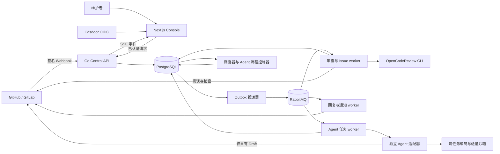
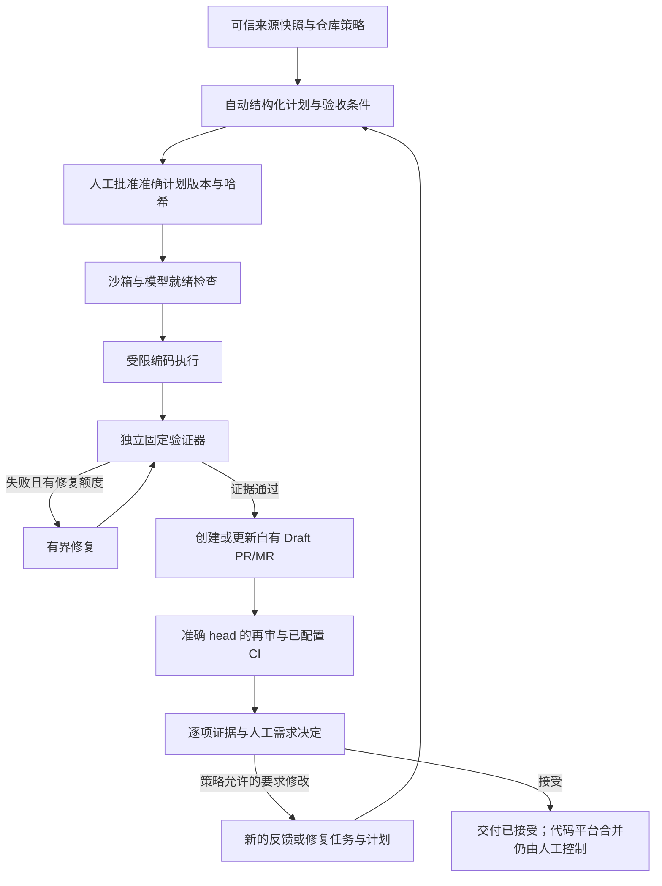

# Open Review Platform

[English](README.md) | **简体中文**

Open Review Platform 是一个开源、可私有化部署的 AI 代码审查与受控编码 Agent 控制平台，支持 GitHub 和 GitLab。它把仓库事件、版本化规则、异步执行、代码平台检查和人工需求验收连接为可审计的流程。

你可以用它审查 PR/MR、分析 Issue、治理团队审查规则，也可以启用 Agent Work，将批准的需求转换为经过验证的 Draft PR/MR。私有部署的核心流程不需要购买或支付流程；基础设施、身份服务和模型访问由部署方提供。

审查引擎使用固定版本的 [OpenCodeReview](https://github.com/alibaba/open-code-review) CLI。本仓库提供 Console、授权、仓库集成、规则治理、持久化任务及 Agent Work。审查运行在自有 worker 中，无需依赖 GitHub Actions。

> **项目状态：** 持续开发中。部分真实代码平台流程、源码回归和隔离数据库检查已有证据；最终人工验收、部分故障恢复场景和部署相关检查仍待完成。上线前请查看下方“验证状态”。

## 核心能力

| 范围 | 当前功能 |
| --- | --- |
| PR/MR 审查 | Webhook 与命令验签准入、准确 base/head 快照、文件筛选、行级发现、证据摘要，以及 GitHub Check 或 GitLab Commit Status。 |
| Issue 分析 | 可配置分析模板、独立输出语言、进度与结果评论、绑定来源版本的重试和表情反馈。 |
| 规则治理 | 工作区默认值与仓库覆盖、不可变规则版本和绑定、审批队列、测试实验室与影响预览、限时例外，以及 Shadow/Canary 灰度控件。 |
| 合并门禁 | 对准确审查提交发布基于严重性的通过/失败结果。真正阻止合并需要代码平台配置对应的分支或流水线保护。 |
| Agent Work | 显式启用的来源准入、自动结构化计划、准确计划审批、受限编码、独立验证、修复、Draft 交付、再审和逐项人工需求验收。 |
| 多仓库批量任务 | 管理员批量检查、字面替换和文档更新；冻结仓库范围、批量准确计划审批、并发控制、逐仓库验收及 Markdown/CSV/JSON 报表。 |
| 运维 | 工作区角色、SSE 进度、审计记录、API/CLI 密钥、模型与代码平台探测、用量限额、保留期任务，以及按仓库路由的钉钉、飞书或 HTTPS 通知。 |
| 语言 | 主要审查与核心流程界面支持英文、简体中文；审查和 Issue 输出语言分别配置。 |

## 整体架构



| 边界 | 进程与职责 |
| --- | --- |
| Console 与身份 | `apps/web`：Next.js App Router 界面、服务端代码平台接入、Casdoor 登录和已认证的 Control API 请求。 |
| 控制面 | `control-api`：租户与仓库授权、Webhook 验签、配置、准入、历史及证据 API；`migrate` 应用版本化数据库迁移。 |
| 持久化消息 | `outbox-relay` 将已提交事件投递到 RabbitMQ；消费者通过 PostgreSQL 状态领取任务并去重。 |
| 仓库流程 | `interaction-responder`、`interaction-admitter`、`acknowledger`、`runner`、`issue-triager`、`issue-publisher` 和 `terminal-reporter` 负责准入、分析、确认与发布。 |
| Agent 执行 | `agent-task-source-admitter` 获取可信来源快照；`agent-task-runner` 派发已批准执行；独立的 `agent-task-adapter` 负责沙箱执行与受限 Draft 发布。 |
| 协调与运维 | 调度器、规则例外与灰度 worker、代码平台反馈轮询、模型/平台/SSO 探测、数据治理任务、通知和可观测性。 |

**PostgreSQL 是权威数据源。** 策略、来源版本、计划、执行次数、发现、回执和审计都保存在数据库中。RabbitMQ 传递可重试任务；事务 Outbox、消费领取和幂等发布标记处理重复消息。这是至少一次投递与受保护的副作用，不能理解为远端 API 严格只执行一次。

完整部署采用独立 worker 进程与凭据。开发用 compact 模式将基本审查 worker 合并到一个容器，共享故障范围；可选 Agent 编码等其他 worker 仍需单独部署。

### 审查与 Issue 流程

1. 验证并去重 Webhook 或已认证命令，持久化事件。
2. 确认安装授权、工作区成员、仓库范围、用量限额和准确来源版本。
3. 冻结有效规则、模型路由、输出语言以及 base/head 提交。
4. 分析隔离 checkout 或 Issue 快照，保存发现和阶段证据。
5. 发布对应评论；PR/MR 还发布绑定准确 head 的检查，保留发布与重试回执。

来源更新会替代过时任务；新提交不能沿用旧提交的审查结论。符合条件的发布失败可根据持久化证据恢复，无需重新调用模型。通知失败独立重试，不改变审查结果。

### 规则流程

创建草稿 → 测试/预览准确版本 → 请求审批 → 发布 → 绑定工作区或仓库 → 观察灰度与反馈 → 修订、回滚或申请限时例外。

准入保存生效策略及其哈希。发布新规则不会悄悄改写既有运行；测试实验室和影响预览评估选定的候选版本。灰度控件仍需对应部署的实际验收。

### Agent 流程



- 计划冻结目标、范围、验证方式、风险、未知项和验收条件。当前自动计划器是确定性实现；分类后端不授予执行权限。
- 仓库策略冻结执行器、允许范围、时长/执行次数和流程修复上限。反馈子任务共享原任务家族的有限执行预算。
- 验证来自部署方维护的固定验证器，签名证据需匹配批准条件。模型自称测试通过不足以作为验收证据；各仓库的验证配置需单独设置和验收。
- 新 head 必须有新审查与 CI 证据。已配置的流程监控可以提出有界修复任务，但不会让任意仓库自动获得 CI。
- 有可信 checkpoint 的反馈交付若即时 Draft 确认失败，可以有界、只读核对准确 head，无需重编码、重推送或重置执行次数。
- 就绪检查失败在消耗编码次数前阻断排队任务。授权失败和结果不确定的模型传输失败会停止执行；明确的临时 HTTP 失败仅进行有限重试。
- 证据缺失、预算耗尽、来源变化、租约丢失或审批撤销都会停止推进。代码交付与最终需求接受是不同状态；Open Review 不自动合并。

默认禁止作者自己审批规则请求或 Agent 计划。单人维护的私有部署中，工作区 Owner 可以分别显式启用这两个自审批选项。角色校验、准确版本、审批人数门槛、重复投票限制和审计仍然生效；关闭后对待审批请求立即生效。

### 多仓库批量任务

在 Console 的“多仓库批量任务”中选择仓库，或选择某个已同步完整目录中全部授权仓库。创建时冻结需求、验收条目、仓库策略和范围。只读检查不需要编码审批；修改会为各仓库生成独立计划，只有管理员批准准确版本和摘要后才开始执行。

字面替换会核对原内容摘要和命中数量，仅应用批准的替换结果。文档更新复用隔离编码 Agent。两者均经过固定验证器、受限修复、草稿交付、准确提交的再审和独立检查，最后由人工进行需求验收。暂停阻止新的执行租约，取消撤销剩余任务；失败重试保留原尝试预算，并要求重新审批计划。

报表分别列出各仓库结果。目录不完整、文件不可读、被排除的文件、检查缺失和预算耗尽都会显式保留。草稿交付不会直接关闭修改任务。可导出带时间的 Markdown、CSV 或 JSON，查看来源提交、命中数量、任务及草稿链接和验收状态。配置、API 和证据边界见[批量任务操作指南](docs/iter-01/34-agent-campaigns.md)。

## 安全与部署边界

- 生产 Console 使用 Casdoor OIDC 和工作区成员授权；开发认证仅允许在开发模式使用。
- 代码平台与模型凭据保留在服务端/worker 边界；浏览器和编码子进程不获取上游模型密钥或代码平台写令牌。
- 仓库内容、Issue 和评论是不可信数据；规则、模型路由、允许路径、验证配置和执行权限由控制面与部署配置决定。
- Agent 编码使用每任务独立沙箱，限制资源与网络。适配器不连接 PostgreSQL/RabbitMQ；编码子进程不挂载 Docker socket 或宿主工作区。适配器本身所需的 Docker 权限应放在专用执行宿主上。
- 租约、版本、归属标记、分支与 head 校验阻止旧任务继续推进。代码平台写入与数据库事务不是原子操作；本地取消或成功回执本身不能证明远端清理完成。
- TLS、备份、密钥轮换、代码平台保护和必要 worker 可用性由部署方负责。Cloudflare Tunnel 是可选入口方案。

连接真实组织前，请阅读[部署与安全](docs/deployment.md)和[代码平台集成](docs/providers.md)。

## 快速开始

### 本地 Console/API

安装 Git、Docker 和 Compose，然后运行：

```bash
git clone https://github.com/RainLib/open-review-platform.git
cd open-review-platform
cp .env.example .env
# 启动前检查并配置 .env。
./scripts/local-stack.sh ui --build
```

打开 [http://localhost:3110](http://localhost:3110)。此模式启动 PostgreSQL、一次性迁移、API 和支持热更新的 Console。**`ui` 模式不启动审查 worker。** 本地开发认证不得暴露到公网。

### 连接代码平台进行验证

先配置 Casdoor、GitHub App 或 GitLab 连接、Webhook 密钥和模型路由，按照开发指南挂载 GitHub App 私钥，再明确选择运行模式：

```bash
# 验证代码平台连接，不启动审查消费者。
./scripts/local-stack.sh setup --github-app --build
# 配置代码平台和模型后，启动 PR/Issue 审查 worker。
./scripts/local-stack.sh review --github-app --build
```

仅使用 GitLab 时省略 `--github-app`。`auth` 用于生产形态 Console 的 OAuth 检查；`compact` 是仅供开发的审查组合模式。切换模式可能保留既有可选 worker，暂停前应按文档检查运行任务。Agent Work 还需要适配器、沙箱镜像、凭据/模型 broker 和固定验证器配置。

生产环境使用完整的分离 worker 部署，在依赖新 schema 的程序上线前应用迁移，并验证代码平台回调和受保护分支。参见[本地开发](docs/local-development.md)、[部署](docs/deployment.md)及可选的 [Cloudflare 入口](docs/cloudflare.md)。

### 源码开发与检查

源码开发基线为 Go **1.25+**、Node.js **22+** 和 pnpm **8.14.3**。连接 worker 还需要 PostgreSQL **16+** 和 RabbitMQ。审查 runner 固定使用 `@alibaba-group/open-code-review@1.12.5`；Docker 构建会安装匹配的运行依赖。

```bash
go test ./...
corepack pnpm --dir apps/web install --frozen-lockfile
corepack pnpm --dir apps/web run test:workflow
corepack pnpm --dir apps/web run i18n:check
corepack pnpm --dir apps/web run typecheck
corepack pnpm --dir apps/web run lint
corepack pnpm --dir apps/web run build
```

未设置 `OPEN_REVIEW_TEST_DATABASE_URL` 时数据库测试会跳过。需要隔离的测试还要求在可丢弃 PostgreSQL 实例上设置 `OPEN_REVIEW_TEST_ISOLATED_DATABASE=true`，这些测试会创建和删除测试数据库。不得连接业务数据库执行。直接运行 worker 和 CLI 的示例见[开发指南](docs/local-development.md#local-development)。

## 国际化

Console 支持 `en` 和 `zh-CN`，在顶栏切换，刷新后保留选择。Agent、审批、规则治理、测试实验室和 Issue 核心界面使用统一词条；切换界面语言保持来源正文、命令、哈希、签名回执、批准计划和用户证据原文不变。

PR 审查输出支持英文、简体中文、日文和西班牙文，通过工作区/仓库配置并在每次准入时冻结；Issue 回复语言独立配置。部分次级设置与任意后端错误仍在国际化过程中，不能视为全站覆盖。参见[国际化验证记录](docs/iter-01/32-console-workflow-i18n-validation.md)。

## 验证状态

证据分别记录源码测试、隔离数据库检查、运行可用性、真实代码平台行为和人工验收。历史收据是当时的快照，不代表所有当前部署都已通过。

| 证据 | 当前边界 |
| --- | --- |
| 审查与 Issue | [核心流程矩阵](docs/iter-01/24-core-flow-completion-matrix.md)记录真实 GitHub 与可丢弃 GitLab 实测；你的部署拓扑和权限需自行验证。 |
| Agent 交付与反馈 | 真实 GitHub 回合验证了计划/审批、验证失败 → 修复 → 通过、Draft 交付、人工要求修改、反馈交付、准确 head 再审及只读发布确认恢复。 |
| Agent 最终验收 | 最新记录的 Draft 仍开放且为 `awaiting_acceptance`；最终人工决定与合并尚未发生。 |
| 核心界面国际化 | 静态检查、35 项流程测试、TypeScript、范围内 lint、构建和初次真实中英文检查通过；未保存输入修复的部署后浏览器复验及剩余页面遍历等待重新登录。 |
| 后续实机验收 | CI 诊断驱动的 Agent 修复、Agent 分支自动 CI、完整 Shadow/Canary/回滚、历史 DLQ 恢复、严格 main 合并限制和其他/离线拓扑仍需专门证据。 |

最新详情：[私有部署验收](docs/iter-01/30-private-deployment-live-acceptance.md)、[Agent 反馈与再验证](docs/iter-01/31-agent-feedback-revalidation-request.md)、[国际化验证](docs/iter-01/32-console-workflow-i18n-validation.md)。容器健康、HTTP 200、成功推送或 fixture 测试通过，单独都不代表业务验收完成。

## 仓库与文档

| 路径 | 内容 |
| --- | --- |
| `apps/web/` | Next.js Console、认证与接入路由、界面词条及流程测试。 |
| `cmd/` | Control API、CLI、迁移和 worker 入口。 |
| `internal/` | 领域逻辑、代码平台集成、存储、规则、审查执行与 Agent 服务。 |
| `migrations/` | 版本化 PostgreSQL schema。 |
| `deploy/` | 部署示例和可观测性配置。 |
| `docs/` | 架构设计、运维指南、契约和带日期的验收记录。 |
| `scripts/` | 本地运行与验证脚本。 |

- [本地开发与 CLI](docs/local-development.md)
- [部署与安全](docs/deployment.md)
- [代码平台契约](docs/providers.md)
- [架构](docs/iter-01/02-system-architecture.md)与[流程/消息契约](docs/iter-01/03-workflows-and-messaging.md)
- [Agent 治理与实现边界](docs/iter-01/26-agentic-issue-to-pr-governance.md)
- [恢复手册](docs/runbooks/README.md)与[设计索引](docs/iter-01/README.md)

设计文档包含路线图内容，请结合当前源码与带日期的验收记录区分已实现行为和提案。

## 参与贡献

欢迎提交 Issue 和 Pull Request。请说明问题、受影响的代码平台/部署模式、复现步骤和预期结果；保持改动范围明确，并添加有意义的行为测试。策略、worker 和发布改动需解释版本绑定、授权、重试/幂等、故障恢复和验证边界。欢迎改进中英文文档与界面；翻译占位符需一致，治理来源证据保持原文。

请勿提交凭据或客户数据。疑似安全问题不要在公开 Issue 中发布利用细节或密钥，请私下联系维护者。

## 许可证

Open Review Platform 使用 [Apache License 2.0](LICENSE)。OpenCodeReview 和可选编码 CLI 是独立依赖，请分别查看其许可证与服务条款。
