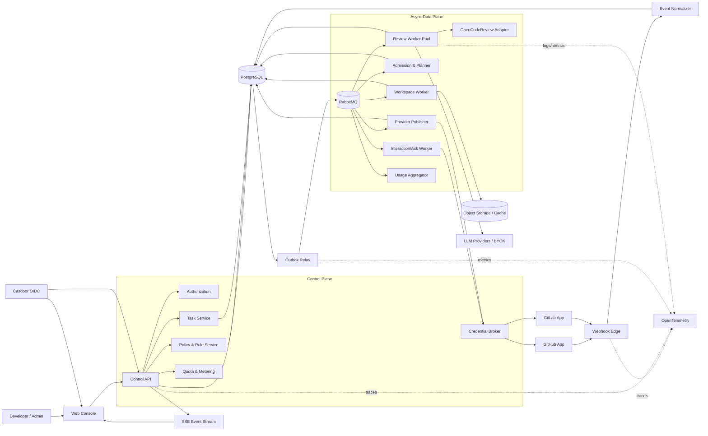
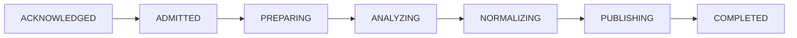
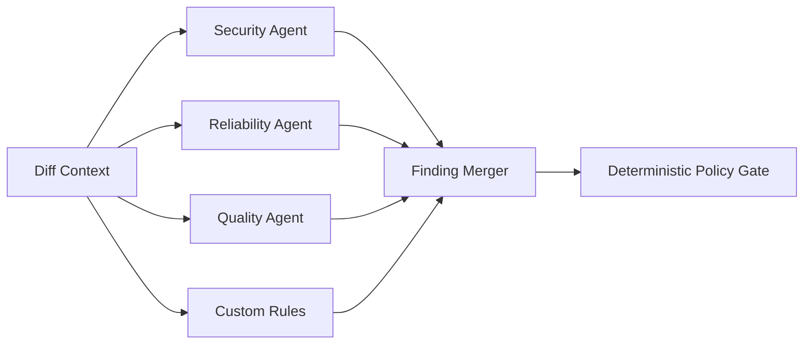

# 02 — 系统架构设计

## 1. 架构结论

平台采用“**控制面 + 事件接入面 + 异步数据面**”架构：

- 控制面负责租户、身份、provider、规则、任务查询、配额、审计和 UI API。
- 接入面负责公网 webhook、验签、归一化、去重和持久化。
- 数据面负责准备仓库、执行 OCR/agent、规范化 finding 和发布结果。
- PostgreSQL 保存权威业务状态；RabbitMQ 提供异步唤醒、消峰、优先级、重试隔离和消费者扩缩容。



## 2. 部署单元

| 单元 | 职责 | 是否公网 | 扩缩容依据 |
| --- | --- | --- | --- |
| `web` | SaaS 控制台与 BFF（可选） | 是 | RPS/静态缓存 |
| `control-api` | 管理 API、查询、SSE、命令 | 是 | RPS/SSE 连接数 |
| `webhook-edge` | provider 验签、限流、归一化、事务落库 | 是，仅 webhook | webhook RPS/延迟 |
| `outbox-relay` | 可靠投递 PostgreSQL outbox 到 MQ | 否 | outbox lag |
| `interaction-worker` | 高优先级回执与状态评论 | 否 | ack queue lag |
| `planner-worker` | 权限/额度/规则解析、生成 run plan | 否 | plan queue lag |
| `workspace-worker` | checkout、diff、输入清单和缓存 | 否 | 准备时长/IO |
| `review-worker` | OCR/agent 执行与 finding 规范化 | 否 | CPU/内存/LLM 并发 |
| `publisher-worker` | GitHub/GitLab 幂等写入 | 否 | provider queue lag/rate limit |
| `usage-worker` | 汇总用量、预算结算 | 否 | usage lag |
| `scheduler/reaper` | 延迟任务、超时、租约回收、补偿 | 否，单主或锁 | 扫描时延 |

初期可以将多个 worker 编译在同一 Go 二进制中，以不同 command/queue 启动；**部署与资源隔离仍按角色区分**。这避免过早微服务化，同时保留未来拆分边界。

## 3. 关键组件职责

### 3.1 Web Console

- AI 原生工作台、任务实时视图、策略工作室、连接、用量与审计。
- 使用 Casdoor OIDC Authorization Code + PKCE。
- 通过 REST 执行动作，通过 SSE 接收状态；不得直接访问 MQ 或数据库。
- UI 的权限隐藏只是体验优化，所有授权仍由 API 执行。

### 3.2 Control API

- 领域命令和查询入口，不执行长任务。
- 对每个 mutation 接受 `Idempotency-Key`，在同租户/同路由范围缓存结果。
- 写入任务、规则、绑定、审计和 outbox 时使用单个事务。
- 返回 `202 + Location` 表示异步操作已被持久化，不表示已执行完成。

### 3.3 Webhook Edge

- 在读取/解析业务 JSON 前验证签名和 body 大小。
- 用 provider delivery ID + instance + installation 建立唯一键。
- 将 provider payload 转为版本化 canonical event；原始 payload 加密保存或按策略不保存。
- 事务成功后返回 `202`；重复 delivery 返回 `202` 与 `duplicate: true`。
- 不使用 fire-and-forget 内存 goroutine 作为可靠性边界。

### 3.4 Rule/Policy Service

- 管理规则生命周期、继承、审批、绑定、例外和测试。
- 解析一次 run 的 effective rules，并生成不可变 snapshot。
- 只把受信任的、已编译的规则文件交给执行层。

### 3.5 Admission & Planner

在消耗昂贵计算前依次检查：

1. run 是否仍为期望 revision，是否取消/替代；
2. actor、installation、repository 是否有效；
3. 并发、套餐、预算、变更大小和 provider rate limit；
4. base/head SHA 与 diff 元数据；
5. rule snapshot、engine version、model route 和数据地域；
6. 生成不可变 `execution_plan` 并进入准备阶段。

### 3.6 Review Worker

- 每个 run 使用临时、无特权、无宿主挂载的隔离环境。
- 输入包括固定 SHA、文件 manifest、规则快照、引擎镜像 digest 和 model route。
- 每个阶段保存 checkpoint 和输出引用；幂等重试读取已有 checkpoint。
- 多 agent 是 run 内部的可选并行图，不改变外部任务契约。
- 只输出结构化、高层运行信号，不输出私有推理文本。

### 3.7 Provider Publisher

- 以 installation token 写入；token 不进入消息体。
- 状态评论、summary、review 和 inline finding 使用各自稳定 marker。
- 发布前获取当前 head SHA；不匹配时把 run 标为 `superseded` 或进入人工确认。
- 尊重 provider rate limit，使用独立延迟重试，不重新执行审查。

## 4. 数据权威与消息一致性

```text
API transaction:
  domain rows + state transition + audit_event + outbox_event
                                  |
                                  v
outbox relay --publisher confirms--> RabbitMQ
                                  |
                                  v
consumer inbox claim -> execute idempotent side effect -> transition + outbox
```

- **PostgreSQL 是权威**：run 当前状态、revision、attempt、取消标记、规则快照和发布记录均在数据库。
- **RabbitMQ 是通知**：消息丢失可由 outbox 重发；重复消息由 inbox/领域幂等消除。
- **至少一次投递**：平台不宣称 exactly-once；通过稳定幂等键实现业务效果一次。
- **事务边界**：状态变化与下一事件写入同一事务，避免“状态已变但消息未发”。

## 5. 执行图

阶段一默认线性骨架：



阶段二允许在 `ANALYZING` 内部并行：



并行 agent 的合并必须：fingerprint 去重、冲突解决、严重级别上限、路径/行号校验、预算截断和可追溯来源。

## 6. 多租户隔离

- 所有业务主键查询都同时限定 `tenant_id`；repository/provider 外部 ID 不是全局主键。
- PostgreSQL 可在成熟后启用 RLS 作为纵深防御，但应用层作用域不可省略。
- MQ payload 只传不可伪造的内部 ID；worker 从数据库重新解析租户与权限上下文。
- 对象存储键按 region/tenant/run 分区，使用短期 signed URL。
- 每租户限制并发、队列、模型、预算和数据地域；大客户可映射专用 consumer group/worker pool。
- provider/LLM 凭据通过 `credential_ref` 间接访问，broker 校验调用方、租户与用途。

## 7. 可用性与伸缩

### 7.1 水平伸缩

- webhook-edge/control-api 无状态，多副本。
- relay 用 `FOR UPDATE SKIP LOCKED` 或 advisory lock 分片扫描 outbox。
- worker 按 queue 与 tenant fairness 扩缩；单租户不能占满全局并发。
- LLM provider/model 设置 semaphore 和 circuit breaker。
- SSE 使用数据库事件序号 + pub/sub 加速；pub/sub 丢失时从事件表补偿。

### 7.2 背压

按顺序执行：

1. admission 给出预计等待并限制新 run；
2. 自动触发可合并为最新 head，手动触发保留用户意图；
3. 按 tenant 权重和任务模式调度；
4. 达到硬预算/容量时明确拒绝并给出可操作原因，绝不静默丢弃。

### 7.3 故障隔离

- 回执、审查、发布、通知、计量使用不同队列/消费者。
- GitHub 限流不阻塞 GitLab；发布失败不重新跑 OCR。
- 某 LLM provider 故障只影响对应 route，可按租户策略 fallback。
- poison message 达到上限进入 DLQ，同时 run 进入可见终态或 `needs_attention`。

## 8. 架构演进

从当前仓库到目标架构建议采用扩展替换：

1. 为现有 `review_jobs` 增加 request/run/revision/outbox/inbox，不立刻删除轮询 worker。
2. 引入 RabbitMQ relay，worker 同时支持数据库补偿扫描。
3. 将 runner 拆出 prepare/execute/publish 状态，但可先共用二进制。
4. 新任务走目标路径，旧任务排空后移除直接轮询耦合。
5. 最后开启复杂规则、计费和多 agent 并行，避免一次迁移所有风险。
