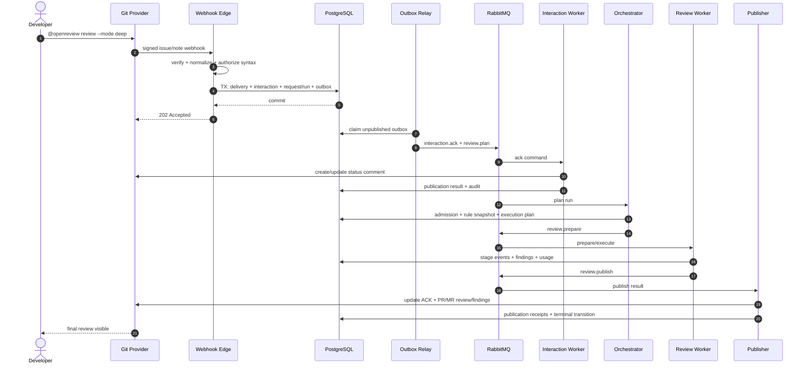
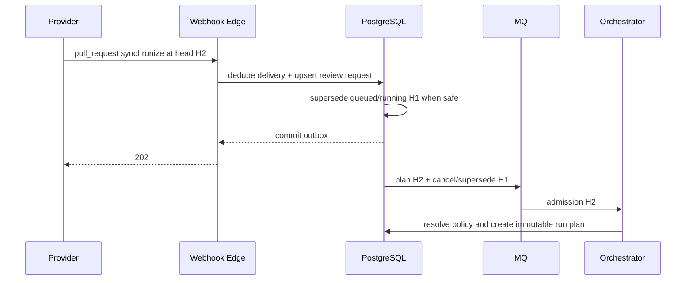
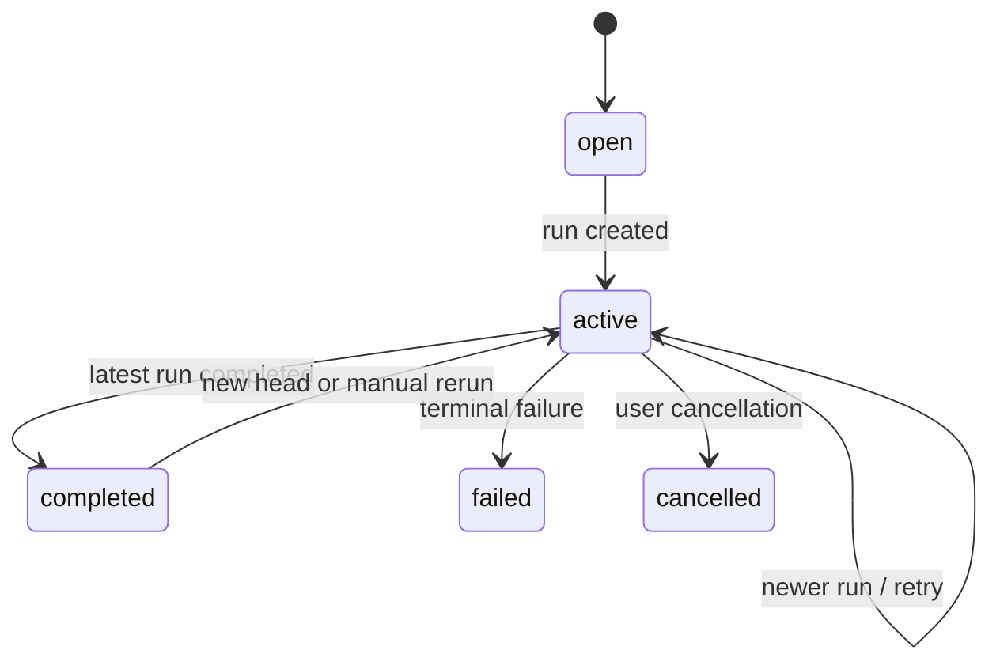
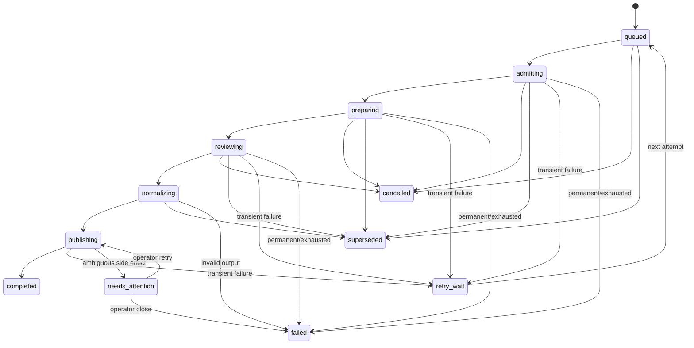

# 03 — 工作流、消息队列与可靠性设计

## 1. 两类 ACK 必须区分

1. **Transport ACK**：webhook HTTP `202`，只表示已验签且事件/outbox 已持久化。
2. **User ACK**：provider 上的评论/状态更新，告诉用户“已接收、任务 ID、当前状态、如何取消”。

Transport ACK 不等待 provider 写回；User ACK 走高优先级独立队列。两者都不表示审查完成。

## 2. 评论命令完整链路



### 2.1 回执评论模板

初始：

```markdown
Open Review accepted this request.

- Task: ORP-1842
- Mode: deep
- State: queued
- Rule snapshot: resolving

Track: <task-url> · Cancel: `@openreview cancel ORP-1842`
<!-- open-review:interaction:<interaction-id> -->
```

运行中更新同一评论，不连续新增评论：

```markdown
Open Review is reviewing 24 of 37 files (68%).
Current stage: review
Elapsed: 2m 14s
<!-- open-review:interaction:<interaction-id> -->
```

完成时，状态评论只提供摘要和链接；正式 findings 通过 provider review 能力发布。

## 3. 自动 PR/MR 触发链路



默认合并策略：

- 自动触发：同一 PR/MR 只保留最新 head 的待执行任务。
- 手动触发：保留用户意图，但在发布前校验 head；过期时终态为 `superseded`，允许查看结果但不写回。
- 已进入 provider 发布且部分成功：不删除已发布内容，改为更新摘要说明已过期，并为新 head 创建新 run。

## 4. 任务状态机

### 4.1 Review Request



### 4.2 Review Run



规则：

- 每次迁移使用 `WHERE id = ? AND revision = ? AND state IN (...)` 乐观锁。
- 迁移同时增加 `revision`，写 `task_event`、`audit_event`、必要的 `outbox_event`。
- terminal 状态不可原地恢复；手动 retry 创建新 attempt 或新 run，并保留 parent ID。
- `cancel_requested_at` 是意图；只有 worker 安全停止后才写 `cancelled`。
- `needs_attention` 表示外部写入结果不确定，不能盲目自动重放。

## 5. RabbitMQ 拓扑

建议使用 quorum queues；延迟重试可使用 delayed-message exchange（基础设施允许时）或 TTL retry queue + DLX。

| Exchange / Queue | 优先级 | 消费者 | 说明 |
| --- | ---: | --- | --- |
| `interaction.ack.q` | 最高 | interaction worker | 初始回执、状态合并更新 |
| `webhook.normalize.q` | 高 | normalizer | 可选异步重解析；首版可在 edge 内完成 |
| `review.plan.q` | 高 | planner | admission、规则与执行计划 |
| `review.prepare.q` | 中 | workspace worker | checkout、diff、manifest |
| `review.execute.standard.q` | 中 | review workers | 普通模式 |
| `review.execute.deep.q` | 低/独立 | deep workers | 高成本任务，独立并发 |
| `review.execute.security.q` | 中/隔离 | security workers | 可路由到受控模型/区域 |
| `review.publish.github.q` | 高 | GitHub publisher | GitHub 限流独立 |
| `review.publish.gitlab.q` | 高 | GitLab publisher | GitLab 限流独立 |
| `usage.record.q` | 低 | usage worker | 计量汇总，不阻塞主链路 |
| `notification.q` | 低 | notifier | email/webhook 等扩展通知 |
| `<queue>.retry.<tier>` | — | broker | 10s / 1m / 5m / 30m 延迟 |
| `<queue>.dlq` | — | operator tooling | 终止自动重试、等待处置 |

### 5.1 不同队列的价值

- 回执不会被长时间 LLM 调用占用。
- deep/security 有不同并发、预算和数据路由。
- provider 限流不会触发审查重算。
- usage/notification 降级时主任务仍可完成，随后补偿。
- 不同租户可用 routing key 或调度层实现公平性，而非无限创建物理队列。

### 5.2 消息约束

- 消息体只包含内部 ID、revision、event ID、trace context 和 schema version。
- 不包含源码、provider token、LLM key、完整规则正文或用户敏感字段。
- 消费者必须从 PostgreSQL 获取最新权威状态；过期 revision 消息直接 ACK 为 stale。
- publisher confirm 成功后才把 outbox 标记 published。

## 6. Outbox

`outbox_events` 最少字段：

```text
id UUID PK
tenant_id UUID
aggregate_type TEXT
aggregate_id UUID
aggregate_revision BIGINT
event_type TEXT
schema_version INT
payload JSONB
available_at TIMESTAMPTZ
published_at TIMESTAMPTZ NULL
attempts INT
last_error TEXT NULL
created_at TIMESTAMPTZ
```

relay：

1. 用 `FOR UPDATE SKIP LOCKED` claim 一小批到期事件。
2. 发布到 exchange，等待 publisher confirm。
3. confirm 后设置 `published_at`；失败时指数回退。
4. 定期检查 outbox lag、最老未发布事件和 attempts。
5. 允许安全重放；消费端必须幂等。

## 7. Inbox 与幂等

`inbox_claims(consumer, message_id)` 唯一。状态包括 `processing`、`completed`、`retryable_failed`、`permanent_failed`，带 claim lease。

处理算法：

1. 开启事务并插入/claim inbox；已 completed 则直接 ACK。
2. 读取 aggregate，验证 revision/state。
3. 对外部副作用先查 `publication_receipts` 或 provider marker。
4. 执行内部事务或外部操作。
5. 保存结果、状态迁移和下一 outbox，标记 inbox completed。

关键幂等键：

| 场景 | 幂等键 |
| --- | --- |
| webhook | `provider_instance + delivery_id` |
| 评论命令 | `installation + provider_comment_id + normalized_command_hash` |
| review request | `tenant + repository + review_number + head_sha + trigger_kind` |
| run attempt | `request_id + head_sha + rule_snapshot_sha + engine_digest + attempt` |
| status comment | `interaction_id` hidden marker |
| summary | `run_id + summary` hidden marker |
| inline finding | `run_id + finding_fingerprint` hidden marker |
| usage | `run_id + meter + sequence` |

## 8. 重试和错误分类

### 8.1 错误类别

| 类别 | 示例 | 处理 |
| --- | --- | --- |
| transient | 5xx、网络、临时 rate limit | 自动退避重试 |
| throttled | provider 429、LLM 限流 | 尊重 Retry-After，独立并发控制 |
| permanent_input | SHA 不存在、规则语法错误 | 直接失败，给可操作消息 |
| permanent_auth | 安装撤销、权限不足 | `needs_attention`，通知管理员 |
| policy_denied | 额度/范围/模式不允许 | admission 拒绝，不执行 |
| stale | revision/head 已变化 | ACK 消息，run superseded |
| ambiguous_side_effect | 外部超时但可能已写入 | 查 marker；无法确认则人工处理 |
| platform_bug | panic、schema 不兼容 | 捕获、DLQ、告警，不无限重试 |

### 8.2 建议退避

- 立即可重试：10s、1m、5m、30m，最多 5 次。
- provider 明确给出 `Retry-After` 时优先使用，设置上限和 jitter。
- OCR 输入/输出无效不自动重试同一执行计划。
- 外部发布阶段重试不回退到 review 阶段。

## 9. 租约、心跳与回收

- worker claim 保存 `lease_owner`、`lease_expires_at`、`heartbeat_at`。
- 长阶段每 15–30 秒 heartbeat；扩展租约使用 revision/owner 条件。
- reaper 只回收到期且无新 heartbeat 的阶段；先记录 `lease_expired` 事件。
- 外部命令执行使用可终止子进程、明确 timeout 和进程组清理。
- workspace 使用 run-scoped 目录，终态/超时后异步清理并记录结果。

## 10. 状态更新合并与防刷屏

- 状态评论同一 interaction 只维护一条。
- 最短更新间隔默认 15 秒；阶段变化、失败、完成可绕过。
- 进度变化低于 5% 不更新 provider，但 SSE 可实时发送。
- 多次状态变化在 outbox/publisher 层按 `interaction_id` 合并为最新 revision。
- provider 写失败不影响 run 继续，但界面标记“状态同步延迟”。

## 11. 公平调度

调度分数可由以下因素组成：

```text
priority = interaction/manual weight
         + waiting age
         + tenant plan weight
         - estimated cost penalty
         - tenant active concurrency penalty
```

- 为每租户设置并发上限和 token bucket。
- 预留一小部分容量给手动/安全紧急任务。
- 不允许高套餐租户把低套餐任务永久饿死；age 必须最终占优。

## 12. 可观测指标

- webhook verify/commit latency、duplicate ratio、unknown installation ratio。
- outbox lag、publish failures、inbox duplicate/stale ratio。
- 每队列 depth、oldest age、redelivery、DLQ size。
- ack comment P50/P95/P99、plan latency、checkout、review、publish 时长。
- 按 tenant/mode/provider 的成功率、取消率、supersede 率和成本。
- lease expiry、ambiguous publication、stale head prevented count。
