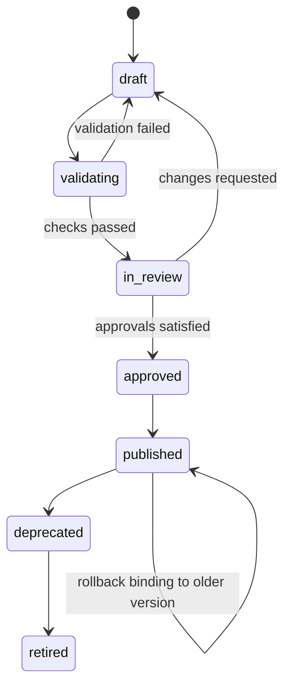

# 04 — 企业规则与策略治理设计

## 1. 设计目标

企业规则不是传给模型的一段自由文本，而是具备以下属性的治理对象：

- 有所有者、目的、作用域和风险级别；
- 有不可变版本、评审、审批、发布和回滚；
- 可解释最终为何在某次 run 中生效；
- 可在发布前验证语法、影响、成本和潜在误报；
- 可将确定性门禁与 AI 审查建议分开执行；
- 以可信输入对接 OCR，不能被待审 PR 自行替换。

## 2. 规则层级

从低到高解析：

```text
Platform safety baseline
  → Organization baseline
    → Team overlay
      → Repository rules
        → Branch/path bindings
          → Run override (authorized only)
```

### 2.1 合并语义

每条规则具有稳定 `rule_key`、`enforcement` 和 `merge_behavior`：

- `mandatory`：下层只能收紧或补充，不能禁用。
- `advisory`：下层可覆盖、禁用或调整严重级别。
- `replace`：同 key 的高层版本被当前层完整替代，仅允许 advisory。
- `append`：多个来源都保留，适合独立检查。
- `deny_override`：平台安全基线固定策略。

冲突解析必须确定性；同优先级、同 key 的冲突使 snapshot 编译失败，不使用“最后写入获胜”的隐式规则。

### 2.2 作用域

规则绑定可包含：

- organization/team/repository ID；
- provider 与 repository visibility；
- target/source branch glob；
- path include/exclude glob；
- language、文件类型、变更规模；
- trigger kind、review mode；
- 生效起止时间和数据地域。

## 3. 规则分类

| 类型 | 示例 | 执行方式 |
| --- | --- | --- |
| AI semantic rule | 事务一致性、错误处理、业务约束 | OCR/agent 提示与结构化输出 |
| deterministic policy | 禁止 secret、许可列表、覆盖率阈值 | 独立确定性检查器 |
| publishing policy | 严重级别门槛、最大 inline 数、阻断条件 | normalizer/publisher |
| routing policy | 模型、region、agent 组合、预算 | planner |
| governance policy | 审批人数、mandatory、例外期限 | control plane |

确定性门禁不能仅依赖 LLM 判断；LLM finding 也不能伪装成确定性扫描结果。

## 4. 生命周期



- `draft` 可编辑；每次保存增加 draft revision。
- 进入 `in_review` 后内容冻结；修改会回到 draft 并清空不再有效的审批。
- `published` 内容不可变；任何改变创建下一语义版本。
- 回滚是把 binding 指向已发布旧版本，而非修改历史版本。
- 删除只允许未使用 draft；已被 run snapshot 引用的对象永久保留元数据和摘要。

## 5. 审批策略

审批条件可按风险配置：

| 变化 | 默认要求 |
| --- | --- |
| 文案/描述，不改变执行 | 1 位规则管理员 |
| 新增 advisory 规则 | 1 位规则管理员 |
| 严重级别提高、范围扩大 | 2 位批准者，其中 1 位安全角色 |
| 新增/修改 mandatory 或 merge gate | 2 位安全批准者 + 组织 owner |
| 模型/地域/数据处理变化 | 安全与平台管理员 |

- 作者不能作为唯一批准者。
- approval 绑定内容 SHA；内容变化自动失效。
- 紧急发布需 break-glass 权限、理由、有效期和事后复核。

## 6. 版本与快照模型

核心实体：

```text
rule_sets
rule_versions
rule_bindings
rule_approval_requests
rule_approvals
rule_exceptions
rule_snapshots
rule_snapshot_sources
rule_test_runs
rule_feedback_aggregates
```

### 6.1 Snapshot 编译

planner 在 admission 阶段：

1. 读取 platform/tenant/team/repo/branch/path 绑定。
2. 固定各 binding revision，排除过期 exception。
3. 按层级和 merge semantics 合并。
4. 检查冲突、权限、数据地域、模式与引擎兼容性。
5. 生成 canonical JSON，排序键与规则数组。
6. 计算 `sha256`，保存 `rule_snapshot` 和来源映射。
7. 将 snapshot ID/SHA 固定到 execution plan；后续规则发布不影响该 run。

示例摘要：

```json
{
  "schema_version": 1,
  "engine": "ocr",
  "merge_system_rule": true,
  "rules": [
    {
      "key": "payments.idempotent-retry",
      "source": "rule-version-id",
      "enforcement": "mandatory",
      "severity": "critical",
      "paths": ["services/payments/**"]
    }
  ]
}
```

## 7. OCR 对接

OpenCodeReview 官方能力支持命令行 `--rule`、仓库内 `.opencodereview/rule.json` 和 `merge_system_rule` 等规则输入（见 [OCR 官方 skill](https://github.com/alibaba/open-code-review/blob/main/plugins/open-code-review/skills/open-code-review/SKILL.md)）。因此平台适配器采用：

```text
effective snapshot
  → validated canonical model
  → runner-scoped trusted rule file
  → ocr review --rule <trusted-path> ...
```

安全边界：

- 默认只使用控制平面发布的 snapshot，或显式配置为从 **base/default branch** 读取仓库规则。
- 不从待审 PR/MR 的 head 读取可执行规则，避免攻击者通过改规则影响持有 secrets 的审查。
- runner 生成只读规则文件，路径不受 webhook 参数控制。
- snapshot 保存 OCR 适配版本和编译器版本；升级后可解释输出差异。
- 若启用仓库规则，平台先验证 schema、大小、允许字段和 provenance，再合并。

OCR 官方 GitHub Action 会把 rule 输入传给 `ocr review --rule`，并对规则内容参与 fingerprint；其示例也明确提醒，在 secrets 可用的工作流中不能信任待审分支里的规则文件。平台因此把“规则来源可信性”作为控制面职责，而不是简单透传仓库路径。参考 [官方 Action](https://github.com/alibaba/open-code-review/blob/main/action.yml) 与 [官方 GitHub Actions 示例](https://github.com/alibaba/open-code-review/blob/main/examples/github_actions/README.md)。

## 8. Test Lab

发布前必须支持四层验证：

### 8.1 静态校验

- JSON/schema、必填字段、未知字段、glob、重复 key。
- OCR 兼容性和 `ocr rules check`（适用时）。
- prompt/文本大小、禁止内容、模型上下文上限估算。

### 8.2 样本测试

- 规则作者维护正例/反例 fixture。
- 断言 finding category、severity、path 和是否命中；不强制全文逐字一致。
- 记录模型、温度、引擎版本和随机性边界。

### 8.3 历史回放与影响预览

- 对最近 N 个已授权 PR/MR 的已存 manifest/可重取 diff 抽样。
- 比较当前 published 与候选版本：新增、消失、严重级别变化、成本、耗时。
- 估算 false-positive 风险，并展示受影响仓库/团队，而不是只给总数。
- 回放结果不得自动发布到 provider。

### 8.4 Shadow/Canary

- shadow：实际运行候选规则但不发布，只收集差异。
- canary：按 tenant/repository/比例绑定，失败可自动回退旧 binding。
- mandatory 阻断规则上线默认先 shadow，除非 break-glass。

## 9. 例外管理

例外不是删除规则，字段包括：

- 被豁免的 rule key/version；
- tenant/repo/branch/path 范围；
- 原因、风险接受人、批准人；
- 创建/到期时间；
- 关联 issue/ticket；
- 到期提醒和自动失效。

run snapshot 必须记录实际使用的 exception；规则页面可按到期、owner 和风险筛选。

## 10. 发布门禁与 finding 行为

- `advisory` finding：评论，不改变 merge gate。
- `required` finding：进入 required check 结论，但允许授权角色 override。
- `blocking` deterministic policy：直接失败 check，必须有确定性证据。
- AI critical finding 默认不自动阻断，除非企业明确配置、完成影响验证且提供人工 override。

同一规则的 finding fingerprint 建议包含：

```text
hash(rule_key + semantic_location + normalized_evidence + head_sha_scope)
```

避免把不稳定的自然语言全文放入 fingerprint。

## 11. 反馈闭环

每个 finding 可收到：useful、false_positive、resolved、won't_fix、severity_adjusted。聚合指标：

- 命中率与每千行/每 PR findings；
- 接受/修复率、误报率、平均处理时间；
- 按规则版本、仓库、语言、模型和 agent 分组；
- 发布前后差异和 canary 对照。

反馈只作为规则改进证据，不自动修改 published 规则。

## 12. UI 关键流程

### 创建与发布

```text
New rule set
→ 选择模板/空白
→ 定义目的、规则、严重级别和范围
→ Static check
→ Test fixtures
→ Impact preview
→ Request approval
→ Approvers inspect diff + evidence
→ Publish/canary
→ Observe feedback
```

### 查看某次 run 生效规则

任务详情 → Rules → 显示 snapshot SHA、来源层级、被覆盖项、例外、OCR 编译结果摘要和版本链接。历史 run 永远链接当时版本，不跳到 latest。
