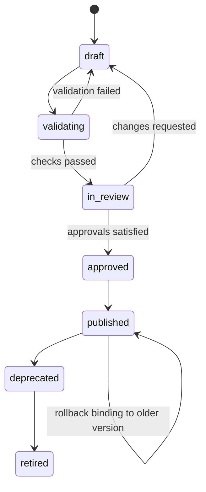

# 04 — 企业规则与策略治理设计

## 1. 设计目标

企业规则不是传给模型的一段自由文本，而是具备以下属性的治理对象：

- 有所有者、目的、作用域和风险级别；
- 有不可变版本、评审、审批、发布和回滚；
- 可解释最终为何在某次 run 中生效；
- 可在发布前验证语法、影响、成本和潜在误报；
- 可将确定性门禁与 AI 审查建议分开执行；
- 以可信输入对接 OCR，不能被待审 PR 自行替换。

## 2. 规则层级

从低到高解析：

```text
Platform safety baseline
  → Organization baseline
    → Team overlay
      → Repository rules
        → Branch/path bindings
          → Run override (authorized only)
```

### 2.1 合并语义

每条规则具有稳定 `rule_key`、`enforcement` 和 `merge_behavior`：

- `mandatory`：下层只能收紧或补充，不能禁用。
- `advisory`：下层可覆盖、禁用或调整严重级别。
- `replace`：同 key 的高层版本被当前层完整替代，仅允许 advisory。
- `append`：多个来源都保留，适合独立检查。
- `deny_override`：平台安全基线固定策略。

冲突解析必须确定性；同优先级、同 key 的冲突使 snapshot 编译失败，不使用“最后写入获胜”的隐式规则。

### 2.2 作用域

规则绑定可包含：

- organization/team/repository ID；
- provider 与 repository visibility；
- target/source branch glob；
- path include/exclude glob；
- language、文件类型、变更规模；
- trigger kind、review mode；
- 生效起止时间和数据地域。

## 3. 规则分类

| 类型 | 示例 | 执行方式 |
| --- | --- | --- |
| AI semantic rule | 事务一致性、错误处理、业务约束 | OCR/agent 提示与结构化输出 |
| deterministic policy | 禁止 secret、许可列表、覆盖率阈值 | 独立确定性检查器 |
| publishing policy | 严重级别门槛、最大 inline 数、阻断条件 | normalizer/publisher |
| routing policy | 模型、region、agent 组合、预算 | planner |
| governance policy | 审批人数、mandatory、例外期限 | control plane |

确定性门禁不能仅依赖 LLM 判断；LLM finding 也不能伪装成确定性扫描结果。

## 4. 生命周期


```mermaid
stateDiagram-v2
  [*] --> draft
  draft --> validating
  validating --> draft: validation failed
  validating --> in_review: checks passed
  in_review --> draft: changes requested
  in_review --> approved: approvals satisfied
  approved --> published
  published --> deprecated
  deprecated --> retired
  published --> published: rollback binding to older version
```

- `draft` 可编辑；每次保存增加 draft revision。
- 进入 `in_review` 后内容冻结；修改会回到 draft 并清空不再有效的审批。
- `published` 内容不可变；任何改变创建下一语义版本。
- 回滚是把 binding 指向已发布旧版本，而非修改历史版本。
- 删除只允许未使用 draft；已被 run snapshot 引用的对象永久保留元数据和摘要。

## 5. 审批策略

审批条件可按风险配置：

| 变化 | 默认要求 |
| --- | --- |
| 文案/描述，不改变执行 | 1 位规则管理员 |
| 新增 advisory 规则 | 1 位规则管理员 |
| 严重级别提高、范围扩大 | 2 位批准者，其中 1 位安全角色 |
| 新增/修改 mandatory 或 merge gate | 2 位安全批准者 + 组织 owner |
| 模型/地域/数据处理变化 | 安全与平台管理员 |

- 作者不能作为唯一批准者。
- approval 绑定内容 SHA；内容变化自动失效。
- 紧急发布需 break-glass 权限、理由、有效期和事后复核。

## 6. 版本与快照模型

核心实体：

```text
rule_sets
rule_versions
rule_bindings
rule_approval_requests
rule_approvals
rule_exceptions
rule_snapshots
rule_snapshot_sources
rule_test_runs
rule_feedback_aggregates
```

### 6.1 Snapshot 编译

planner 在 admission 阶段：

1. 读取 platform/tenant/team/repo/branch/path 绑定。
2. 固定各 binding revision，排除过期 exception。
3. 按层级和 merge semantics 合并。
4. 检查冲突、权限、数据地域、模式与引擎兼容性。
5. 生成 canonical JSON，排序键与规则数组。
6. 计算 `sha256`，保存 `rule_snapshot` 和来源映射。
7. 将 snapshot ID/SHA 固定到 execution plan；后续规则发布不影响该 run。

示例摘要：

```json
{
  "schema_version": 1,
  "engine": "ocr",
  "merge_system_rule": true,
  "rules": [
    {
      "key": "payments.idempotent-retry",
      "source": "rule-version-id",
      "enforcement": "mandatory",
      "severity": "critical",
      "paths": ["services/payments/**"]
    }
  ]
}
```

当前实现使用 snapshot schema v2 将 active binding 的 `path_include_glob`
与 `path_exclude_glob` 去重、排序后写入 OCR 原生规则文件的 `include` /
`exclude`。include 取并集，exclude 优先；因此同一不可变快照在重试或异步
恢复时会筛选同一批文件，而不重新读取管理员后来修改的 binding。

## 7. OCR 对接

OpenCodeReview 官方能力支持命令行 `--rule`、仓库内 `.opencodereview/rule.json` 和 `merge_system_rule` 等规则输入（见 [OCR 官方 skill](https://github.com/alibaba/open-code-review/blob/main/plugins/open-code-review/skills/open-code-review/SKILL.md)）。因此平台适配器采用：

```text
effective snapshot
  → validated canonical model
  → runner-scoped trusted rule file
  → ocr review --rule <trusted-path> ...
```

安全边界：

- 默认只使用控制平面发布的 snapshot，或显式配置为从 **base/default branch** 读取仓库规则。
- 不从待审 PR/MR 的 head 读取可执行规则，避免攻击者通过改规则影响持有 secrets 的审查。
- runner 生成只读规则文件，路径不受 webhook 参数控制。
- snapshot 保存 OCR 适配版本和编译器版本；升级后可解释输出差异。
- 若启用仓库规则，平台先验证 schema、大小、允许字段和 provenance，再合并。

OCR 官方 GitHub Action 会把 rule 输入传给 `ocr review --rule`，并对规则内容参与 fingerprint；其示例也明确提醒，在 secrets 可用的工作流中不能信任待审分支里的规则文件。平台因此把“规则来源可信性”作为控制面职责，而不是简单透传仓库路径。参考 [官方 Action](https://github.com/alibaba/open-code-review/blob/main/action.yml) 与 [官方 GitHub Actions 示例](https://github.com/alibaba/open-code-review/blob/main/examples/github_actions/README.md)。

## 8. Test Lab

发布前必须支持四层验证：

### 8.1 静态校验

- JSON/schema、必填字段、未知字段、glob、重复 key。
- OCR 兼容性和 `ocr rules check`（适用时）。
- prompt/文本大小、禁止内容、模型上下文上限估算。

### 8.2 样本测试

- 规则作者维护正例/反例 fixture。
- 断言 finding category、severity、path 和是否命中；不强制全文逐字一致。
- 记录模型、温度、引擎版本和随机性边界。

### 8.3 历史回放与影响预览

- 对最近 N 个已授权 PR/MR 的已存 manifest/可重取 diff 抽样。
- 比较当前 published 与候选版本：新增、消失、严重级别变化、成本、耗时。
- 估算 false-positive 风险，并展示受影响仓库/团队，而不是只给总数。
- 回放结果不得自动发布到 provider。

### 8.4 Shadow/Canary

- shadow：实际运行候选规则但不发布，只收集差异。
- canary：按 tenant/repository/比例绑定，失败可自动回退旧 binding。
- mandatory 阻断规则上线默认先 shadow，除非 break-glass。

Canary 创建时冻结自动回退阈值（1–10 个不同 PR/MR，默认 1）与观察窗口（5–1440
分钟，默认 60）。监控器只统计窗口内**实际选中候选 binding**、执行后进入 `failed`
终态的不同 review request；同一 PR 的多个 head 只计一次，配额准入拒绝、基线组
失败、取消和 supersede 不计。达到阈值时在行锁内复核并原子地将 rollout 标为
`rolled_back`，写入原因与审计事件；重复扫描或多副本不能二次回退。新 run 恢复基线，
已入队 run 的不可变规则快照不变。这是偏保守的运行可靠性保护，不把 finding 增减
误判为执行失败，也不能证明失败一定由候选规则引起。候选质量/误报率等统计门槛仍需
独立的 Canary outcome evidence 与晋升审批。

当前阶段一/二实现采用受约束的 `1% → 5% → 25% → 100% → promoted` 状态序列；
首次 Canary 只能选 1% 或 5%，不能在创建时直达 25%/100%。每次放量和最终晋升均
校验阶段推进审计链（旧版本直接创建的 25%/100% Canary 不能绕过新门槛），并
重新检查当前绑定仍是同一发布版本/作用域，要求本阶段已观察完整配置窗口、至少
一个不同 PR/MR 的候选审核完成且其不可变 merge-gate 结论为 `success`、没有候选
执行失败或未终结的候选审核。阶段推进以 optimistic revision 与行锁串行化，晋升
另须由不同于 Canary 创建者的 owner/admin 操作；一个事务内把旧 baseline 置为
`disabled`、candidate 置为 `active`、rollout 置为 `promoted`，并记录审计。已准入
run 的规则快照和 cohort 决策不变。暂停后恢复会重新开始观察窗口。此门槛验证
运行和合并策略结果，**尚不能证明误报率或业务质量**；真实 provider 灰度和这些
质量指标仍须另行验收，不得以一次成功的测试 run 宣称生产发布完成。

## 9. 例外管理

例外不是删除规则，字段包括：

- 被豁免的 rule key/version；
- tenant/repo/branch/path 范围；
- 原因、风险接受人、批准人；
- 创建/到期时间；
- 关联 issue/ticket；
- 到期提醒和自动失效。

run snapshot 必须记录实际使用的 exception；规则页面可按到期、owner 和风险筛选。

当前实现将例外绑定到一个 published `rule_version_id` 与精确 `rule_key`，支持 tenant
或 repository 范围及 target branch glob。请求人不能批准自己的例外；只有 approved
且未到期的记录会在 admission 时移除该来源的 effective rule。例外 ID、来源版本、
key 与到期时间进入 canonical snapshot 和 `rule_snapshot_exceptions`，因此历史 run
不受后续到期或撤销影响。路径级例外尚未启用：现有 OCR adapter 将 effective rules
聚合为一个 catch-all rule，在没有可证明的重叠 glob 语义前，控制面拒绝用 UI 暗示
路径级豁免已经生效。

## 10. 发布门禁与 finding 行为

- `advisory` finding：评论，不改变 merge gate。
- `required` finding：进入 required check 结论，但允许授权角色 override。
- `blocking` deterministic policy：直接失败 check，必须有确定性证据。
- AI critical finding 默认不自动阻断，除非企业明确配置、完成影响验证且提供人工 override。

同一规则的 finding fingerprint 建议包含：

```text
hash(rule_key + semantic_location + normalized_evidence + head_sha_scope)
```

避免把不稳定的自然语言全文放入 fingerprint。

## 11. 反馈闭环

每个 finding 可收到：useful、false_positive、resolved、won't_fix、severity_adjusted。聚合指标：

- 命中率与每千行/每 PR findings；
- 接受/修复率、误报率、平均处理时间；
- 按规则版本、仓库、语言、模型和 agent 分组；
- 发布前后差异和 canary 对照。

反馈只作为规则改进证据，不自动修改 published 规则。

当前 GitHub 闭环以 inline finding 内的确定性 marker 为关联键。经过 webhook
signature 校验的 `reaction` 事件中，👍 记录为 `useful`，👎 记录为
`false_positive`；创建和删除 reaction 都按 provider reaction ID 幂等处理，并记录
actor、finding、tenant 和审计事件。其他表情不进入质量指标，反馈也不会自动改变
merge gate、已发布规则或历史结果。GitLab emoji 与控制台的 resolved/won't-fix
动作仍需通过同一 feedback contract 接入，不能另建一套不可对账的数据。

反馈控制台当前只展示可以证明的层级：workspace 总量，以及按 repository 聚合的
finding、active feedback、高风险 finding 和 immutable snapshot 数量。由于 OCR
当前结构化输出没有提供 originating `rule_key`，UI 明确显示 attribution warning，
不得把 repository/snapshot 反馈伪装成单条规则的准确率。只有引擎契约携带可信
rule key，且该 key 能映射到 run snapshot source 后，才允许新增 rule-version 维度。

GitLab 使用官方 `Emoji Hook`（`award`/`revoke`）进入同一 ledger：仅处理
`awardable_type=Note` 且 note 含确定性 finding marker 的 `thumbsup` / `thumbsdown`，
分别映射为 useful / false-positive。参考 [GitLab Emoji events](https://docs.gitlab.com/user/project/integrations/webhook_events/#emoji-events)。
控制台 reviewer 还可将最近 finding 标记为 `resolved` 或 `wont_fix`，也可清除自己
的处置；该状态以 actor+finding 幂等、记录审计，不覆盖其他人的 reaction，不修改
原始 AI finding，也不回写既有 merge gate。

## 12. UI 关键流程

### 创建与发布

```text
New rule set
→ 选择模板/空白
→ 定义目的、规则、严重级别和范围
→ Static check
→ Test fixtures
→ Impact preview
→ Request approval
→ Approvers inspect diff + evidence
→ Publish/canary
→ Observe feedback
```

当前控制面落地的审批链路保持同一组不变量：策略库显示 latest version、状态与
content SHA；草稿可以提交 1–5 人审批；审批队列从不可变 decision 记录实时聚合
票数；发起人不可自批且同一 reviewer 只能决定一次；只有达到 quorum 的同一内容
SHA 才能进入 `approved`，随后显式发布为不可变 `published` 版本。工作台默认展示
摘要，完整 SHA、说明与决策控件按需展开，避免审批证据和规则详情重复占据页面。

### Test Lab 证据边界

`POST /v1/tenants/{slug}/rule-sets/{id}/versions/{version}/impact-preview`
是只读预演：读取指定版本与目标仓库当前 active/published bindings，在候选
precedence 下执行确定性合并，返回 baseline/candidate snapshot SHA、规则 key
增改删、严重级别构成、匹配 binding 数以及该仓库最近 90 天可用于回放的真实
run/finding 样本范围。接口不创建 review run、不调用 OCR/LLM、不消费审批，也不向
GitHub/GitLab 写评论或 check。

因此历史数量只表示 replay envelope，不表示已经完成回放或证明规则质量；UI 必须
同步展示缺失证据和不确定性。

真实回放使用独立资源 `rule_test_runs` / `rule_test_findings`：规则管理员选择一条已
完成或 needs-attention 的历史 run，控制面冻结候选版本、active baseline 与精确
base/head revision，写入 `rule.test.requested` outbox。专用 worker 使用同一 OCR 和
风险选路能力执行，但类型上不持有 publisher、check 或 lifecycle reporter，因此不能
向 GitHub/GitLab 写评论、review、check 或 merge gate。结果记录 snapshot SHA、OCR
版本、selected/deferred path 数、耗时、finding 与错误；broker 不可用时 polling
recovery 仍能消费 queued task。真实回放仍是规则质量证据，不消费审批，也不能替代
发布授权。

### 查看某次 run 生效规则

任务详情 → Rules → 显示 snapshot SHA、来源层级、被覆盖项、例外、OCR 编译结果摘要和版本链接。历史 run 永远链接当时版本，不跳到 latest。
