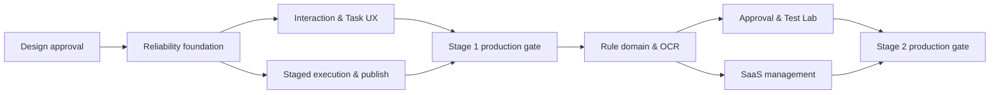

# 08 — 阶段一/阶段二交付与验收计划

## 1. 交付边界

只规划用户要求的两个阶段：

- **阶段一：可靠异步执行与用户交互闭环**
- **阶段二：企业规则与 SaaS 管理闭环**

不在本设计中扩展第三阶段。当前 `iter-01` 是设计产物；前端实现必须等设计评审通过。

## 2. 设计评审里程碑 D0

交付：

- 产品功能、架构、工作流、数据/API、安全和本计划。
- Home、Task、Rules 高保真方向稿。
- 决策/开放问题列表。

退出条件：README 中设计门禁全部勾选；决策记录写入负责人、日期和结论；审批结果为 `APPROVED`。

## 3. 阶段一 — 可靠异步执行与交互闭环

### 3.1 M1：领域与可靠性底座

范围：

- migration：review request/run/stage/event、outbox/inbox、interaction、publication receipt。
- 状态机与 revision 乐观锁。
- RabbitMQ 拓扑、outbox relay、inbox claim/release、retry/DLQ。
- 现有 DB poller 保留为补偿/迁移路径，不作为唯一调度。
- OpenTelemetry trace/correlation 与基础指标。

验收：

- 事务中断不会出现孤儿消息或无消息状态。
- 重放任意消息不会产生重复状态迁移/外部写入。
- broker 停机期间任务仍被持久化；恢复后自动投递。
- worker 在阶段执行前崩溃、执行中崩溃、提交后 ACK 前崩溃均有测试。

### 3.2 M2：交互、任务和实时状态

范围：

- GitHub `issue_comment`、GitLab note/comment 归一化。
- `review/status/cancel/retry/help` 命令解析、actor 权限和幂等。
- 高优先级 ACK worker、状态评论 upsert、更新合并。
- Task REST/SSE、取消、替代和手动重试。
- Home/Tasks/Task detail 前端；严格按已批准稿实现。

验收：

- P95 user ACK < 5 秒（目标负载下）。
- 无效命令给帮助且不创建 run；无权限不泄漏资源信息。
- SSE 断线重连可补发 transition，UI 不倒退 revision。
- 新 head 替代旧任务，旧 finding 不发布到新 diff。

### 3.3 M3：执行阶段化与 provider 发布

范围：

- prepare/execute/normalize/publish 分阶段、租约、heartbeat、reaper。
- isolated checkout、固定 SHA、资源限制、临时目录清理。
- OCR adapter 固定版本/镜像 digest 和结构化结果。
- GitHub/GitLab installation token broker。
- 状态评论、summary、inline finding 的稳定 marker/receipt。

验收：

- provider 429/5xx 只重试 publish，不重跑 OCR。
- 模糊超时先查 marker；无法确定进入 `needs_attention`。
- head mismatch 阻止陈旧发布并记录原因。
- token 不出现在 DB payload、MQ、日志、trace 和错误。

### 3.4 M4：阶段一生产门禁

- 压测 webhook burst、queue fairness 和 ACK 隔离。
- chaos：DB/broker/provider/LLM/worker 中断。
- tenant isolation 与授权负面测试。
- dashboard E2E：评论触发 → 回执 → 运行 → finding → 完成。
- runbook、告警、备份恢复、回滚演练。

阶段一完成定义：GitHub/GitLab 各完成真实 App 安装和线上测试，不以 mock/provider sandbox 代替生产证据。

## 4. 阶段二 — 企业规则与 SaaS 管理闭环

### 4.1 M5：规则领域与 OCR 对接

范围：

- rule set/version/binding/approval/exception/snapshot schema 与 API。
- 确定性继承合并、冲突检测和 canonical SHA。
- trusted rule file 与 OCR `--rule` 对接。
- run 固定 snapshot；任务 UI 显示来源与版本。
- Rules gallery/composer 基础页面。

验收：

- published 版本无法原地修改。
- 相同输入生成相同 canonical snapshot SHA。
- mandatory 规则不能被下层禁用。
- PR head 修改规则不改变受信任 snapshot。
- 历史 run 可还原 effective rules。

### 4.2 M6：审批、Test Lab 与影响预览

范围：

- rule diff、审批策略、content-hash approval。
- static checks、fixtures、历史回放、影响/成本预览。
- shadow/canary binding、回滚和 exception 到期。
- finding feedback 与规则版本指标。

验收：

- 内容变更使既有审批失效。
- 回放不发布 provider 评论。
- canary 失败可恢复旧 binding，不修改历史版本。
- 影响预览显示样本范围、差异和不确定性，不只显示单个分数。

### 4.3 M7：SaaS 管理

范围：

- 组织/团队/成员/角色完整管理，Casdoor SSO 配置入口。
- repository/provider 管理与健康。
- entitlements、额度、reservation/settlement、usage ledger。
- Usage/Audit/Settings 页面、异步导出、数据保留。
- BYOK/model route 可选设计；凭据仍经 broker。

验收：

- 额度在 admission 前生效，结算任务可对账修复漂移。
- tenant/repository/model/rule set 成本归因一致。
- 跨租户 API/SSE/export/cache/object key 自动化测试通过。
- 私有部署可关闭商业计费适配器，但计量、配额和审计仍工作。

### 4.4 M8：阶段二生产门禁

- 规则升级/回滚/例外/审批安全评审。
- 多租户容量与 noisy-neighbor 压测。
- 计量 reconciliation、账本不可变性和导出验证。
- 数据删除/保留/恢复演练。
- UI 可访问性、i18n、1024/390 响应式和完整状态验证。

## 5. 依赖顺序

不能为了前端演示跳过 M1 直接使用内存假任务作为真实实现；可以使用明确标记的 fixture 做设计原型。

## 6. 测试策略

| 层级 | 内容 |
| --- | --- |
| Unit | 状态机、规则合并、幂等键、命令解析、错误分类 |
| Property | 任意合法事件序列不产生非法状态；规则合并确定性 |
| Contract | provider payload fixtures、OpenAPI、event schema、OCR adapter |
| Integration | PostgreSQL + RabbitMQ + worker crash/retry + outbox/inbox |
| Security | tenant isolation、OIDC/RBAC、webhook spoof、prompt/rule injection |
| E2E | GitHub/GitLab App 真连接、评论回执、review 发布、取消/替代 |
| Performance | burst ingest、queue age、ACK SLA、large diff、fairness |
| UX | 关键任务、全状态、键盘、读屏、reconnect、responsive |

测试报告必须区分：本地单测、容器集成、provider sandbox、真实线上 App 和生产观测，不能用较低证据替代较高门禁。

## 7. 数据库迁移策略

- 只使用向前兼容 expand → migrate/backfill → switch → contract。
- 新代码先兼容旧列/状态；backfill 可暂停、可重跑、有进度。
- 大表索引使用并发/在线方式（按 PostgreSQL 能力）。
- contract migration 至少跨一个稳定版本且确认无旧实例。
- migration 前备份，记录预计锁和 rollback/roll-forward 路径。

## 8. 发布与回滚

- feature flags 按 internal tenant → canary tenants → percentage → all。
- DB schema、event schema、worker 版本支持 N/N-1 窗口。
- producer 先发兼容事件，consumer 升级后再启用新字段语义。
- 回滚应用不回滚已提交用户数据；用前向修复处理 schema。
- publisher/规则发布等高风险能力可独立 kill switch。

## 9. Definition of Done

每个 milestone：

- 契约和威胁模型更新；
- 代码、migration、测试、指标、告警、runbook 同时交付；
- 失败/空/权限/重连状态完成；
- 无高危安全问题、无未说明的数据迁移风险；
- PR 只包含本 milestone 范围，变更可审阅；
- 验收证据链接到具体环境、commit 和时间。

## 10. 责任建议

| 领域 | Accountable | Responsible/Consulted |
| --- | --- | --- |
| 产品范围/命令语义 | 产品负责人 | 研发、客户成功 |
| 视觉与交互 | 设计负责人 | 前端、无障碍评审 |
| 状态机/MQ/一致性 | 架构负责人 | 后端、SRE |
| 规则治理 | 安全/研发效能负责人 | 产品、后端 |
| Provider App | 集成负责人 | 安全、后端 |
| SaaS 计量/套餐 | 商业/平台负责人 | 后端、财务 |
| 生产 SLO/灾备 | SRE 负责人 | 全体服务 owner |
