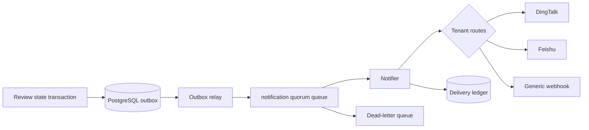

# Notification control plane

## Outcome

Review completion, attention, failure, cancellation, and supersession events
can be routed to DingTalk, Feishu, Slack, or a generic HTTPS webhook. Routes are
tenant-owned and can select a repository prefix, target branch prefix, terminal
event types, and minimum finding severity.

Notification delivery is not part of the merge decision. A slow or unavailable
chat provider must not hold a Git provider webhook, the reviewer, or a required
check open.

## Configuration model

- A destination stores a display name, provider kind, enabled state, and an
  `env:NAME` credential reference. It never stores or returns the webhook URL.
- The self-hosted Compose profile exposes six notifier-only credential slots
  for platform, engineering, security, incident, release, and product channels.
  The console suggests these values while retaining an advanced `env:NAME`
  escape hatch; custom names must also be allowlisted in the notifier service
  environment, so a database write cannot grant itself access to another
  process secret.
- A route binds one destination to `repository_glob`, `branch_glob`, terminal
  event types, and `min_severity`.
- Supported globs are intentionally bounded: exact value, `*`, or a trailing
  prefix wildcard such as `RainLib/*` or `release/*`.
- Only tenant owners and administrators can create destinations or routes.
  Every mutation appends an audit event.
- The routing page can preview a concrete repository/branch/event/finding
  combination without creating an outbox message or resolving a credential. It
  displays every route as selected, filtered, or deduplicated with a reason.

## Delivery semantics

1. The review state transition and outbox event commit together.
2. RabbitMQ fans the same terminal event to reporting and notification queues.
3. The notifier evaluates immutable run/repository/finding data against routes
   ordered by `(created_at, id)`. The first eligible route selects a
   destination; a later eligible route to that same destination is explicitly
   deduplicated. Paused route/destination, event, repository, branch, and
   severity mismatches are filtered. The console preview uses this same
   evaluator before any provider work is admitted.
4. `(event_id, destination_id)` is unique. Successful destinations are skipped
   on redelivery, while failed destinations retry through the inbox claim and
   quorum queue delivery limit.
5. Exhausted messages enter the review DLQ with their delivery ledger retained
   for operations and audit. An administrator can request a targeted retry;
   this creates a new outbox event and preserves the original failed attempt.
6. A destination test is also admitted through the outbox, but has no review
   run. The receipt is created as `pending` before any network request and is
   updated only by the notifier. The request pins the destination revision; a
   paused or changed target becomes a safe failed receipt instead of sending to
   a configuration the administrator did not approve.

## Message contract

Human-facing review cards contain the repository and review number, a provider link,
exact head SHA, target branch, terminal state, finding count, and highest
severity. Generic webhooks receive the provider-neutral `NotificationEvent`
JSON so downstream automation does not parse chat markdown.

When the destination credential includes `signing_secret`, generic webhook
requests carry `X-Open-Review-Timestamp` and
`X-Open-Review-Signature-256: sha256=<hex>`. The signature is HMAC-SHA256 over
`<unix-seconds>.<exact-request-body>`. Receivers should reject a stale
timestamp, compare the signature in constant time, and only then decode JSON.

Test messages use the same provider serializer but are explicitly marked
`test: true`. They contain no synthetic repository, review number, SHA, or
finding data. Their result is available from Delivery logs as
`notification.destination.test`.

## Security and operations

- Outbound URLs must be HTTPS and cannot contain userinfo or fragments.
- Generic webhook receivers should require the optional deployment-owned
  signing secret; chat-provider signing keeps using each provider's native
  protocol.
- Provider response bodies are never persisted because they may echo secrets.
- Use one secret per destination and restrict notifier egress to approved robot
  hosts where the runtime supports an allowlist.
- Rotate a robot by updating the referenced environment secret and restarting
  notifier; no route or repository mapping changes are required.
- Destination and route mutations use explicit revisions, so a stale browser
  cannot overwrite a newer administrative change. The console supports
  pause/enable, recent delivery history, and targeted retry for failed sends.
- Self-hosted phase one resolves deployment-owned `env:NAME` credentials
  inside the notifier process. Encrypted SaaS secret-vault storage remains a
  separate capability.
