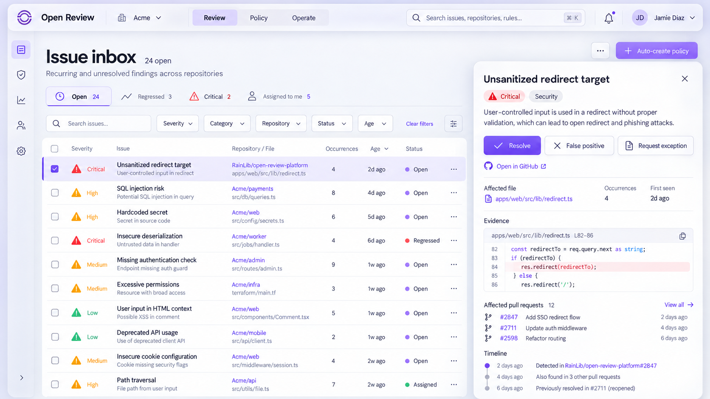
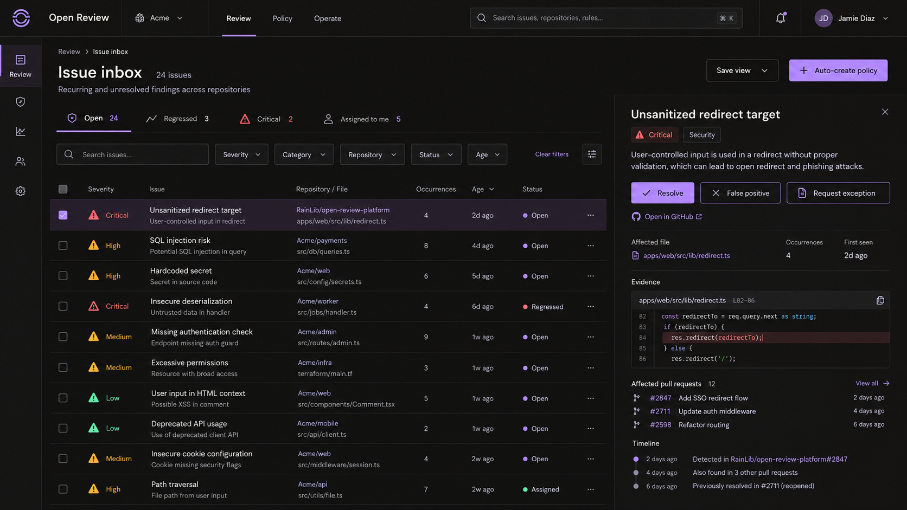
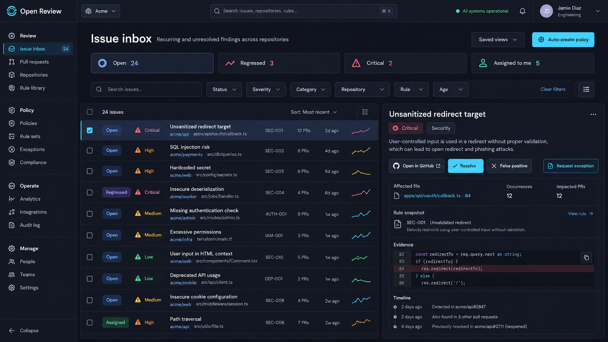
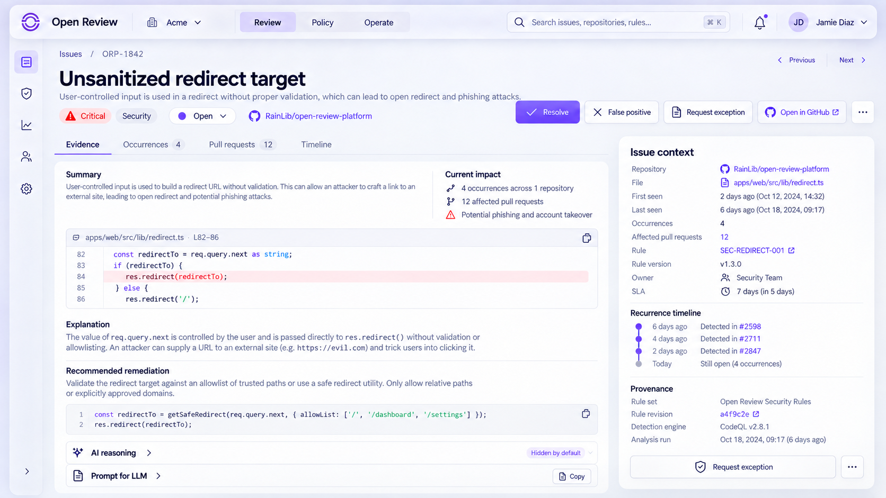
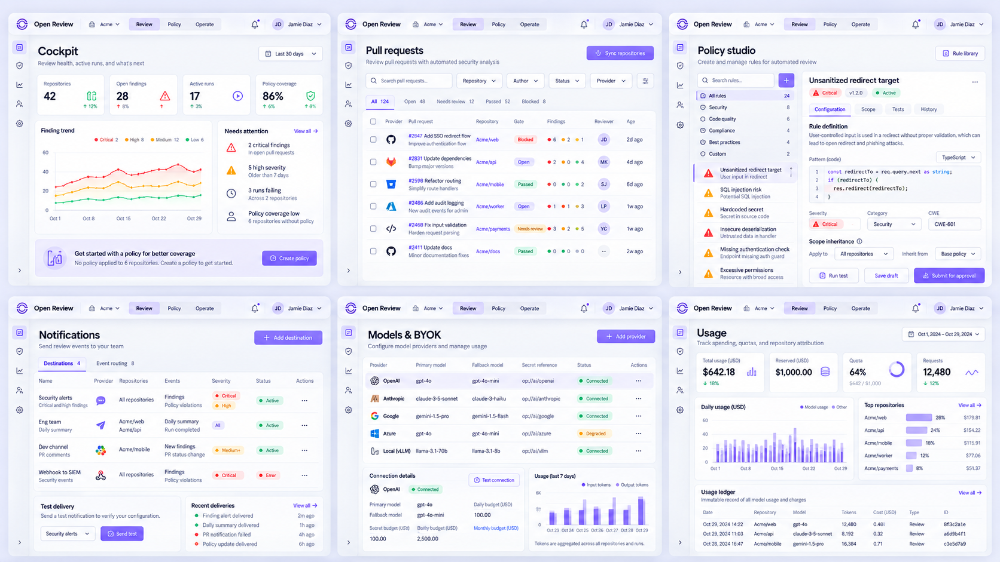
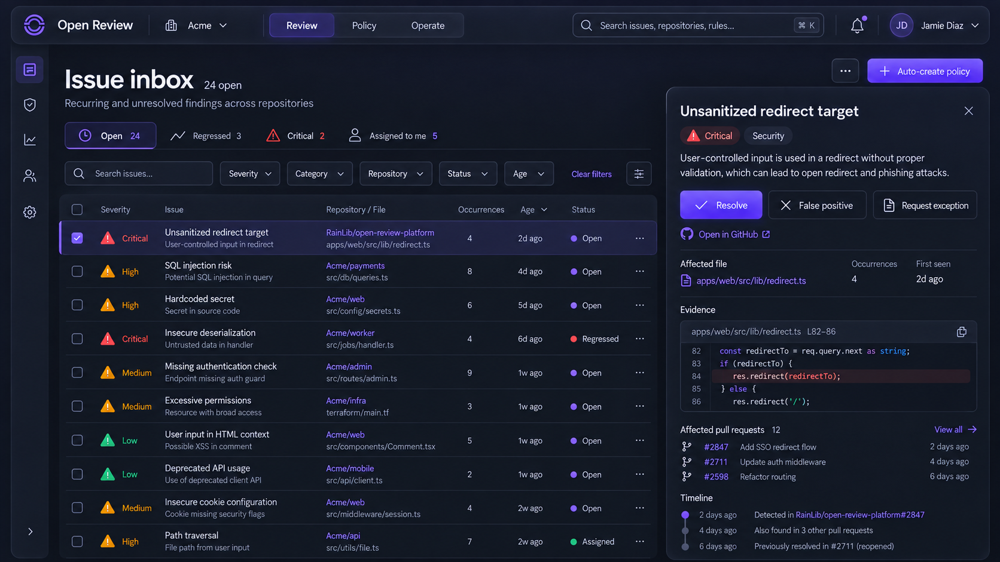
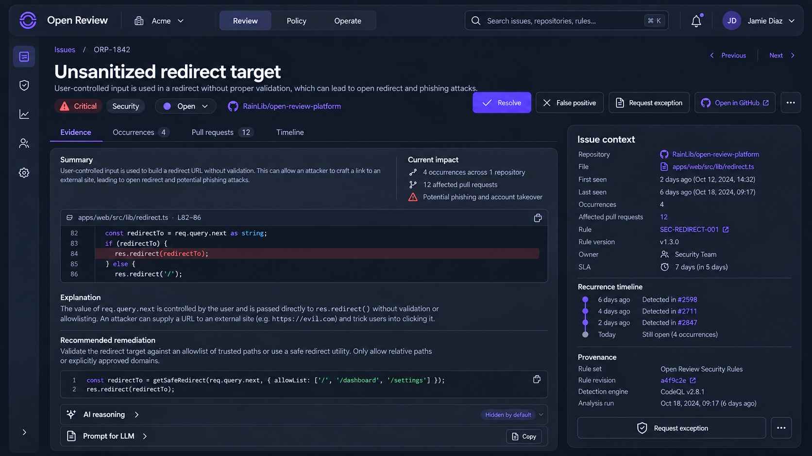
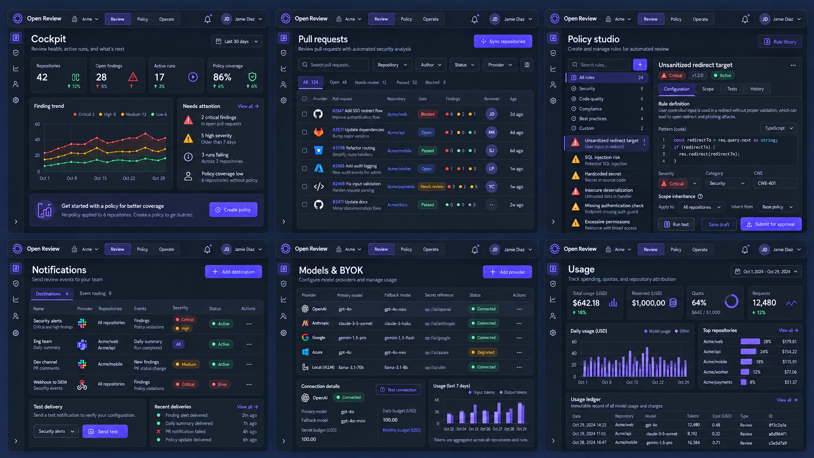
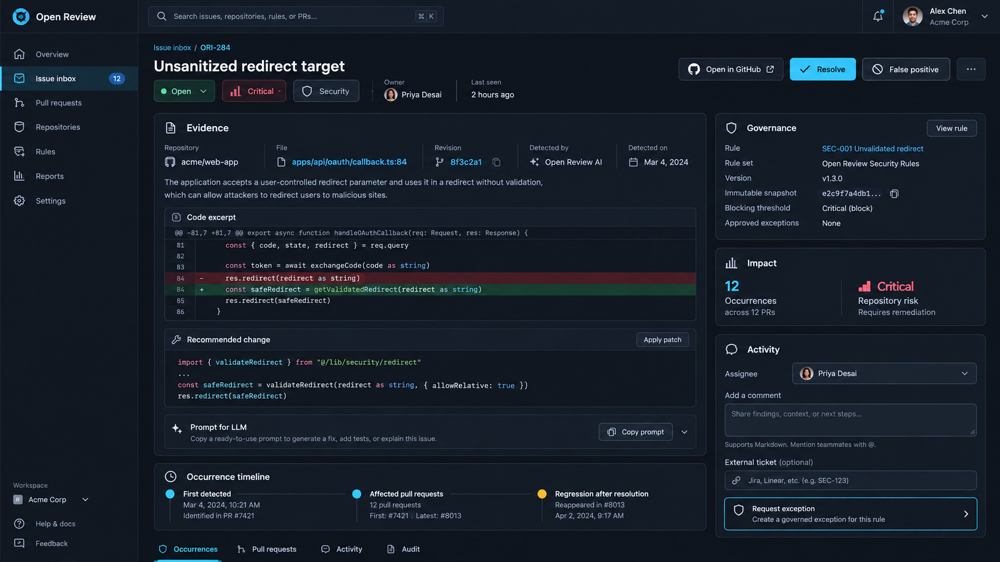
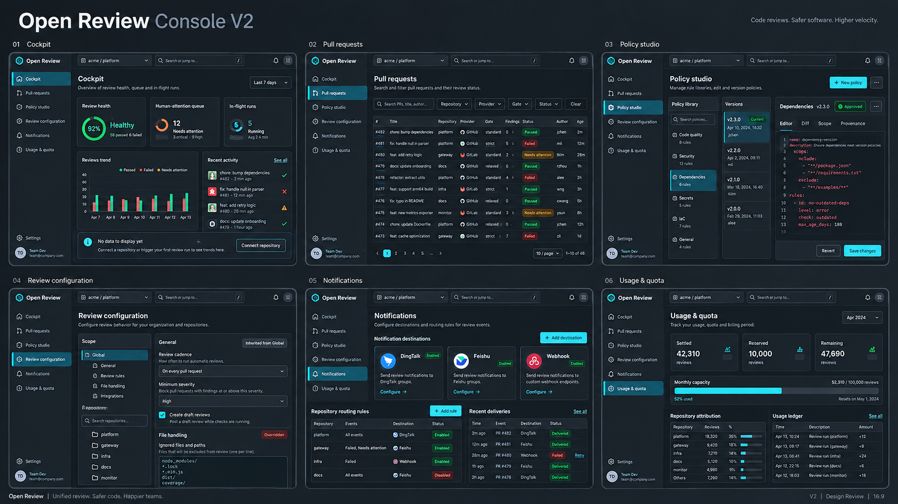

# 14 — Console V2 全页面设计稿清单

> 状态：`APPROVED_BY_OWNER`。2026-09-18 Owner 要求按设计稿开始 1:1 实现核心流程；支付与订阅最后处理。

## 1. 设计结论

Console V2 吸收 Kodus 的功能组织经验，但不复制其导航、命名或视觉：

- 使用紧凑顶栏承载全局领域与工作区，左侧只保留图标级快捷入口，避免管理后台式的厚重导航；
- 将 Pull Requests、CLI Reviews、Tasks 统一成“审查运行”领域，但保留不同入口和筛选上下文；
- 将 Issues 设计为 finding 聚合后的处理工作台，不是简单 finding 表格；
- 将全局/仓库设置做成同一套继承模型，始终显示“当前值来自哪里”；
- 将规则审批、例外、Test Lab、审计和用量作为一级治理能力；
- SaaS 与私有部署共享页面结构，商业订阅只在 SaaS 模式出现。

## 2. 视觉方向：Luminous Spatial

### 2.1 视觉语言

- 画布：珠白、雾灰和极浅薰衣草组成明亮空间，避免纯白刺眼；暗色作为后续主题而不是默认稿。
- 主色：鸢尾紫用于品牌、焦点和主操作；琥珀只用于风险/等待；珊瑚红只用于阻断；薄荷绿只用于已验证完成。
- 材质：半透明与背景模糊仅用于顶栏、图标 rail、浮层 inspector；数据区保持清晰的纸张式表面，禁止全页面玻璃化。
- 层次：优先使用留白、字号、字重、细分隔线和轻柔环境阴影；避免“每块内容一个卡片”。
- 圆角：主要 sheet `20–24px`，工作区表面 `12–16px`，输入框/按钮 `10px`；状态标签允许全圆，但不让所有信息胶囊化。
- 网格：8pt 基础；桌面最大内容宽度 1600px；表格行高 54–58px；正文区保持更大的横向呼吸感。
- 字体：Geist Sans + Geist Mono；数字、SHA、规则键、路径使用等宽字体。
- 动效：140–200ms；仅用于检查器、筛选器、状态更新和运行时间线，不做装饰性漂浮。
- 密度：保留企业工具的信息密度，但通过更宽行距和分组呼吸感降低噪声；一屏只允许一个主操作，次要操作降为文字或描边按钮。
- 原生感：交互节奏参考现代桌面应用的空间关系、工具栏和 sheet，但不复制 macOS Finder、Settings 或任何 Apple 专有资产。
- 原创边界：吸收成熟代码审查产品的信息组织，不复制 Kodus 的品牌、配色、导航或页面结构。

### 2.2 Shell

```text
┌─ 72px rail ─┬──────────────────────────── 68px global bar ───────────────────────┐
│ product     │ workspace · Review / Policy / Operate · command search · identity │
│ shortcuts   ├─────────────────────────────────────────────────────────────────────┤
│             │ breadcrumb / contextual navigation                                 │
│             ├─────────────────────────────────────────────────────────────────────┤
│             │                                                                     │
│             │                 page canvas (max 1600)                              │
│             │                                                                     │
│             │ list/table                         contextual inspector              │
│             │                                                                     │
└─────────────┴─────────────────────────────────────────────────────────────────────┘
```

1024px 下隐藏 rail 的非当前入口，inspector 改为 overlay sheet；390px 下改为底部 4 个主入口 + command sheet。工作区切换保留在顶栏，未初始化工作区只能进入 setup，不能直接进入 console。

## 3. 全页面设计稿清单

### A. 公共、身份与工作区（4 页）

| 页面 | 路由 | 核心稿件 |
| --- | --- | --- |
| 产品首页 | `/` | Hero、工作流证据、Git provider、规则治理、私有部署、CTA |
| 登录 | `/sign-in` | Casdoor/OIDC、私有部署提示、返回路径、错误恢复 |
| 工作区选择 | `/workspaces` | 已初始化/待初始化分组、角色、provider 健康、创建入口 |
| 创建工作区 | `/workspaces/new` | 名称/slug、部署模式、数据区域、创建后进入 setup |

### B. 首次接入（9 页）

| 页面 | 路由 | 核心稿件 |
| --- | --- | --- |
| Setup 总览 | `/setup` | 8 步进度、可恢复状态、安全说明 |
| 选择 Git 工具 | `/setup/provider` | GitHub/GitLab；云与 self-managed 是连接方式，不拆成 provider |
| GitHub App | `/setup/github` | 安装、回调、权限检查、单仓库安装结果 |
| GitLab 连接 | `/setup/gitlab` | GitLab.com / self-managed OAuth 授权；部署档案提供 base URL 与 worker credential；只读连接验证 |
| 选择仓库 | `/setup/repositories` | 搜索、多选、活跃度提示、权限缺失 |
| 审查范围 | `/setup/review-scope` | 我的 PR / 所选仓库全部 PR；draft 与 cadence |
| 团队学习 | `/setup/learning` | 历史 reviewer 选择、排除列表、隐私边界 |
| 严重级别 | `/setup/severity` | Low/Medium/High/Critical，发布与阻断阈值分开 |
| 规则同步与完成 | `/setup/rules` | 配置发现、规则预览、后台同步、进入 Cockpit |

### C. Review 工作台（9 页）

| 页面 | 路由 | 核心稿件 |
| --- | --- | --- |
| Cockpit | `/:org/home` | 健康、待处理、运行中、质量趋势；数据不足时给下一步而非空图 |
| Issues inbox | `/:org/issues` | 聚合 issue 列表、保存视图、组合过滤、自动建 issue 策略 |
| Issue detail | `/:org/issues/:issueId` | 证据、影响 PR、位置、规则版本、时间线、处置与例外入口 |
| Pull requests | `/:org/reviews` | PR 维度状态、gate、finding、仓库/作者/时间筛选 |
| PR review detail | `/:org/reviews/:reviewId` | 多次 run、当前 head、gate 结论、finding 聚合、provider 跳转 |
| Work queue | `/:org/tasks` | 仅运行中/需人工介入；批量排障而非历史库 |
| Run detail | `/:org/tasks/:runId` | 阶段时间线、规则快照、成本/用量、取消/重试、安全错误摘要 |
| CLI reviews | `/:org/cli-reviews` | CLI/API 来源、commit/repo、调用身份、运行状态与证据 |
| Finding explorer | `/:org/findings` | 跨 PR finding 搜索、反馈、误报、规则版本和趋势下钻 |

### D. Policy 工作室（13 页）

| 页面 | 路由 | 核心稿件 |
| --- | --- | --- |
| Policy library | `/:org/rules` | 已启用、推荐、草稿、来源与健康；卡片/紧凑列表切换 |
| Rule detail/composer | `/:org/rules/:ruleSetId` | 版本、规则编辑、diff、验证、送审；右侧生效范围 |
| Discovery gallery | `/:org/rules/discovery` | 可安装规则模板、类别、语言、风险、预览 |
| Approval queue | `/:org/rules/approvals` | content hash、diff、请求人、独立审批、发布条件 |
| Bindings | `/:org/rules/bindings` | tenant/repo/branch scope、precedence、shadow/canary、冲突提示 |
| Exceptions | `/:org/rules/exceptions` | 有期限风险接受、双人审批、到期/撤销、快照证据 |
| Test Lab | `/:org/rules/test-lab` | static preview、历史回放、样本、不发布保证、成本差异 |
| Insights | `/:org/rules/insights` | 命中、采纳、误报、版本/仓库趋势，不伪造不可归因指标 |
| General review | `/:org/review-config/general` | 自动/手动、cadence、draft、approve/request-changes、语言 |
| Categories | `/:org/review-config/categories` | Bug/Security/Performance/Maintainability 开关与权重 |
| Filters | `/:org/review-config/filters` | 发布阈值、阻断阈值、文件/title/branch/path 过滤 |
| Prompts | `/:org/review-config/prompts` | 基础/分类提示词、默认 diff、token 预算、测试入口 |
| PR summary & messages | `/:org/review-config/messages` | 摘要行为、开始/结束/错误模板、上下文变量、实时预览 |

所有 review-config 页面顶部都有 `Global / Repository` 作用域选择器、继承来源、dirty 状态和“恢复继承”操作；不复制两套表单。

### E. Operate 与管理（12 页）

| 页面 | 路由 | 核心稿件 |
| --- | --- | --- |
| Connections | `/:org/connect` | GitHub/GitLab/self-managed 实例、仓库、权限与 webhook 健康 |
| Connection detail | `/:org/connect/:id` | installation、仓库范围、最近 delivery、权限诊断、停用流程 |
| Notifications | `/:org/notifications` | 钉钉/飞书/Webhook 目标、仓库/分支/事件/严重级路由、投递历史 |
| Audit | `/:org/audit` | actor/action/resource/request 过滤、详情、导出 |
| Usage | `/:org/usage` | settled/reserved、仓库归因、额度、不可变账本、SaaS 成本适配 |
| Members | `/:org/settings/members` | 成员、角色、状态、邀请/停用、最后访问 |
| SSO | `/:org/settings/sso` | Casdoor/OIDC/SAML 元数据、域名、测试、强制策略 |
| Models/BYOK | `/:org/settings/models` | provider route、模型、fallback、凭据引用、连通性与预算 |
| API & CLI keys | `/:org/settings/api-keys` | scope/repository/action/expiry、只展示一次、撤销 |
| Data governance | `/:org/settings/data` | retention、导出、删除、备份状态、源码不持久化说明 |
| Subscription | `/:org/settings/subscription` | 仅 SaaS 显示；套餐、席位、额度、发票 |
| Platform health | `/:org/settings/health` | queue age、worker、DLQ、provider/LLM 依赖、runbook 链接 |

## 4. Issues 工作台详细稿

### 4.1 页面结构

```text
Issue inbox                         [Saved views] [Auto-create policy]
Recurring and unresolved findings across repositories

[Open 24] [Regressed 3] [Critical 2] [Assigned to me 5]      Search ⌘K
[Status] [Severity] [Category] [Repository] [Rule] [Age] [+ Filter] [Clear]

┌ issue list (resizable) ───────────────────┬ inspector (row selected) ─────┐
│ status severity title              age     │ Critical · Security           │
│ repo · path · rule · PR count              │ Evidence + recommended action  │
│ repeated fingerprint sparkline              │ Occurrences / PRs / timeline   │
│                                             │ Resolve / false positive       │
│                                             │ Create exception (governed)    │
└─────────────────────────────────────────────┴───────────────────────────────┘
```

### 4.2 数据语义

Issue 不是单条 finding。它按 tenant、repository、rule/fingerprint 和代码位置稳定聚合：

- `open`：至少一个当前 head 上未解决 occurrence；
- `regressed`：已解决 fingerprint 在新 head 再次出现；
- `resolved`：当前活动 PR/MR 中已不存在；
- `suppressed`：命中已批准且未过期的 exception；
- `occurrence_count` 与 `pull_request_count` 分开；
- 任何自动创建 provider issue 的动作都保留 receipt 和去重 key。

### 4.3 Auto-create policy

不使用孤立的全局开关。点击后打开 policy sheet：

- provider issue / Jira / Linear（后两者为扩展）；
- repository scope；
- minimum severity；
- categories/rule set；
- 首次出现、回归、重复 N 次触发；
- 负责人/标签/模板；
- 每个 fingerprint 只保留一个活动外部 issue；
- dry run 显示过去 30 天会创建多少条。

### 4.4 空、错与权限状态

- 真正健康：庆祝型空状态，显示已扫描 PR 与最后同步时间；
- 过滤无结果：保留表头并提供 Clear filters；
- 未启用聚合：解释 finding 与 issue 的区别并提供 Configure；
- 数据同步中：骨架行 + 最近可用数据时间；
- 无权限：不泄漏仓库/路径，只显示所需角色；
- 控制面离线：保留只读缓存并标记 stale，不显示为“0 issues”。

## 5. 组件与抽象

- `WorkspaceShell`：响应式 rail、context bar、workspace switcher；
- `PageHeader`：eyebrow、标题、描述、状态与 actions；
- `FilterBuilder`：字段/操作符/值、URL 序列化、saved views；
- `DataTable`：列配置、行密度、键盘导航、虚拟滚动；
- `InspectorPanel`：列表不丢上下文的右侧详情；
- `StatusChip` / `SeverityChip` / `ProviderMark`：跨页面统一；
- `EvidenceBlock`：revision、rule snapshot、engine、run link；
- `ScopePicker`：global/repository/branch；
- `ProvenanceBanner`：继承来源、覆盖、stale、权限；
- `AsyncAction`：idle/pending/success/error/retry；
- `StatePanel`：loading/empty/error/offline/permission/stale；
- `DangerConfirm`：高风险动作必须展示影响范围和不可逆项。

## 6. 设计验收门禁

- 桌面 1440、笔记本 1024、移动 390 三档稿；
- 所有页面覆盖 loading/empty/partial/error/permission/stale/offline；
- 只用键盘可以完成筛选、打开 inspector、处置 issue 和保存配置；
- 状态不只靠颜色；正文与交互对比度达到 WCAG AA；
- 同一配置在 global/repository 视图中明确显示继承来源；
- provider 跳转必须区分 GitHub、GitLab.com 与 self-managed base URL；
- 设计评审通过前不修改生产页面。

## 7. 视觉稿分组

第一轮方向稿用于验证功能结构，但其冷青色、厚重侧栏和卡片化层次在设计评审中被否决，只保留为历史对照，不得作为实现基线。

第二、三轮从 Issues inbox 开始重做视觉语法，并已将确认方向扩展到 Light/Dark 的 Issue detail 与全页面系统板：

1. `console-v2-issues-inbox-v3-apple.png`：当前优先候选，明亮空间化 Issues inbox；
2. `console-v2-issues-inbox-v2.png`：暗色 Obsidian Paper 备选；
3. `console-v2-issues-inbox.png`：已否决的第一轮 Issues 方向，仅供对照；
4. `console-v2-issue-detail-v3-apple.png`：Luminous Spatial Issue detail；
5. `console-v2-screen-system-v3-apple.png`：Cockpit、PR、Policy、Notifications、Models、Usage 系统板；
6. `console-v2-issues-inbox-v3-dark.png`：Dark Issues inbox；
7. `console-v2-issue-detail-v3-dark.png`：Dark Issue detail；
8. `console-v2-screen-system-v3-dark.png`：Dark 六屏系统板；
9. `console-v2-issue-detail.png` 与 `console-v2-screen-system.png`：已否决的第一轮稿，仅供对照。

方向确认后，再按本文件第 3 节逐页出 1440/1024/390 三档高保真稿。

页面族与 tab 切换态已进入详细设计，覆盖 Issues、Issue detail、PR/run、Policy、Operate、Review 配置、企业管理、Onboarding、治理分析与 Workspace/访问状态。设计稿和交互语义统一收录在 [16-console-v2-page-state-mockups.md](16-console-v2-page-state-mockups.md)。核心布局的响应式逐屏稿、扩展 Dark 页面与 token 对比度审计见 [17-responsive-dark-validation.md](17-responsive-dark-validation.md)；真实组件的无障碍验证仍属于实现前门禁。

PR 详情、连接与通知、企业设置、Onboarding 与 Policy 治理的二级页面和 Tab 已进一步拆成 30 个高保真桌面状态，详见 [19-console-v2-detailed-tab-mockups.md](19-console-v2-detailed-tab-mockups.md)。这些新增稿当前处于 Owner 评审状态；确认后才作为逐页 1:1 实现基线。

### 7.1 Issues inbox V3 — 当前优先候选



本稿的关键变化：

- 珠白画布与低对比雾灰材料，降低传统安全后台的压迫感；
- 顶栏、rail 与 inspector 使用有限的半透明层，数据表保持清晰不透；
- 更大的标题、行距与留白，建立接近原生桌面应用的视觉节奏；
- inspector 作为浮动 sheet 呈现，仍与当前列表保持明确上下文；
- 主操作使用鸢尾紫，severity 继续使用独立语义色；
- 所有主要能力完整保留，没有用视觉简化替代业务功能。

### 7.2 Issues inbox V2 — 暗色备选



本稿的关键变化：

- 全局顶栏 + 轻量图标 rail，释放横向空间；
- saved views 变成紧凑分段入口，不再使用 KPI 卡片；
- issue 列表通过排版和细分隔线组织，选中态使用低饱和紫色表面；
- inspector 与列表共用同一工作平面，证据、PR 和时间线不再层层套卡片；
- 风险颜色严格语义化，品牌色不与 severity 竞争；
- 主操作集中在处置区，外部跳转和次要动作降级展示。

### 7.3 第一轮方向 — 已否决，仅留档



### 7.4 Issue detail V3 — 当前优先候选



详情页不重复列表摘要，而是围绕“理解证据 → 判断影响 → 采取治理动作”组织：

- 标题区同时给出状态、仓库和可执行动作；
- Evidence、Occurrences、Pull requests、Timeline 共享一套上下文；
- 代码证据、解释和修复建议处于主阅读流；
- AI reasoning 默认收起，Prompt for LLM 可复制但不抢占页面；
- 右侧 context sheet 固定展示规则版本、SLA、复发时间线和 provenance；
- exception 从风险处置入口进入审批流程，不表现成普通开关。

### 7.5 Screen system V3 — 当前优先候选



系统板验证同一视觉语法可覆盖六类工作模式：

- Cockpit：健康、趋势、待处理和下一步；
- Pull requests：高密度筛选与 gate 列表；
- Policy studio：规则目录、编辑、继承、测试和审批；
- Notifications：目标、路由、投递测试和历史；
- Models & BYOK：模型路由、fallback、密钥引用、健康与预算；
- Usage：settled/reserved、配额、仓库归因和不可变账本。

### 7.6 Luminous Spatial Dark

Dark 不是 Light token 的机械反色。导航、浮层、数据面、代码面和 semantic colors 分别校准，保持相同信息架构与交互位置。

#### Issues inbox



#### Issue detail



#### Screen system



Dark 主题约束：

- 不使用纯黑、青色霓虹或发光描边；
- 表格和代码区使用不透明 graphite 表面；
- frosted material 仍只用于 toolbar、rail 和临时 sheet；
- 通过色调差、hairline 和单层柔和阴影表达深度；
- 次级文字、disabled、selection 和 focus 必须独立通过对比度验收；
- severity 色在暗背景上重新校准，不能直接复用 Light 数值。

### 7.7 第一轮 Issue detail — 已否决，仅留档



### 7.8 第一轮 Screen system — 已否决，仅留档


