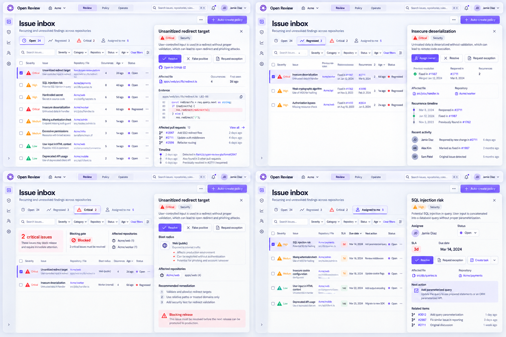
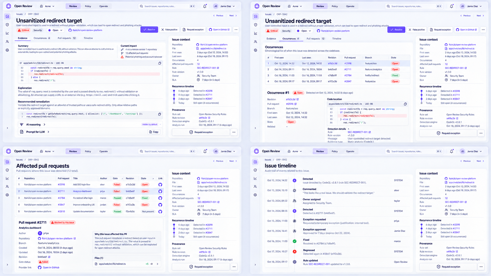
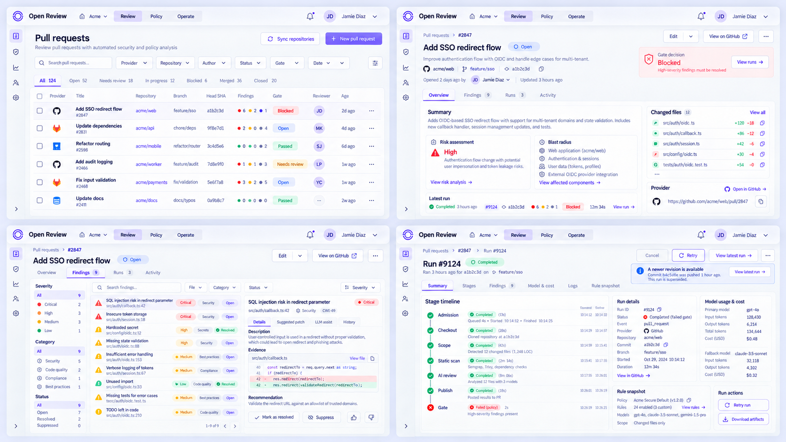
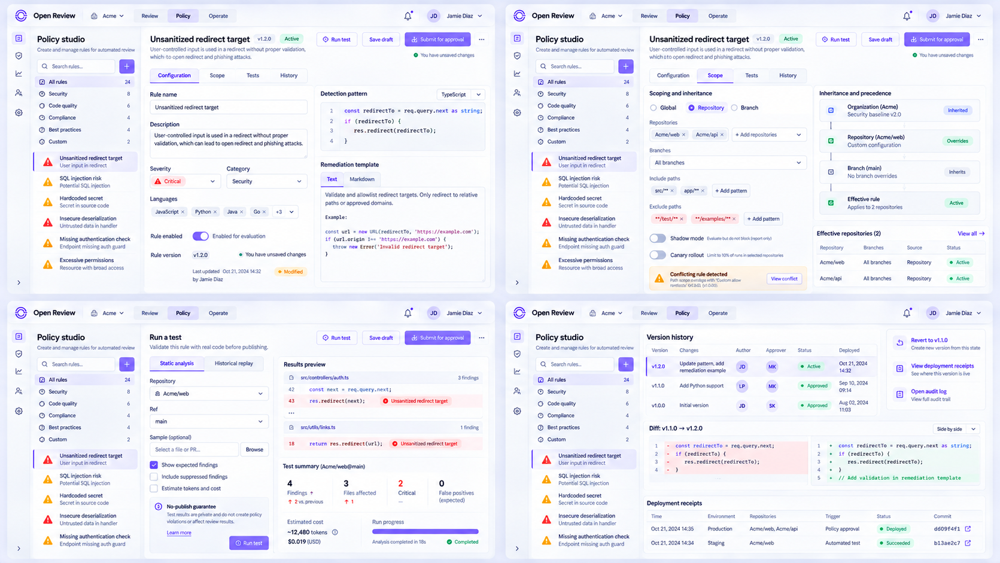
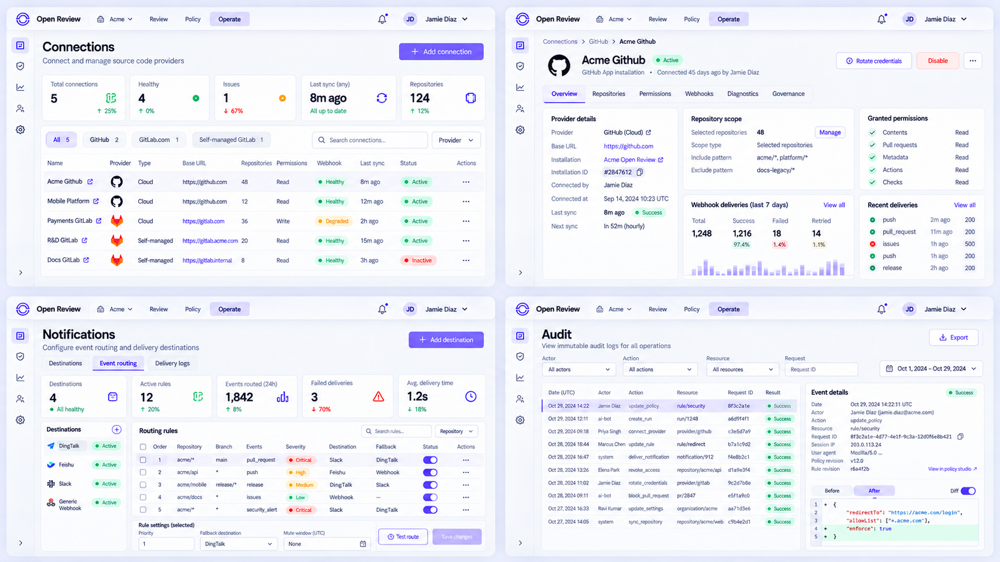
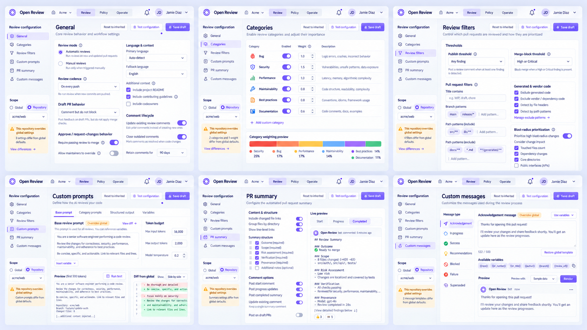
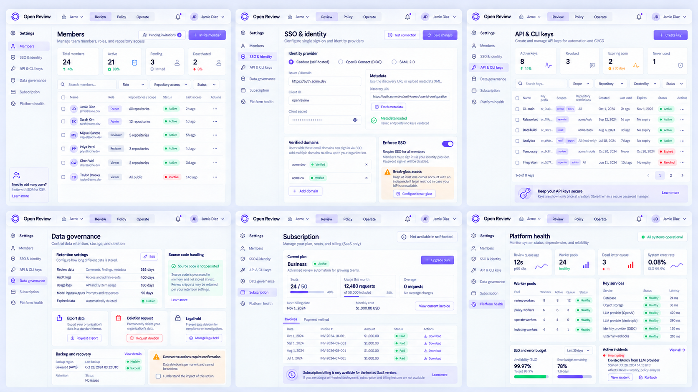
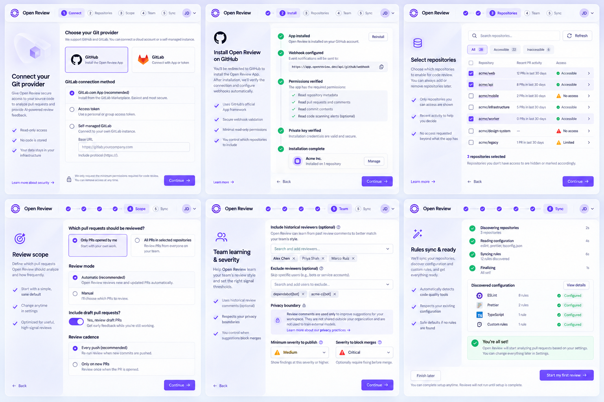
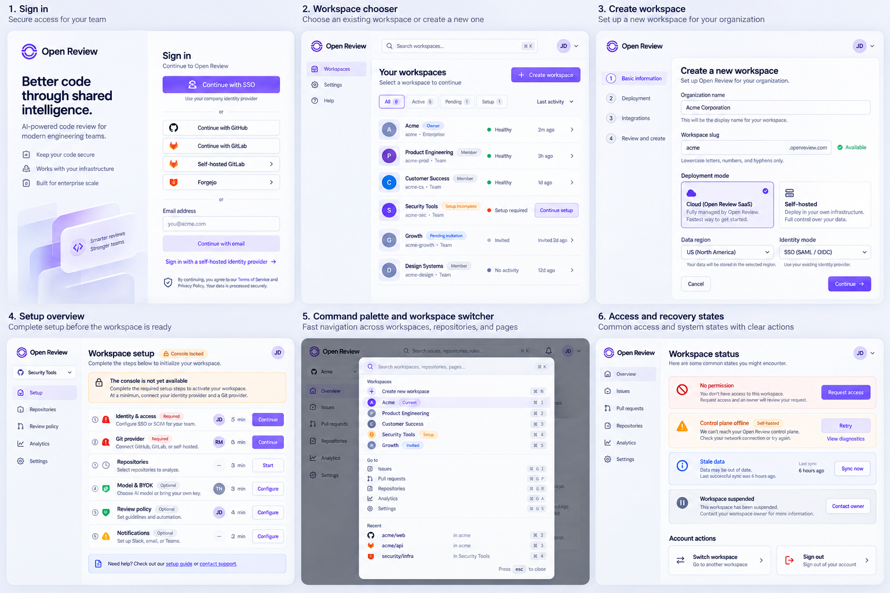
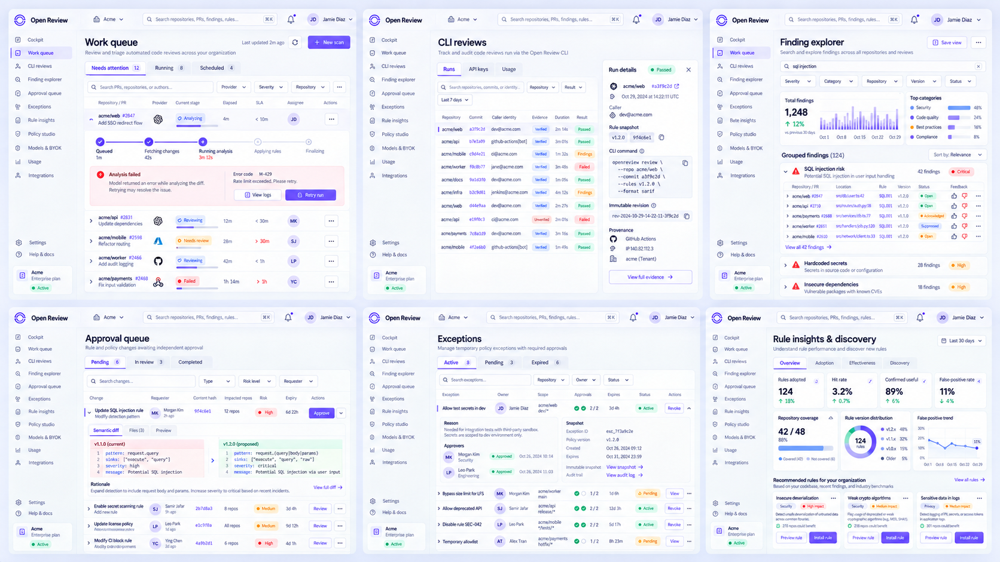

# 16 — Console V2 页面与切换状态设计稿

> 状态：`APPROVED_BY_OWNER`。2026-09-18 Owner 授权按本页面族与状态语义开始实现；支付与订阅延后，其他页面按核心链路顺序交付。

## 1. 设计目标

这一轮不再用一张静态页面代表整个模块，而是验证“切换之后页面如何变化”：

- tab 必须改变数据语义、主要任务和可用操作，不能只移动选中下划线；
- 列表、详情、运行证据、策略和配置共用 Luminous Spatial token 与组件契约；
- GitHub、GitLab.com、self-managed GitLab 与 Forgejo 保留各自 provider identity 和 deep link；
- 未初始化 workspace 只能进入 setup；权限、离线、stale、suspended 均有独立恢复动作；
- Light 稿用于结构评审，Dark 使用相同信息架构和 [15-luminous-spatial-design-system.md](15-luminous-spatial-design-system.md) 中独立校准的 token，不做机械反色。

## 2. 页面覆盖矩阵

| 页面族 | 页面 / tab | 设计稿 |
| --- | --- | --- |
| Issues inbox | Open、Regressed、Critical、Assigned to me | `console-v2-issues-tabs.png` |
| Issue detail | Evidence、Occurrences、Pull requests、Timeline | `console-v2-issue-detail-tabs.png` |
| PR 与运行 | Pull requests、PR Overview、PR Findings、Run detail | `console-v2-pr-run-workflow.png` |
| Policy Studio | Configuration、Scope、Tests、History | `console-v2-policy-tabs.png` |
| Operate | Connections、Connection detail、Notifications/Event routing、Audit | `console-v2-operate-integrations.png` |
| Review 配置 | General、Categories、Review filters、Custom prompts、PR summary、Custom messages | `console-v2-review-configuration.png` |
| 企业管理 | Members、SSO、API/CLI keys、Data governance、Subscription、Platform health | `console-v2-enterprise-management.png` |
| 首次接入 | Provider、GitHub App、Repositories、Scope、Learning/Severity、Rules/Ready | `console-v2-onboarding-flow.png` |
| 治理与分析 | Work queue、CLI reviews、Finding explorer、Approvals、Exceptions、Rule insights | `console-v2-governance-analysis-board.png` |
| 访问与 workspace | Sign in、Chooser、Create、Setup、Command palette、Recovery states | `console-v2-workspace-access-board.png` |

## 3. Issues 页面族

### 3.1 Inbox 切换态

| Tab | 数据范围 | 主要差异 | 主操作 |
| --- | --- | --- | --- |
| Open | 当前 head 上仍活动的 issue | 显示 age、occurrence、受影响 PR 和 owner | Assign / Resolve |
| Regressed | 已解决后再次出现 | 显示首次解决 revision、回归 revision 与复发次数 | Open evidence |
| Critical | 当前达到 critical 的活动 issue | 固定风险、信任边界和 merge gate 列 | Review now |
| Assigned to me | 当前用户负责的活动 issue | 显示 SLA、due state 与团队上下文 | Update status |

同一个 issue 在不同 tab 中保留稳定 `issue_id`，切换 tab 不应清空 inspector 中已选择对象；如果对象不属于新范围，inspector 关闭并把焦点返回 tab。

### 3.2 Detail 切换态

- **Evidence**：代码证据、规则、解释、建议修改和可复制 LLM prompt；文件路径与 revision 必须可跳转。
- **Occurrences**：按 revision 和 branch 展示 fingerprint 命中，区分 active、resolved、suppressed、regressed。
- **Pull requests**：展示每个关联 PR/MR 的 provider、gate、review run 与最新结论。
- **Timeline**：只记录可审计事件；规则版本、exception、状态、反馈与外部同步都带 actor 和 receipt。

## 4. Pull request 与 durable run

- PR 列表负责筛选和 gate 判断，不在列表塞入完整 finding 内容；
- Overview 回答“能否合并、为什么、证据是否完整”；
- Findings 按代码位置展示详细结论、建议 patch 与 prompt，summary 只保留导航性摘要；
- Run detail 展示 durable stage、每阶段 attempt、耗时、输入 revision、规则快照、模型路由与失败恢复；
- 新 revision 到达后旧 run 标记 `superseded`，不能继续承担新 revision 的 merge evidence。

## 5. Policy Studio

| Tab | 任务 | 必须显示的证据 |
| --- | --- | --- |
| Configuration | 编辑规则与阻断阈值 | 当前版本、草稿状态、继承来源 |
| Scope | 绑定 workspace/repository/branch | include/exclude、冲突解析、影响仓库数 |
| Tests | 用 fixtures 或历史 PR dry run | baseline、candidate、差异、假阳性反馈 |
| History | 审批与版本追溯 | content hash、actor、approval、rollback target |

Publish、exception 和 rollback 必须进入 `AsyncAction`，服务端 receipt 返回前不能显示成功。

## 6. 连接、通知与审计

- Connections 首屏只展示 provider、安装范围、健康和最后同步；敏感配置进入 detail sheet；
- GitLab 的 `gitlab.com` 与 self-managed `base_url` 是同一 provider 的不同连接方式；
- Event routing 以“事件 + repository scope + 条件 → destinations”表达，支持钉钉、飞书和通用 webhook；
- Delivery logs 显示幂等键、attempt、HTTP result、重试时间与脱敏响应；
- Audit 是不可变事件查询，不允许用普通列表删除语义处理。

## 7. Review 配置

六个页面共用 `SettingsScopeHeader`，始终显示 workspace/repository scope、继承来源与未保存状态：

1. General：自动审查、draft、重新审查和 merge gate；
2. Categories：Bug、Security、Performance、Maintainability 等类别开关与最低 severity；
3. Review filters：路径、作者、标签、分支和 generated/vendor 排除；
4. Custom prompts：受信系统指令与 repository context 分区，附注入边界；
5. PR summary：summary sections、长度、Change Contract 与验证证据；
6. Custom messages：started、completed、blocked、failed、superseded 等生命周期模板。

## 8. 企业管理

- Members、SSO、API/CLI keys 和 Data governance 在 SaaS/self-hosted 中均存在；
- Subscription 仅 SaaS 可见，self-hosted 由 entitlement/许可证状态替代；
- Platform health 展示 queue age、worker、DLQ、provider/LLM dependency 和 runbook；
- 密钥只展示 reference、scope、创建人、最后使用和 expiry，创建后的明文只显示一次。

## 9. Onboarding 与访问状态

### 9.1 首次接入流程

流程保持可恢复：Git provider → 安装/授权 → 仓库 → review scope → learning/severity → rules sync。GitHub App 回调、权限和单仓库安装结果是独立状态；仓库未授权时不能伪装成空仓库。

### 9.2 登录、workspace 与恢复

- chooser 区分 active、pending invitation 和 setup incomplete；
- 创建 workspace 时明确 Cloud / Self-hosted、region 与 identity mode；
- required setup 未完成时 console locked，不能自动进入 `/:org/home`；
- workspace switcher 同时是 command palette，可跳转页面、仓库和最近对象；
- no permission、offline、stale、suspended 分别提供 request、diagnostics/retry、sync、contact owner，不合并成一个 generic error。

## 10. 治理与分析

- Work queue 区分 needs attention、running 和 scheduled，并展开 durable stage 与 retry 依据；
- CLI Reviews 保留 caller identity、commit、规则快照、证据、运行来源和可复现命令；
- Finding Explorer 用于跨 PR 查找、反馈、抑制与规则版本趋势，不替代 issue aggregation；
- Approval queue 显示 semantic diff、content hash、impact 和独立审批；
- Exceptions 必须有 owner、reason、scope、双人审批、expiry、revoke 和不可变 snapshot；
- Rule insights 将 adoption、hit rate、confirmed useful、false-positive 和 version distribution 作为规则治理依据。

## 11. 组件化边界

| 组件 | 复用页面 | 责任边界 |
| --- | --- | --- |
| `WorkspaceShell` | 全部 console | workspace、domain、rail、command、identity |
| `TabStateRouter` | Issues、PR、Policy、Settings | URL/state 同步、权限和焦点恢复，不负责数据呈现 |
| `DataSurface` | Inbox、PR、CLI、Audit、Keys | 列、行、选择、空错态、虚拟化 |
| `InspectorSheet` | Inbox、queue、approval、settings | 保持列表上下文的 focused detail |
| `EvidenceViewer` | Issue、finding、PR、run | revision、path、line、rule snapshot、deep link、copy prompt |
| `ScopeProvenance` | Policy、Review config、Models | scope、继承、覆盖、stale 与权限 |
| `DurableRunTimeline` | PR、Work queue、CLI | stage/attempt、receipt、retry、superseded |
| `GovernedAction` | Publish、Exception、Key、SSO | 影响预览、审批、确认、异步 receipt |
| `ProviderIdentity` | Git/PR/repository links | provider icon、host、base URL 和安全 deep link |
| `StatePanel` | 全部页面 | loading、healthy empty、filtered empty、partial、error、permission、stale、offline |

## 12. 后续评审门禁

本轮已经补齐桌面页面族和 tab 语义。核心布局的响应式与扩展 Dark 验证见 [17-responsive-dark-validation.md](17-responsive-dark-validation.md)，进入实现前仍需完成：

- 在真实组件上复验 1440 / 1024 / 390 行为和新增页面 Dark 表现；
- table、sheet、form、code/diff、chart 在浏览器渲染后的 WCAG AA 检查；
- 键盘路径、200% zoom、reduced motion 和 screen-reader name/role/state 评审；
- Owner 已确认页面语义与实现方向；每个切片仍需用实际 API 字段、角色负面测试和 SaaS/self-hosted 配置验证差异。

后续变更评审继续使用 `APPROVED`、`APPROVED_WITH_CHANGES`、`CHANGES_REQUESTED`；已批准页面可以实现，但未验证能力不得以静态 UI 宣称完成。

## 13. 二级 Tab 细化补充

本文件定义页面族与数据语义；[19-console-v2-detailed-tab-mockups.md](19-console-v2-detailed-tab-mockups.md) 进一步补齐以下可实现高保真状态：

- Pull requests 与 PR detail 的 Overview、Findings、Files、Checks、Activity；
- Connections 的 Installation、Repositories、Webhooks、Activity；
- Notifications 的 Destinations、Event routing、Delivery logs；
- Members、SSO、Models & BYOK、API & CLI keys、Data governance、Platform health；
- Onboarding 的 provider/install/repository/scope/learning/severity/sync/ready；
- Policy library、Discovery、Approvals、Bindings、Exceptions、Insights。

新增稿保持支付与订阅延后，状态为 `DRAFT_FOR_OWNER_REVIEW`，Owner 确认后再升级为实现验收基线。
