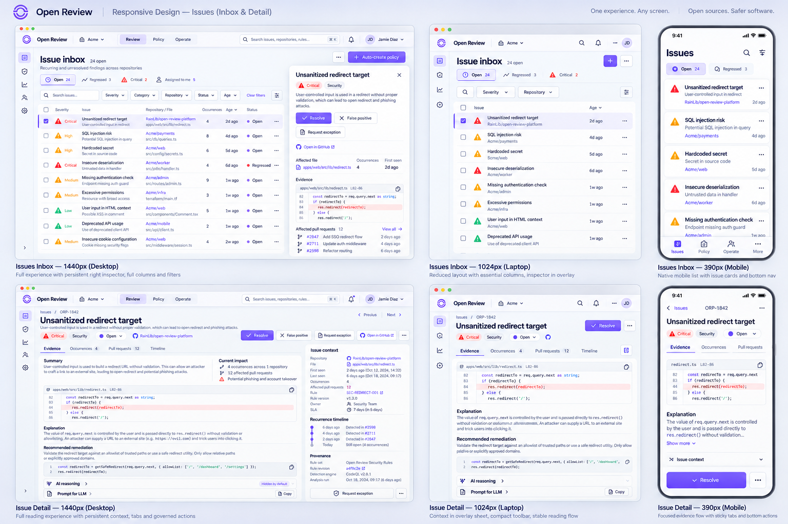
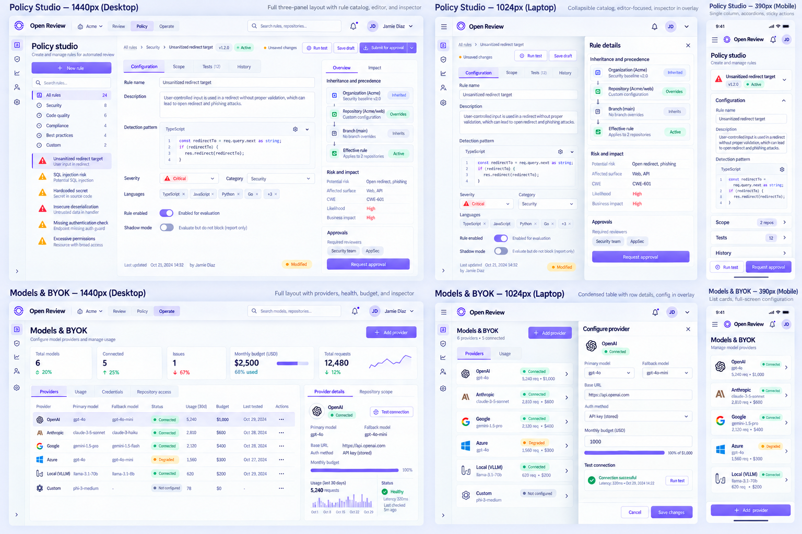
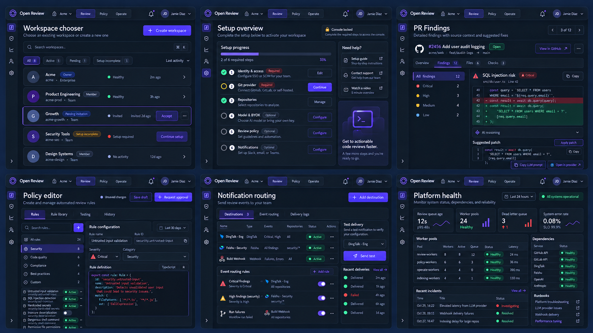

# 17 — Console V2 响应式与 Dark 验证

> 状态：`APPROVED_BY_OWNER`。2026-09-18 Owner 授权进入实现；本文件继续作为 1440 / 1024 / 390、Light / Dark 与可访问性验收契约。

## 1. 验证范围

本轮选取四种会决定组件实现方式的核心布局：

1. Inbox + inspector；
2. Evidence detail + context；
3. Split editor + provenance；
4. Operational settings + configuration sheet。

逐屏稿不是将桌面等比缩小。每个断点都重新确定导航、数据呈现、sheet、主要动作和焦点恢复方式。

## 2. Inbox 与 Evidence detail

| 能力 | 1440 Desktop | 1024 Laptop | 390 Mobile |
| --- | --- | --- | --- |
| 导航 | compact rail + global toolbar | rail 缩减，command 保留 | compact top bar + 4 项 bottom nav |
| Inbox 数据 | 完整列 + persistent inspector | 隐藏低优先列，inspector overlay | 语义卡片，不压缩桌面表格 |
| Filters | inline builder | 核心条件 inline，其余 sheet | full-screen filter sheet |
| Detail context | stable right context | overlay sheet，保留阅读位置 | full-screen context sheet |
| Tabs | 标题下完整 tabs | 完整 tabs，允许横向滚动 | sticky compact tabs |
| Actions | 标题区 + context | compact toolbar | safe-area bottom action bar |
| Code | 工作面内完整宽度 | 主阅读流自适应 | 代码块内部横向滚动 |

在任何宽度下，path、revision、provider deep link、copy prompt 和 governed action 都不能因响应式降级而消失。

## 3. Policy 与 Models/BYOK

| 能力 | 1440 Desktop | 1024 Laptop | 390 Mobile |
| --- | --- | --- | --- |
| Policy catalog | 固定左栏 | collapsible drawer | 顶部 rule selector |
| Policy editor | editor + provenance inspector | editor 独占 canvas，inspector overlay | section accordion + internal code scroll |
| Policy actions | header actions | header compact actions | sticky Test / Request approval |
| Models list | table + detail inspector | condensed semantic rows + overlay | provider cards + full-screen form |
| Secret | 只显示 credential reference | 同左 | 同左，永不回显明文 |
| Async feedback | queued/running/receipt | overlay 内保持 | form sheet 内保持并可恢复 |

1024 和 390 下只改变呈现，不改变 scope、继承、预算、连接健康、审批或审计语义。

## 4. 扩展页面 Dark

验证板覆盖：

- Workspace chooser：active、pending invitation、setup incomplete；
- Setup overview：required step 未完成时 console locked；
- PR Findings：代码、diff、suggested patch、Prompt for LLM 和 provider deep link；
- Policy editor：catalog、editor、provenance、unsaved 与 approval；
- Notification routing：钉钉、飞书、Webhook 路由和 delivery；
- Platform health：queue、worker、DLQ、依赖、incident 与 runbook。

Dark 使用独立 graphite 表面和 hairline；表格、表单、代码与长正文保持不透明。紫色只承担品牌/操作，不替代 severity。

## 5. WCAG 对比度审计

计算采用 WCAG 2.x 相对亮度公式。背景分别是 Light `#FCFCFE` 和 Dark `#151821`；结果保留两位小数。

| Token / 组合 | Ratio | 结论 |
| --- | ---: | --- |
| Light `--text` | 17.51:1 | AA/AAA 正文 |
| Light `--text-secondary` | 6.42:1 | AA 正文 |
| Light `--text-tertiary` | 3.43:1 | 仅大字/UI；普通正文禁止 |
| Light `--accent` | 5.19:1 | AA 正文 |
| White on Light `--accent` | 5.32:1 | AA 正文 |
| Light `--critical` | 3.82:1 | 仅大字/UI；正文使用 `--critical-text` |
| Light `--warning` | 2.77:1 | 不能直接用于 surface 上的文字/独立图标 |
| Light `--success` | 3.37:1 | 仅大字/UI；正文使用 `--success-text` |
| Light `--critical-text` `#C83239` | 5.16:1 | AA 正文 |
| Light `--warning-text` `#A95E00` | 4.78:1 | AA 正文 |
| Light `--success-text` `#167A52` | 5.20:1 | AA 正文 |
| Dark `--text` | 15.79:1 | AA/AAA 正文 |
| Dark `--text-secondary` | 8.85:1 | AA/AAA 正文 |
| Dark `--text-tertiary` `#9693A8` | 5.94:1 | AA 正文 |
| Dark `--accent` `#9B81FF` | 5.89:1 | AA 正文 |
| Dark `--accent` on `--accent-soft` | 4.87:1 | AA 正文 |
| Dark `--critical` | 6.08:1 | AA 正文 |
| Dark `--warning` | 8.81:1 | AA/AAA 正文 |
| Dark `--success` | 9.58:1 | AA/AAA 正文 |
| Dark `--info` | 6.77:1 | AA 正文 |
| Dark `--on-accent` `#171525` on `--accent` | 5.96:1 | AA 正文 |

图片用于布局与层次评审，不是颜色测量来源；实现必须使用 token，并在浏览器渲染后再次跑自动与人工对比度检查。

## 6. 实现约束

- `DataSurface` 在 390 下切换到 semantic list renderer，不以 CSS 缩放桌面表格；
- overlay/full-screen sheet 关闭后焦点返回原触发点；
- breakpoint 变化不能丢失 selected item、filter、tab、draft 或未提交表单；
- bottom action bar 尊重 safe area，不遮挡代码或最后一项；
- Light semantic base colors 用作 fill 时必须选择已验证的前景色；surface 上正文使用 `*-text` token；
- Dark code/diff、chart、focus、selection 和 disabled state 仍需在真实组件实现中逐项复验。

## 7. 真实组件验证记录（2026-09-22）

已登录、经 Cloudflare 暴露的 repository-scoped Issue-format editor 在生产
Console image 上完成 1440×900、1024×768 与 390×844 三个断点的只读审计：

- 三个断点均保持一个 `main`、一个 `h1`、一个 selected tab、零重复 ID、零无名
  交互控件、零小于 24px 的交互目标和零页面级横向溢出；
- 自定义 computed-style 审计分别验证 96、96、91 个可可靠解析为纯色背景的
  可见文本节点；首次运行发现 6 个 dark 小字号对比度失败，最低为白字/强调色
  的 3.69:1；
- dark `--accent`、`--text-tertiary` 与新增 `--on-accent` 经统一 token 修复后，
  三个断点均为零已测失败；渐变、半透明合成等无法可靠归因的 18、18、21 个
  节点明确跳过，不把自定义审计冒充完整 axe 结果；
- DevTools 模拟 `prefers-reduced-motion: reduce` 后检查 398 个可见节点，零节点
  保留超过 0.01ms 的 transition/animation，且 animation iteration 均为 1；测试后
  已恢复媒体与 viewport 覆盖。
- DevTools page scale `2` 下 visual viewport 正确变为布局 viewport 的一半，页面
  仍保留一个 `main`/`h1` 且无 document-level overflow；该证据只覆盖视觉缩放，
  不冒充真实浏览器 200% zoom 的重排与人工阅读验收。
- 当前生产 Console image 随后以已登录会话对 35 个静态后台路由完成
  1440×900 与 390×844 双断点审计（70/70）：每页均保留一个 `main`、一个
  `h1`、命名控件、唯一 ID、至少 24px 的有效交互目标、零页面级横向溢出、
  零 Next error overlay，且两个时间窗口内均无浏览器 warning/error。首轮审计
  找到 Home/Reviews/Tasks/Audit/API Keys 的真实小目标并已修复；同时捕获
  Platform Health 的 SSR/browser 时间格式 hydration 失败，现以固定 `en + UTC`
  和服务端采样时间确定性渲染，重新部署后的完整双断点复测为零错误。该检查是
  自定义结构/目标/日志审计，不冒充 axe 或人工辅助技术验收。

## 8. 尚未关闭的门禁

- 对代表性路由执行 200% zoom 与人工 screen-reader 验证；
- 在已登录 route suite 上运行正式 axe（含复合背景、状态变化与 dialog）并记录
  结果；当前 computed-style 审计只关闭纯色文本对比度的代表性证据；
- Owner 已确认本轮页面语义并授权实现；剩余门禁是 axe、真实 200% zoom 与
  人工辅助技术证据。
