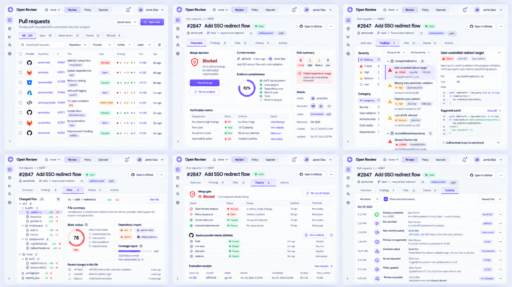
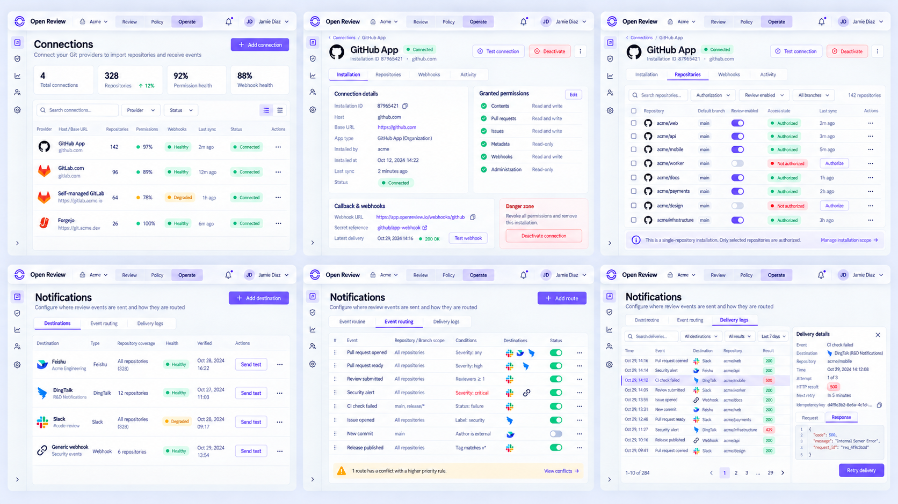
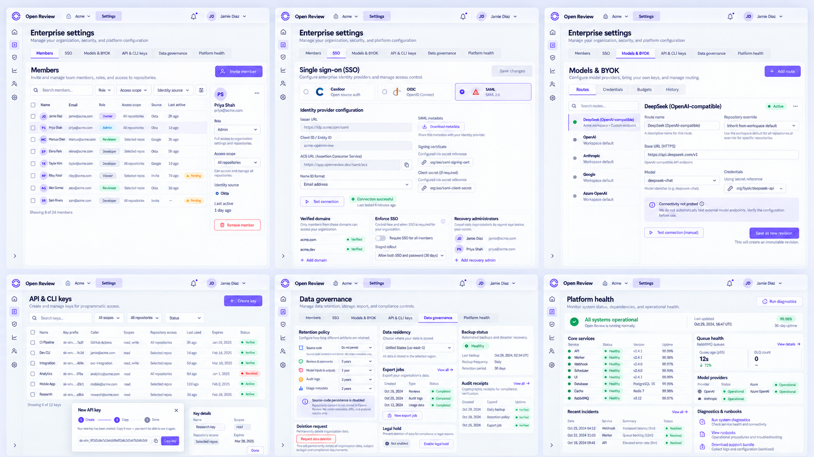
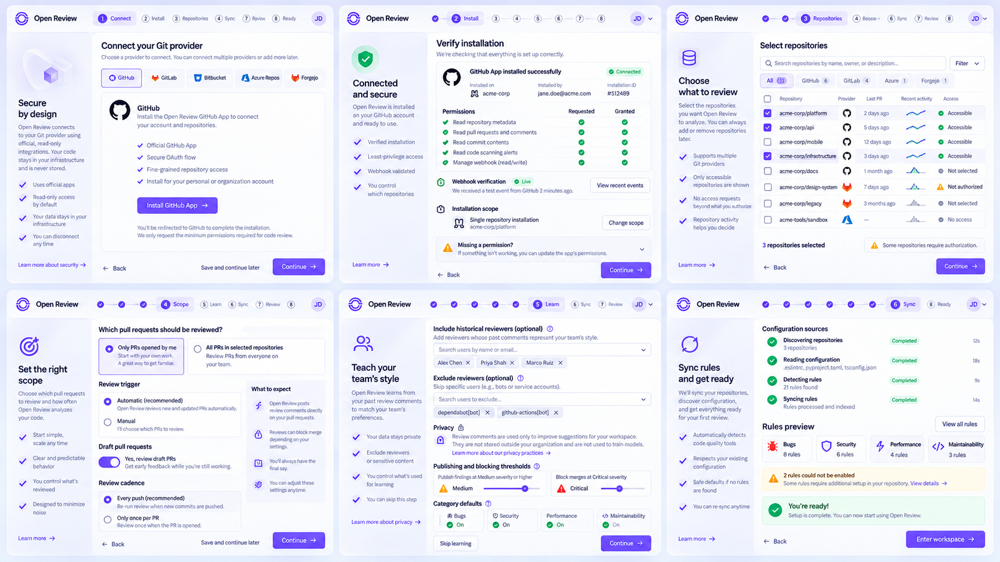
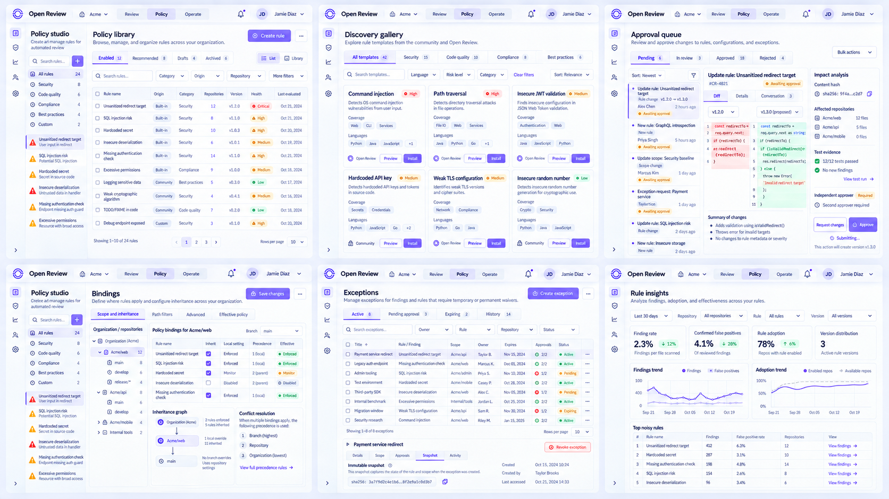

# 19 — Console V2 二级页面与 Tab 细化稿

> 状态：`DRAFT_FOR_OWNER_REVIEW`。本文件补齐页面族总览之后的二级页面、Tab、状态与操作契约；支付与订阅继续延后。

## 1. 设计目标

本轮解决“一级页面已有设计，但切换 Tab 后仍缺少可实现细节”的问题。五张状态板共覆盖 30 个桌面页面状态，并遵循以下约束：

- Tab 必须改变数据范围、主要任务或可执行动作，不能只改变选中样式；
- 页面状态写入 URL，刷新、分享和返回时保留 `tab`、scope、filter 与 selection；
- 列表中的 repository、PR/MR、file、revision、rule 与 run 均为真实可跳转对象；
- 异步动作先返回 receipt/run，再进入 queued/running/succeeded/failed/superseded；
- secret 只展示 reference，任何页面均不得回显 token、私钥或模型凭据；
- Light 使用本轮高保真稿，Dark 沿用相同布局并使用 [15-luminous-spatial-design-system.md](15-luminous-spatial-design-system.md) 的独立 token，不做 CSS 反色。

## 2. Pull Request 与证据 Tab

| 页面 / Tab | 数据范围 | 核心任务 | 主操作 | 必须覆盖的状态 |
| --- | --- | --- | --- | --- |
| Pull requests / All | 当前 workspace 可见 PR/MR | 筛选 gate、finding、provider、仓库与负责人 | 打开 review | loading、filtered empty、provider partial、stale |
| Overview | 当前 head revision 的权威 review | 回答是否可合并、为什么、证据是否完整 | 查看 findings / 重新审查 | blocked、passed with findings、passed clean、superseded |
| Findings | 当前 run 的 actionable findings | 按文件和严重级定位证据、patch 与 prompt | 打开 provider / 复制 prompt | no findings、partial publish、dismissed、permission |
| Files | 当前 base...head diff | 判断 changed files、blast radius、依赖影响和覆盖信号 | 打开文件 | binary、renamed、generated、too large |
| Checks | Open Review gate 与 provider checks | 区分平台门禁、GitHub/GitLab CI 与验证 receipt | 重跑可重试检查 | queued、running、failed、cancelled、superseded |
| Activity | 当前 review 的不可变事件 | 追踪 admission、stage、feedback、policy 与 retry | 打开 receipt | live、offline cached、pagination、redacted event |

切换 Tab 时保留当前 `review_id` 与 revision。新 commit 到达后，旧 revision 可读但只读；任何旧结果不得继续承担新 head 的 merge evidence。

## 3. Operate：连接与通知 Tab

### 3.1 Connections

| Tab | 核心内容 | 关键动作 | 安全/异常边界 |
| --- | --- | --- | --- |
| Overview | provider、host/base URL、仓库数、权限、webhook、最后同步 | Add connection | GitLab.com 与 self-managed 是同一 provider 的连接模式 |
| Installation | installation identity、requested/granted permissions、callback 与 secret reference | Test / Deactivate | 私钥、token、webhook secret 不回显 |
| Repositories | 每仓库授权、默认分支、review enabled、sync | Authorize / Toggle | 未授权不能渲染为“无仓库” |
| Webhooks | delivery、signature、callback response、事件订阅 | Test webhook | response 必须脱敏 |
| Activity | 安装、权限、同步和停用事件 | 打开 receipt | 仅不可变审计，不提供删除 |

### 3.2 Notifications

| Tab | 核心内容 | 主操作 | 必须覆盖的状态 |
| --- | --- | --- | --- |
| Destinations | 飞书、钉钉、Slack、Webhook 目标及健康 | Add destination / Send test | secret reference、degraded、disabled、verification failed |
| Event routing | 事件 + 仓库/分支 + 条件 → destinations 的有序规则 | Add route / Reorder | precedence conflict、shadowed、invalid scope |
| Delivery logs | attempt、HTTP result、idempotency key、next retry | Retry delivery | delivered、retrying、DLQ、redacted response |

## 4. 企业设置 Tab

| Tab | 核心任务 | 关键证据 | 主操作 |
| --- | --- | --- | --- |
| Members | 邀请、角色、仓库范围、停用 | identity source、last active、invitation state | Invite member |
| SSO | Casdoor/OIDC/SAML、域名与强制策略 | verified domain、test receipt、recovery admins | Test / Stage enforcement |
| Models & BYOK | Routes、Credentials、Budgets、History | scope provenance、route revision、connectivity、secret ref | Save immutable revision |
| API & CLI keys | 创建、限制 scope/action/repository/expiry、撤销 | prefix、caller、last used、audit receipt | Create key |
| Data governance | retention、region、export、deletion、backup、legal hold | job/receipt、policy revision、backup verification | Request export/deletion |
| Platform health | API/worker/webhook、queue/DLQ、provider/model dependency | sample time、SLO、incident、runbook | Run diagnostics |

`Models & BYOK` 的二级 Tab 语义：

- **Routes**：workspace default 与 repository override，显式显示继承来源；
- **Credentials**：仅管理 secret reference、状态和轮换时间，不显示明文；
- **Budgets**：prompt/token/subtask timeout 与 workspace 限额；
- **History**：不可变 revision、actor、hash、scope 与回滚目标。

## 5. Onboarding 分步页面

| Step | 完成条件 | 可恢复信息 | 禁止的误导状态 |
| --- | --- | --- | --- |
| Connect | provider 与连接模式已选择 | provider、base URL 草稿 | self-managed 被伪装成独立 provider |
| Install | callback、权限与 webhook 检查完成 | installation ID、granted permissions | 缺权限却显示 connected |
| Repositories | 至少一个已授权仓库被选中 | selection、search、provider host | 未授权仓库被当作空结果 |
| Scope | trigger、PR scope、draft 与 cadence 已保存 | 表单 revision | 自动 review 未启用却显示 ready |
| Learn | reviewer exclusions 与隐私确认已保存或明确跳过 | skip reason、reviewer IDs | 以“学习中”掩盖缺少权限 |
| Severity | 发布阈值和阻断阈值分别保存 | category defaults | 发布阈值等同阻断阈值 |
| Sync | config discovery 与 rule sync 有终态 receipt | run ID、warnings、rule count | 后台运行被显示为已完成 |
| Ready | 所有 required steps 完成 | readiness snapshot | 未初始化 workspace 进入 console |

Provider Tab 允许切换 GitHub、GitLab、Bitbucket、Azure Repos、Forgejo。切换时保存各 provider 的未提交草稿，但不会跨 provider 复用凭据。

## 6. Policy 治理页面

| 页面 / Tab | 核心任务 | 必须显示的证据 | 主操作 |
| --- | --- | --- | --- |
| Library / Enabled | 管理当前生效规则 | origin、version、scope、health、last evaluated | Open rule |
| Library / Recommended | 查看与当前代码匹配的候选规则 | recommendation basis、languages、coverage | Preview |
| Library / Drafts | 继续未发布版本 | dirty state、base version、author | Continue editing |
| Library / Archived | 查询历史规则 | archived actor/time、last version | Restore as draft |
| Discovery | 搜索和安装模板 | origin、risk、language、preview | Install as draft |
| Approvals | 独立审批 semantic diff | content hash、tests、impact、requester/approver | Approve / Request changes |
| Bindings | 管理 workspace/repo/branch precedence | effective rule、conflict、shadow/canary | Save revision |
| Exceptions | 受控风险接受 | owner、reason、scope、dual approval、expiry、snapshot | Create / Revoke |
| Insights | 评估规则质量 | finding rate、useful feedback、false positives、version distribution | Open evidence |

Policy 的 publish、approve、exception、revoke、rollback 均使用 `GovernedAction`；没有 receipt 时不得显示成功。

## 7. 共用 Tab 行为

1. URL 使用稳定 slug，例如 `?tab=findings`，禁止使用显示文案或数组索引。
2. 浏览器 Back/Forward 恢复 Tab、filter、scope 与选中对象；不得额外提交表单。
3. Tab 的服务端计数加载中显示 skeleton，不回退为 `0`。
4. 权限不足的 Tab 保留可发现性并说明所需角色；后端仍做相同授权。
5. 键盘使用 Arrow/Home/End 移动焦点、Enter/Space 激活；切换后焦点进入对应 panel 标题。
6. Tab 不用于普通过滤；同一数据集的过滤由 `FilterBuilder`，同一对象的互斥视图才使用 Tab。
7. 窄屏下 Tab 允许水平滚动或进入 overflow menu，但顺序与语义不变。
8. Dark、200% zoom、reduced motion 和 screen reader name/role/state 必须在真实组件中复验。

## 8. 评审清单

- [ ] PR 的 Overview/Findings/Files/Checks/Activity 信息分工正确；
- [ ] Connections 与 Notifications 的二级 Tab 覆盖真实 provider 和投递失败恢复；
- [ ] 企业设置中 Models、SSO、Keys、Data、Health 的控制边界正确；
- [ ] Onboarding required/optional、可恢复状态和 console lock 正确；
- [ ] Policy 的 approval、binding、exception 与 insights 可形成完整治理闭环；
- [ ] Owner 确认后将状态改为 `APPROVED` 或 `APPROVED_WITH_CHANGES`，再作为 1:1 实现验收基线。
