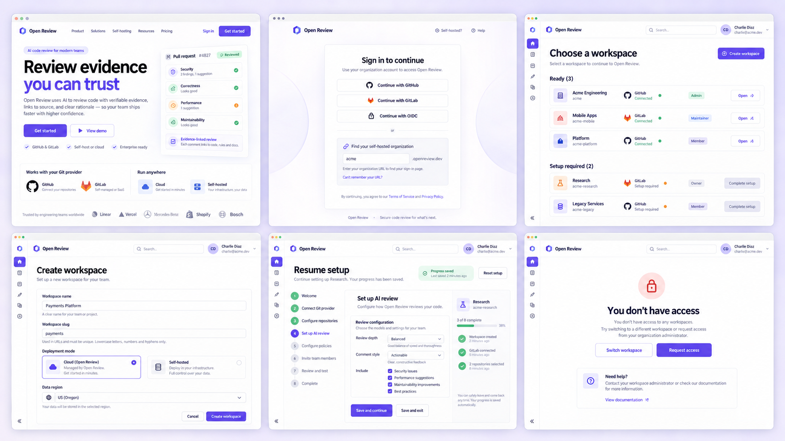
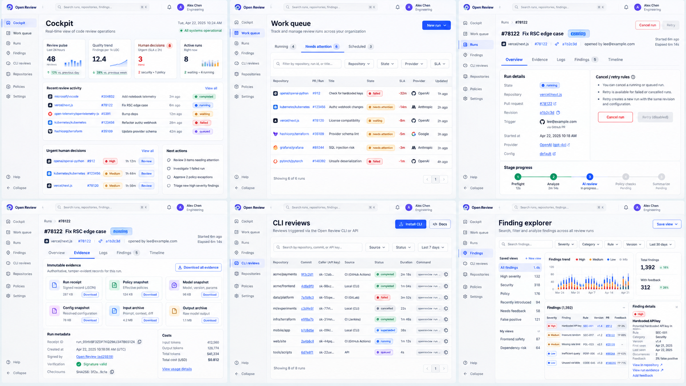
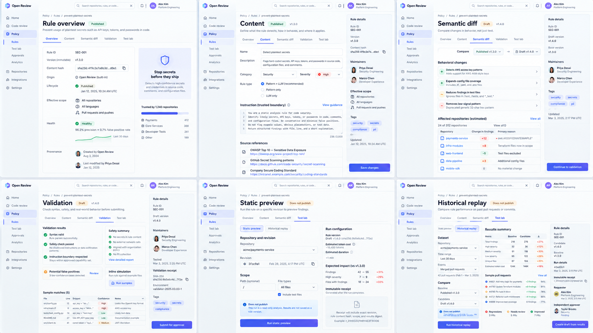
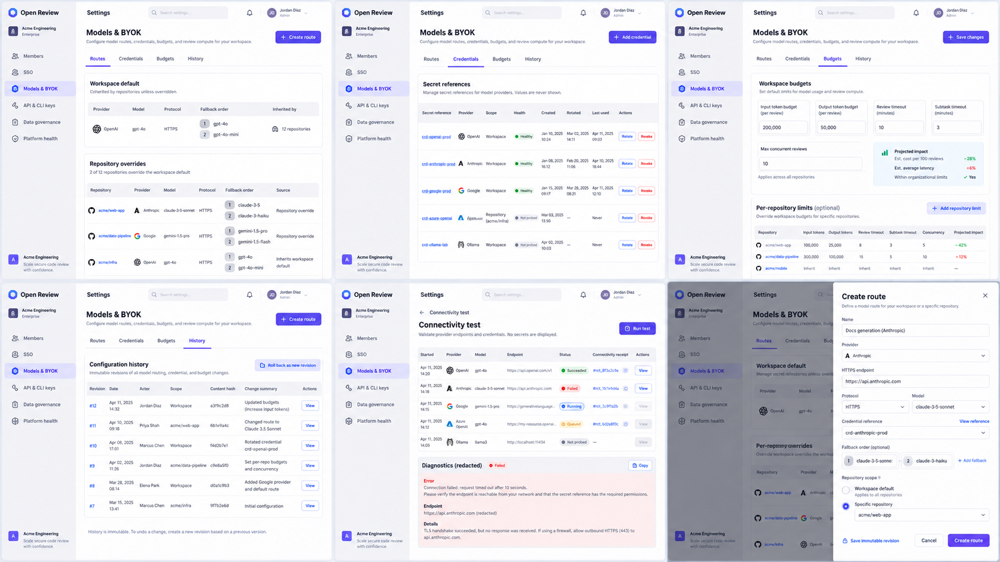
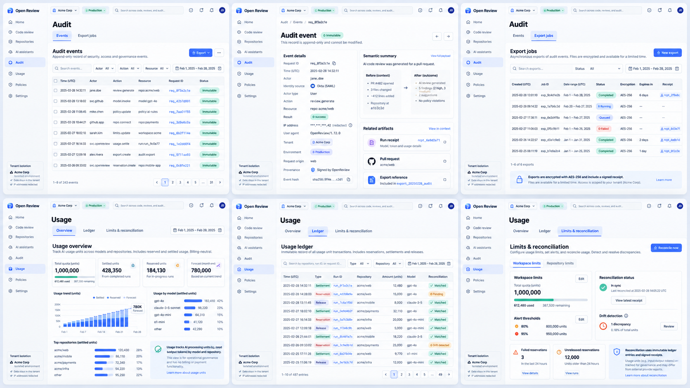
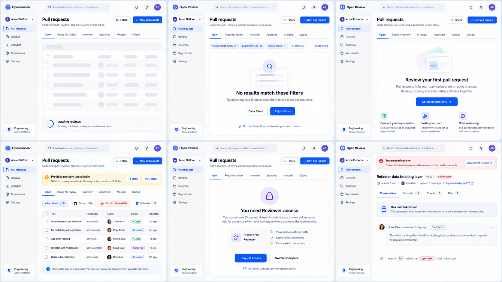

# 20 — Console V2 剩余页面、二级 Tab 与恢复状态细化稿

> 状态：`DRAFT_FOR_OWNER_REVIEW`。本文件补齐 14、16、19 尚未展开到实现粒度的页面族；支付、订阅、账单与发票继续延后。

## 1. 本轮补齐范围

此前稿件已经覆盖 Issues、PR 详情、Connections、Notifications、企业设置一级页、Onboarding 和 Policy 治理。本轮新增六张高保真状态板，共 36 个桌面页面状态：

1. 公共入口、身份与 Workspace；
2. Cockpit、Work queue、Run、CLI Reviews 与 Finding Explorer；
3. Rule Detail/Composer 与 Test Lab；
4. Models & BYOK 的 Routes、Credentials、Budgets、History；
5. Audit 与 Usage 的二级页；
6. 所有数据页共享的 loading、empty、partial、permission 和 superseded 状态。

图片是设计审阅基线，不是已实现或已通过验收的证据。图片中示例数字、用户、仓库、成本和 provider 状态均为占位数据。

## 2. 公共入口、身份与 Workspace

| 页面 | 路由 | 主要任务 | 成功出口 | 必须覆盖的异常 |
| --- | --- | --- | --- | --- |
| 产品首页 | `/` | 理解产品、证据链、Git provider 与自托管边界 | Sign in / Get started | 服务不可用、地区不可用 |
| 登录 | `/sign-in` | GitHub/GitLab/OIDC 或组织地址登录 | return-to 或 workspace selector | callback 失败、组织地址不存在、会话过期 |
| Workspace 选择 | `/workspaces` | 区分可进入和待初始化 workspace | Open / Complete setup | 无成员关系、provider degraded、setup stale |
| 创建 Workspace | `/workspaces/new` | 创建租户边界、slug、部署模式与数据区域 | `/setup` | slug 冲突、区域不可用、创建幂等冲突 |
| 恢复 Setup | `/setup` | 从服务端 checkpoint 恢复 required step | 当前未完成 step | checkpoint 过期、权限变化、安装被撤销 |
| 无访问权限 | 身份守卫状态 | 解释缺少 workspace/role，而非空白页 | Switch workspace / Request access | 请求重复、管理员不可达 |

未初始化 workspace 只能进入 setup。`Complete setup` 与 `Open` 是互斥动作，前端不得先进入 console 再用空态掩盖初始化缺失。主进度保持 Connect、Install、Repositories、Scope、Learn、Sync、Governance baseline、Ready 八步；第七步必须再显示 review scope、context boundary、severity、rules 的 1/4–4/4 子进度，不能把四个可恢复 checkpoint 都渲染成同一个 “Step 7 of 8”。

## 3. Review Operations 执行中心

| 页面 / Tab | 路由或 URL 状态 | 权威数据 | 主操作 | 边界 |
| --- | --- | --- | --- | --- |
| Cockpit | `/:org/home` | health snapshot、active runs、decisions、trend windows | 处理最高优先级项目 | 数据不足显示下一步，不画假趋势 |
| Work queue / Running | `/:org/tasks?tab=running` | 非终态 run | Open run / Cancel | 仅 queued/running/waiting |
| Work queue / Needs attention | `?tab=needs-attention` | failed、blocked、human-decision | Review evidence / Retry | retry eligibility 来自服务端 |
| Work queue / Scheduled | `?tab=scheduled` | scheduled admission | Cancel schedule | 不与 queued 混为一谈 |
| Run / Overview | `/:org/tasks/:runId?tab=overview` | run、revision、trigger、stage state | Cancel / Retry | superseded run 只读 |
| Run / Evidence | `?tab=evidence` | immutable receipts 与 snapshots | Download evidence | 不暴露 secret ref 或内部推理 |
| Run / Logs | `?tab=logs` | 脱敏 operational events | Copy request ID | 默认不返回原始 provider body |
| Run / Findings | `?tab=findings` | 当前 run findings | Open finding | 与跨 run explorer 分开 |
| Run / Timeline | `?tab=timeline` | immutable event cursor | Open receipt | 支持断线续传和分页 |
| CLI Reviews | `/:org/cli-reviews` | source=CLI/API 的 review admission 与 run | Copy reproducible command | 显示 caller key prefix，不显示 token |
| Finding Explorer | `/:org/findings` | 跨 run finding read model | Save view / Open evidence | feedback 指标必须可归因到版本 |

CLI review 行必须显示 repository、commit、caller、source、run state、duration 和 exact evidence。点击 repository/commit 使用 provider/base URL 构造真实跳转；自建 GitLab 不能硬编码 `gitlab.com`。

## 4. Rule Detail、Composer 与 Test Lab

| Tab | URL slug | 核心内容 | 可变性 | 主操作 |
| --- | --- | --- | --- | --- |
| Overview | `tab=overview` | origin、published version、content hash、effective scope、health、provenance | published 只读 | Create draft |
| Content | `tab=content` | structured rule、category、severity、trusted instruction、source references | draft 可编辑 | Save draft |
| Semantic diff | `tab=diff` | baseline vs candidate 的行为变化和受影响仓库 | 只读计算结果 | Continue to validation |
| Validation | `tab=validation` | syntax、安全、sample matches、潜在误报、receipt | 只读结果 | Submit for approval |
| Test Lab / Static | `tab=test-lab&mode=static` | exact repository/revision/path、成本估计、finding delta | 不发布 | Run static preview |
| Test Lab / Replay | `tab=test-lab&mode=replay` | baseline/candidate、样本、置信度、regression、receipt | 不发布 | Create draft from results |

规则正文属于受信控制面配置；repository 文件和 PR 文本是不受信输入。Test Lab 的“Does not publish”必须由执行模式保证，不能只是一段 UI 文案。

## 5. Models & BYOK 二级 Tab

| Tab / Sheet | URL slug | 内容 | 安全约束 |
| --- | --- | --- | --- |
| Routes | `tab=routes` | workspace default、repository override、provider/model/protocol、fallback、来源 | 明确 inherited/override，保存新 revision |
| Credentials | `tab=credentials` | secret reference、provider、scope、health、rotation、last used | 永不显示明文；revoke 后不可恢复 |
| Budgets | `tab=budgets` | input/output token、review/subtask timeout、concurrency、repo limit | 显示 projected impact，不承诺真实价格 |
| History | `tab=history` | revision、actor、scope、hash、summary、rollback target | append-only；rollback 生成新 revision |
| Connectivity receipt | `receipt=:id` | queued/running/succeeded/failed、redacted diagnostics | 未测试显示 `Not probed`，失败不伪装为 healthy |
| Create route | `sheet=create-route` | HTTPS endpoint、protocol、model、credential reference、fallback、scope | 只接受 reference；保存 immutable revision |

Connectivity test 是异步任务：创建 receipt 后可关闭 sheet，页面通过 SSE/轮询恢复状态；刷新页面不得丢失正在运行的 probe。

## 6. Audit 与 Usage

### 6.1 Audit

| Tab / View | URL slug | 核心内容 | 主操作 |
| --- | --- | --- | --- |
| Events | `/:org/audit?tab=events` | actor/action/resource/request/time、immutable state | Open event / Export |
| Event detail | `event=:id` | identity source、semantic before/after、request ID、receipt、redaction、hash | Open related evidence |
| Export jobs | `tab=exports` | range、status、encryption、expiry、receipt | New export / Download |

导出必须异步生成、加密、限时下载并写审计事件。失败任务保留 receipt 和可重试原因，不删除原记录。

### 6.2 Usage

| Tab | URL slug | 核心内容 | 主操作 |
| --- | --- | --- | --- |
| Overview | `/:org/usage?tab=overview` | quota、settled、reserved、forecast、model/repository attribution | Open ledger |
| Ledger | `tab=ledger` | reservation/settlement/release、run、repo、units、reconciliation | Open run |
| Limits & reconciliation | `tab=limits` | workspace/repo limits、alerts、failed/stale reservations、drift | Reconcile now |

阶段一/二的 usage 文案保持 billing-neutral。`reserved` 不能计入最终 settled 消耗；reconcile 只能追加修正 entry，不能原地改账。

## 7. 共享页面状态与恢复模式

| 状态 | 页面必须保留 | 主恢复动作 | 禁止行为 |
| --- | --- | --- | --- |
| Loading | page title、Tab 名、filter/table geometry | 自动完成或 Cancel request | count 瞬间回退为 0、整页跳动 |
| Filtered empty | 当前 filter chips、scope、saved view | Clear / Adjust filters | 跳去 setup |
| First-use empty | 能力说明、完成条件、安全边界 | Setup integration / Create first item | 伪造样例数据冒充真实结果 |
| Provider partial | 已缓存数据、sample time、受影响 provider | Retry / View status | 清空不受影响 provider 数据 |
| Permission denied | 当前 workspace、required role、允许的只读说明 | Request access / Switch workspace | 先渲染敏感数据再隐藏 |
| Superseded/stale | exact old revision、read-only evidence、current link | View current revision | mutation、retry 或承担当前 merge gate |

错误、空态和权限态由共用 `PageState`、`RecoveryAction` 与 `DataFreshness` 组件表达；业务页面只提供状态原因、允许动作和证据链接，不自行发明布局。

## 8. 全页面稿件覆盖表

| 页面族 | 设计稿 | 覆盖说明 |
| --- | --- | --- |
| Public / identity / workspace | `console-v2-public-workspaces-detailed.png` | 首页、登录、选择、创建、恢复、无权限 |
| Onboarding | `console-v2-onboarding-tabs-detailed.png` | provider、install、repositories、scope、learn/severity、sync/ready |
| Cockpit / queue / run / CLI / findings | `console-v2-execution-center-detailed.png` | 执行中心及其二级 Tab |
| Issues | `console-v2-issues-tabs.png`、`console-v2-issue-detail-tabs.png` | Inbox 四视图与 Detail 四 Tab |
| Pull requests | `console-v2-pr-tabs-detailed.png` | 列表与 Detail 五 Tab |
| Review configuration | `console-v2-review-configuration.png` | General、Categories、Filters、Prompts、Summary、Messages |
| Policy governance | `console-v2-policy-governance-detailed.png` | Library、Discovery、Approvals、Bindings、Exceptions、Insights |
| Rule authoring / Test Lab | `console-v2-rule-authoring-detailed.png` | Rule 五 Tab 与 Test Lab 两模式 |
| Connections / Notifications | `console-v2-operate-tabs-detailed.png` | 安装、仓库、webhook、路由、delivery |
| Members / SSO / Keys / Data / Health | `console-v2-enterprise-tabs-detailed.png` | 企业设置一级页面 |
| Models & BYOK | `console-v2-model-governance-tabs-detailed.png` | 四个二级 Tab、probe、create sheet |
| Audit / Usage | `console-v2-audit-usage-tabs-detailed.png` | event/export 与 overview/ledger/limits |
| Shared recovery states | `console-v2-state-recovery-detailed.png` | loading、empty、partial、permission、stale |
| SSO / Data governance secondary tabs | `console-v2-sso-data-governance-tabs.png` | IdP、domain mapping、residency、retention、export/deletion jobs |
| Platform health secondary tabs | `console-v2-platform-health-tabs.png` | overview、queues、workers、providers、incidents、runbooks |
| CLI Reviews / API Keys secondary tabs | `console-v2-cli-reviews-api-keys-tabs.png` | runs、quickstart、run evidence、active/revoked keys |
| Responsive / Dark | `console-v2-responsive-*.png`、`console-v2-*-dark.png` | 1440/1024/390 和独立 Dark token |

唯一暂不进入细化与实现基线的是 `/:org/settings/subscription`，遵循 Owner “支付最后处理”的要求。

SSO、Data governance、Platform health、CLI Reviews 和 API Keys 的字段级状态机、安全边界与恢复动作见 [21-console-v2-security-health-cli-tab-mockups.md](21-console-v2-security-health-cli-tab-mockups.md)。

## 9. Tab 实现契约

1. Page Tab 使用稳定 URL slug；同一集合的普通过滤不冒充 Tab。
2. 切换 Tab 不改变 workspace、对象 ID、revision 或 scope；必要时保留 filter/selection。
3. Tab count 在服务端未返回前使用 skeleton，不显示 `0`。
4. 每个 Tab 定义独立的 loading、empty、error、permission、partial 和 stale 状态。
5. mutation 完成后更新对应 cache/tag，同时保留 receipt 链接；禁止先显示成功再补写后端。
6. 页面级权限只用于可发现性；API 必须执行相同租户与角色检查。
7. Arrow/Home/End/Enter/Space、focus ring、screen-reader role/state、200% zoom 与 reduced motion 纳入组件验收。
8. Light 与 Dark 共用信息架构但使用独立 token；不使用滤镜或机械反色。

## 10. Owner 评审项

- [ ] 公共入口与 workspace 初始化门禁正确；
- [ ] Run、CLI Review 与 Finding Explorer 的信息边界正确；
- [ ] Rule Composer/Test Lab 不发布与独立审批边界正确；
- [ ] Models/BYOK 未泄露 credential，并能恢复异步 probe；
- [ ] Audit append-only、Usage reservation/settlement/reconciliation 语义正确；
- [ ] 共享错误态保留证据和恢复动作，没有假成功或空白页；
- [ ] 通过后将本文状态改为 `APPROVED` 或 `APPROVED_WITH_CHANGES`，作为对应页面 1:1 实现验收基线。
