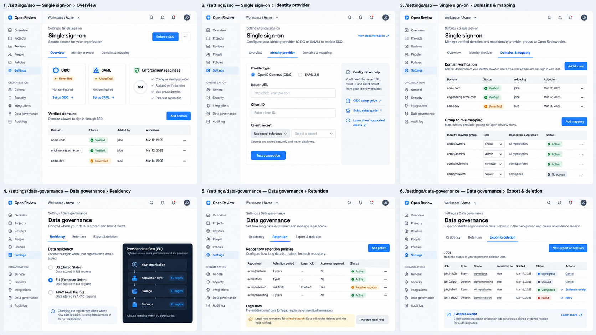
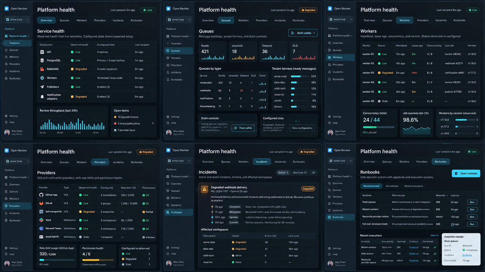
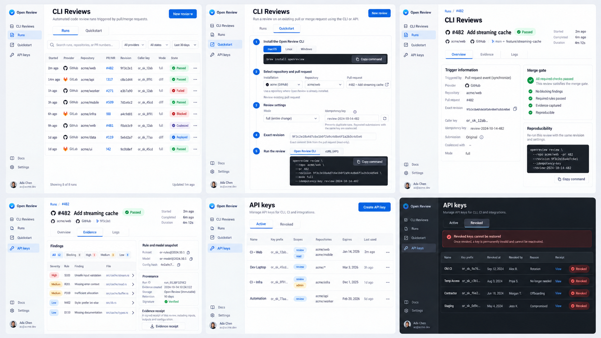

# 21 — Console V2 安全、平台健康与 CLI Reviews 二级 Tab 细化稿

> 状态：`DRAFT_FOR_OWNER_REVIEW`
> 范围：补齐 SSO、数据治理、平台健康、CLI Reviews 与 API Keys 的二级页面；支付、订阅、账单和发票仍不在本轮范围。
> 原则：设计稿中的数据是占位内容，页面必须以控制面实时读模型、不可变证据与明确权限结果为准。

## 1. 本轮补齐的页面族







三张状态板共覆盖 18 个桌面页面状态：

- SSO：Overview、Identity provider、Domains & mapping；
- Data governance：Residency、Retention、Export & deletion；
- Platform health：Overview、Queues、Workers、Providers、Incidents、Runbooks；
- CLI Reviews：Runs、Quickstart、Run Overview、Run Evidence；
- API Keys：Active、Revoked & audit。

所有 Tab 都必须有稳定 URL、独立可恢复状态和服务端权限校验。设计稿不是健康、连接成功、审查完成或安全合规的运行证据。

## 2. SSO

基础路由：`/:org/settings/sso`。

| Tab | URL | 权威数据 | 主操作 | 关键边界 |
| --- | --- | --- | --- | --- |
| Overview | `?tab=overview` | SSO config revision、connection test receipt、verified domains、mapping count、enforcement readiness | Continue setup / Enforce SSO | `saved`、`tested`、`enforced` 是三个不同状态；Owner 必须保留 break-glass 入口 |
| Identity provider | `?tab=identity-provider` | OIDC/SAML config、secret reference、last probe、metadata revision | Save draft / Test connection | 不回显 client secret；probe 异步且可恢复；未测试不能显示 Connected |
| Domains & mapping | `?tab=domains-mapping` | verified domain challenge、group claim、role/repository mapping revision | Add domain / Add mapping | domain 必须完成所有权验证；mapping 冲突和越权必须在服务端拒绝 |

### 2.1 SSO 状态机

```text
not_configured -> draft_saved -> testing -> verified -> enforcement_ready -> enforced
                         |            |               |
                         +-> failed <-+               +-> suspended
```

- `draft_saved` 只表示配置通过 schema 校验；
- `verified` 必须关联最近一次成功 probe receipt 和 tested revision；
- 修改 IdP、domain 或 mapping 会使 readiness 重新计算；
- `Enforce SSO` 要求 owner 二次确认、break-glass 账号、审计事件和回滚动作；
- 用户无管理权限时仍可看到当前登录方式和支持入口，但不能看到 secret reference 细节。

## 3. Data governance

基础路由：`/:org/settings/data`。

| Tab | URL | 权威数据 | 主操作 | 恢复和审计 |
| --- | --- | --- | --- | --- |
| Residency | `?tab=residency` | tenant region、storage/backup/model route boundaries、effective-at | Request migration | region change 是 durable job；迁移前后均保留 receipt，不立即切换显示 |
| Retention | `?tab=retention` | tenant default、repository override、legal hold、effective revision | Add policy / Manage hold | legal hold 优先于删除；缩短 retention 需要影响预览和审批 |
| Export & deletion | `?tab=jobs` | job type、scope、requester、state、progress、receipt | New job / Cancel / Retry / Download | export 使用短期、鉴权、审计的加密制品下载；删除 job 在可撤销窗口后才进入 destructive 阶段 |

### 3.1 数据流可视化语义

Residency 图只允许表达已知边界：应用层、PostgreSQL、对象存储、备份、队列和模型 provider。未知或外部 provider 必须显示 `external/unknown`，不能用绿色区域标签暗示已经满足数据驻留。

### 3.2 Export / deletion job 状态

```text
requested -> awaiting_approval -> queued -> running -> completed
       |             |              |          |
       +-> cancelled +-> rejected   +-> failed +-> failed
```

删除任务另外具有 `reversible_until`；超过该时间后，UI 不再显示 Cancel。每个终态必须有不可变 receipt 或明确说明为什么没有产出。

## 4. Platform health

基础路由：`/:org/settings/health`。该页面的读权限可以授予管理员和 SRE；任何控制动作仍由独立权限和审批保护。为保持已分享的早期设计链接可用，`/:org/settings/platform-health` 会服务端跳转到此 canonical URL，并保留受支持的 `tab` 参数。

| Tab | URL | 观测源 | 主要判断 | 操作边界 |
| --- | --- | --- | --- | --- |
| Overview | `?tab=overview` | API、DB、broker、worker、publisher、notifier health sample | observed vs configured、sample age、affected capability | 不从配置推断健康；stale sample 不显示 Live |
| Queues | `?tab=queues` | broker queue metrics、DLQ、tenant fairness | ready/unacked/delayed/DLQ、oldest age | Drain 是审批操作；不得清空 DLQ 作为恢复手段 |
| Workers | `?tab=workers` | heartbeat、lease、concurrency、version | stale、saturated、version skew | restart/drain 必须关联目标和 receipt |
| Providers | `?tab=providers` | permission probe、rate limit、last webhook/publish | provider/host 级 degraded 状态 | GitHub.com、GHE、GitLab.com、自建 GitLab 分开聚合 |
| Incidents | `?tab=incidents` | incident record、health samples、affected tenants | active/resolved、scope、timeline | 不公开其他租户名称；跨租户视图仅平台管理员可见 |
| Runbooks | `?tab=runbooks` | versioned runbook、required role/approval、execution receipt | action eligibility、last run、rollback | 页面不执行任意 shell；只能调用受控 operator command |

### 4.1 共享 health 状态

- `live`：sample 在 freshness window 内且 health probe 成功；
- `degraded`：至少一个能力受损但主要服务仍可用；
- `critical`：审查准入、权威状态或发布能力不可用；
- `stale`：没有足够新的观测数据；
- `configured_only`：只有期望状态，没有运行观测。

健康页面禁止展示“100% uptime”这类没有时间窗口和采样来源的结论。

## 5. CLI Reviews

基础路由：`/:org/cli-reviews`。首个实现切片只触发已安装仓库中已存在的 PR/MR；不接受用户提供任意 clone URL，也不伪造 PR `#0`。

| 页面 / Tab | URL | 权威数据 | 主操作 | 关键边界 |
| --- | --- | --- | --- | --- |
| Runs | `?tab=runs` | trigger kind `cli` 的 review run summaries | Open run / Cancel eligible run | caller 只显示 key prefix/ID；replayed/coalesced 单独标识 |
| Quickstart | `?tab=quickstart` | installations、repository allowlist、provider PR/MR、exact head SHA | Copy CLI/cURL command | idempotency key 必填；repository 和 revision 由可信 installation 校验 |
| Run Overview | `/:org/cli-reviews/:runId?tab=overview` | run、request、trigger event、stage state、merge gate | Cancel / Reproduce | superseded run 只读；不得用当前配置重算历史结论 |
| Run Evidence | `/:org/cli-reviews/:runId?tab=evidence` | findings、rule/model/config snapshots、receipts、provenance | Download receipt / Open provider | secret、credential ref 和私有推理均不进入 evidence |
| Run Activity | `/:org/cli-reviews/:runId?tab=activity` | append-only events、actor、revision | Copy event ID | 事件按 revision 排序；缺口和 partial 明确标出 |

### 5.1 Create review 契约

`POST /v1/tenants/:slug/cli-reviews` 使用 Bearer API key，并要求：

- `Idempotency-Key`；
- `installation_id`；
- `repository`；
- 已存在的 `review_number`；
- `base_ref`、`head_ref`、完整 `base_sha`、完整 `head_sha`；
- `mode`：`configured | standard | deep | security`。

服务端从 installation 推导 provider API 和 clone URL，验证 key/repository allowlist、installation scope、revision 和租户边界。成功返回 `202`、run ID、revision、状态 URL 和 evidence URL。相同 idempotency key 返回同一 run；同一 active head 的不同请求返回 `coalesced` receipt。

## 6. API Keys

基础路由：`/:org/settings/api-keys`。

| Tab | URL | 展示内容 | 主操作 | 安全边界 |
| --- | --- | --- | --- | --- |
| Active | `?tab=active` | name、prefix、scopes、repository allowlist、expires、last used | Create / Revoke | 完整 secret 只在创建成功页显示一次；列表和日志永不包含 secret |
| Revoked | `?tab=revoked` | prefix、revoked at/by/reason、receipt | View receipt | revoke 不可逆，不能 Reactivate |
| Usage guide | `?tab=guide` | CLI/cURL、env var、rotation checklist | Copy command | 示例必须用 placeholder，不嵌入真实 secret |

创建流程使用三步 sheet：用途与期限 -> 最小权限与仓库 -> 一次性 secret。关闭一次性 secret 层后只允许创建新 key，不提供恢复旧 secret。

## 7. 组件化边界

| 组件 | 输入 | 复用页面 |
| --- | --- | --- |
| `SettingsTabFrame` | tabs、active slug、permission、freshness | SSO、Data governance、Platform health、API Keys |
| `ObservedStateBadge` | observed state、sampled at、configured state | Platform health 全部 Tab |
| `AsyncOperationReceipt` | operation ID、state、progress、receipt URL、allowed actions | probe、export、deletion、region migration、runbook |
| `SecretReferenceField` | provider、reference ID、permission | SSO、Models、Notifications |
| `ScopeAndRevisionHeader` | workspace、repository、revision、hash、inheritance | governance、review config、models |
| `EvidenceLink` | receipt type、immutable ID、URL | CLI runs、health actions、data jobs、audit |
| `PageState` | loading/empty/error/partial/permission/stale、recovery action | 所有数据页 |

业务页面不得复制 loading、permission、partial 和 stale 布局，也不得自行构造 provider URL 或权限文案。

## 8. 响应式与 Dark

- 1440：左 rail、顶栏和完整表格；详情可使用右侧 inspector；
- 1024：次级导航保留水平 Tab，表格降列或用行展开，不缩放文字；
- 390：rail 变底部主导航，Tab 横向滚动，表格切换 semantic cards；
- Dark 使用独立 graphite surface、code block 和 semantic token，不使用 `filter: invert()`；
- health 的绿色、黄色、红色同时包含文字或图标，不仅依赖颜色；
- destructive actions 不进入移动端溢出菜单的首项，并保持确认上下文。

## 9. 设计到实现的门禁

- [x] SSO 保存、probe 和 enforce 状态未混淆；
- [x] Data governance export 已具有 lease、加密 artifact、receipt、鉴权下载和审计；raw webhook/findings/audit deletion 已有双人审批、撤销窗、Legal Hold 二次检查与 tombstone；region 已有双向签名、异步 reconcile 与 observed completion；usage/log deletion 和真实部署迁移证据仍是运行门禁；
- [x] Platform health 区分 observed/configured/stale，并限制 operator actions；durable worker heartbeat 与只读 provider probe 已落地，broker metrics 与 provider write 权限证据仍是运行门禁；
- [x] CLI Reviews 仅审查可信 installation 下的真实 PR/MR 和 exact revision；
- [x] API key 完整 secret 仅显示一次，revoke 不可逆；
- [ ] 每个 Tab 都有 loading、empty、partial、permission、stale 和 error 规格；
- [ ] 390/1024/1440、Light/Dark、键盘、读屏、200% zoom 完成组件验收；
- [ ] 支付相关页面仍未进入实现范围。
