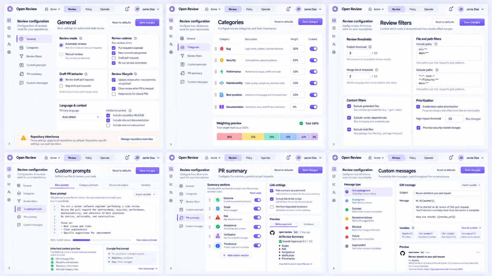
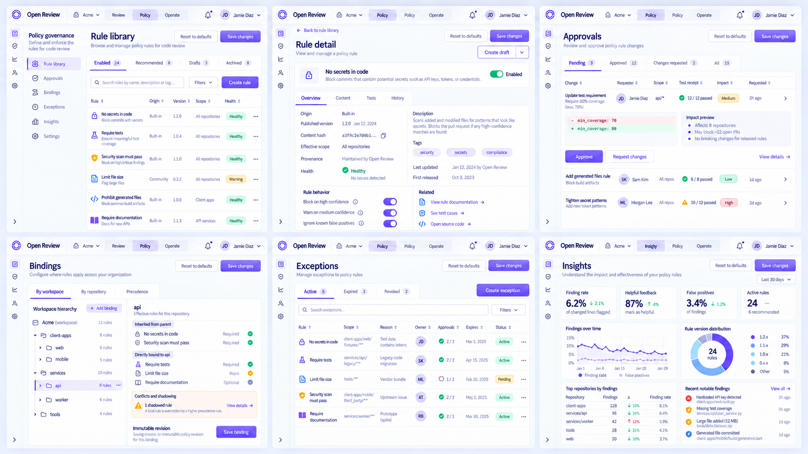
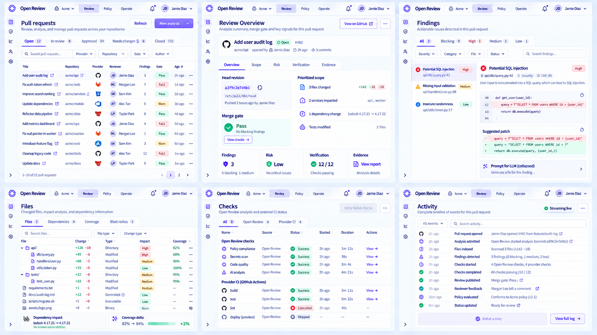
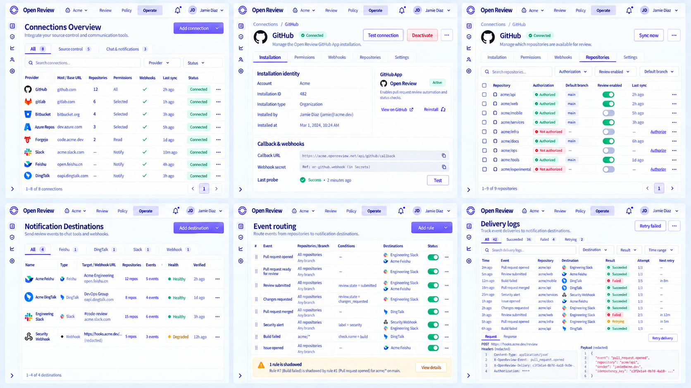
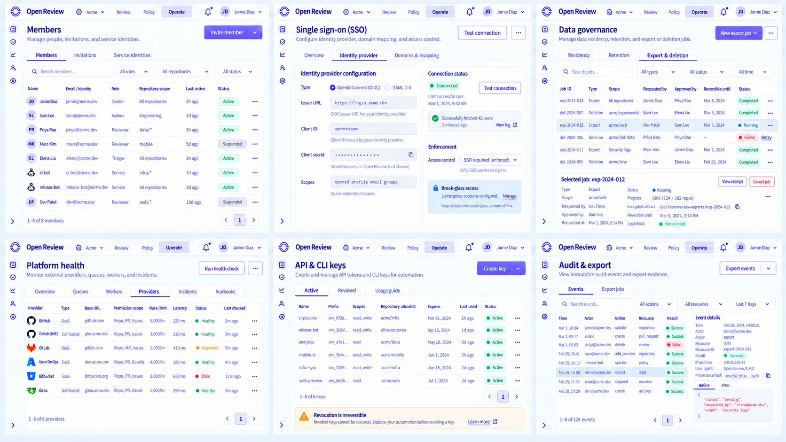

# 22 — Console V2 Luminous Apple 全量 Tab 细化稿

> 状态：`APPROVED_FOR_IMPLEMENTATION`
> 范围：把此前仍采用旧版蓝白管理台语言的二级页面，统一重绘为已确认的 Luminous Apple 视觉；支付、订阅、账单与发票继续延后。

> Owner decision（2026-09-19）：以本稿作为 1:1 实现的视觉与信息架构基线。该决定不替代每项外部 provider、模型或通知写入的生产验收；运行边界仍以控制面 receipt 与部署验证为准。

## 1. 本轮产出

五张高保真状态板补齐 30 个可直接进入实现的桌面页面。每张图中的每个画面都是一个真实 Tab 或对象视图，不是导航占位或同一页面的换色副本。

### 1.1 Review Configuration

| Tab | URL | 主任务 | 保存语义 |
| --- | --- | --- | --- |
| General | `/:org/review-config/general` | 自动/手动触发、cadence、draft 行为、生命周期、语言与上下文 | 保存新的配置 revision |
| Categories | `/:org/review-config/categories` | 类别启停、权重与覆盖范围 | 权重校验通过后保存 revision |
| Review filters | `/:org/review-config/filters` | 发布阈值、阻断阈值、路径与 blast-radius 优先级 | 阈值分别保存，不能互相推导 |
| Custom prompts | `/:org/review-config/prompts` | base/category/output/variables 与 token budget | 只保存受信控制面 prompt；显示继承差异 |
| PR summary | `/:org/review-config/summary` | Outcome、Scope、Risk、Acceptance、Verification、Provenance 结构 | live preview 不发布评论 |
| Custom messages | `/:org/review-config/messages` | acknowledgment、progress、success、recommendation、blocked、failure、superseded | 变量经 schema 校验后保存 |

## 2. Policy Governance

| 页面 | URL | 核心对象 | 主动作 |
| --- | --- | --- | --- |
| Rule library | `/:org/rules?tab=enabled` | enabled/recommended/drafts/archived 规则集合 | Create rule |
| Rule detail | `/:org/rules/:ruleId?tab=overview` | origin、version、hash、scope、provenance、health | Create draft |
| Approvals | `/:org/rules/approvals` | semantic diff、tests、impact、requester/approver | Approve / Request changes |
| Bindings | `/:org/rules/bindings` | workspace/repository/branch precedence | Save immutable revision |
| Exceptions | `/:org/rules/exceptions` | reason、owner、scope、dual approval、expiry、snapshot | Create / Revoke |
| Insights | `/:org/rules/insights` | finding rate、helpful feedback、false positives、version distribution | Open evidence |

审批、发布、例外和撤销只在服务端返回 receipt 后进入成功态。Insights 的指标必须能追溯到规则版本、仓库和 review run。

## 3. Pull Request / Review

| Tab | URL | 信息边界 | 关键状态 |
| --- | --- | --- | --- |
| Pull requests | `/:org/reviews` | workspace 内可见 PR/MR 列表 | loading、partial provider、filtered empty |
| Overview | `/:org/reviews/:id?tab=overview` | 当前 revision 的 merge gate 与紧凑证据摘要 | blocked、passed、superseded |
| Findings | `?tab=findings` | finding、code、patch、可折叠 LLM prompt | partial publish、dismissed、permission |
| Files | `?tab=files` | diff、blast radius、dependency、coverage | binary、renamed、generated、too large |
| Checks | `?tab=checks` | Open Review gate 与 provider CI 分层 | queued、running、failed、cancelled |
| Activity | `?tab=activity` | admission 至 feedback/policy 的不可变事件 | live、offline cached、cursor gap |

Overview 不重复 findings 的完整说明；详细代码、建议补丁和 prompt 只在 Findings 中展开。旧 revision 保留只读证据，但不得承担当前 head 的 merge gate。

## 4. Connections / Notifications

| 页面 / Tab | URL | 核心任务 | 安全与恢复边界 |
| --- | --- | --- | --- |
| Connections | `/:org/connect` | provider、host、仓库、权限、webhook 与同步状态 | GitLab.com 与 self-managed 是连接模式，不是两个 provider |
| Installation | `/:org/connect/:id?tab=installation` | identity、granted permissions、callback、probe | token、private key、webhook secret 只显示 reference |
| Repositories | `?tab=repositories` | 授权、默认分支、review enabled、last sync | 未授权必须与空仓库区分 |
| Destinations | `/:org/notifications?tab=destinations` | 飞书、钉钉、Slack、Webhook 目标 | Send test 返回异步 receipt |
| Event routing | `?tab=routing` | event + repo/branch + condition → destinations | 显示 precedence conflict 与 shadowed rule |
| Delivery logs | `?tab=deliveries` | attempt、result、idempotency、next retry | request/response 脱敏；只对 eligible delivery Retry |

## 5. Enterprise Controls

| 页面 / Tab | URL | 核心任务 | 不变量 |
| --- | --- | --- | --- |
| Members | `/:org/settings/members` | members、invitations、service identities | tenant scope 与 identity source 始终可见 |
| SSO / Identity provider | `/:org/settings/sso?tab=identity-provider` | OIDC/SAML、probe、enforcement readiness | saved、tested、enforced 为独立状态；保留 break-glass |
| Data / Export & deletion | `/:org/settings/data?tab=jobs` | export/deletion job、审批、进度与 artifact | legal hold 优先；删除越过可撤销窗后不可 Cancel |
| Health / Providers | `/:org/settings/health?tab=providers` | host 级 permission/rate-limit/latency probe | configured 不等于 healthy；sample stale 明确标记 |
| API & CLI keys | `/:org/settings/api-keys?tab=active` | key scope、allowlist、expiry、last used | secret 仅创建成功时展示一次；revoke 不可逆 |
| Audit / Events | `/:org/audit?tab=events` | actor/action/resource/request、before/after、hash | append-only；export 加密、限时、可审计 |

## 6. Tab 与页面状态验收

每个页面进入 1:1 实现前都需要逐项验证：

1. URL 使用稳定 slug，刷新、分享和 Back/Forward 保留 Tab、scope、filter 与 selection；
2. loading 保留标题、Tab 与表格几何，计数未返回前使用 skeleton，不显示假 `0`；
3. first-use empty、filtered empty、permission、partial、stale、superseded 分别有明确原因和恢复动作；
4. provider、repository、PR/MR、commit、file、rule、run、receipt 均使用真实可跳转地址；
5. mutation 先获得 receipt/revision，再更新成功状态；异步操作可在刷新后恢复；
6. secret 只显示 reference，日志、audit、evidence、导出和错误消息均不得回显；
7. Light 与 Dark 共用信息架构，但使用独立 token；本轮页面的 Dark 映射以 `console-v2-screen-system-v3-dark.png` 为视觉基线；
8. 1440、1024、390、200% zoom、键盘、读屏与 reduced motion 需在真实组件中复验。

## 7. Owner 评审项

- [ ] Review Configuration 六个页面的信息分工正确；
- [ ] Policy 的 approval、binding、exception 与 insights 形成治理闭环；
- [ ] Review Overview 足够简洁，Findings 承担详细分析；
- [ ] Connections 与 Notifications 具有真实失败恢复和 secret 边界；
- [ ] SSO、Data、Health、Keys、Audit 的状态语义与权限边界正确；
- [ ] 确认后将本文状态改为 `APPROVED` 或 `APPROVED_WITH_CHANGES`，作为 1:1 实现验收基线。
