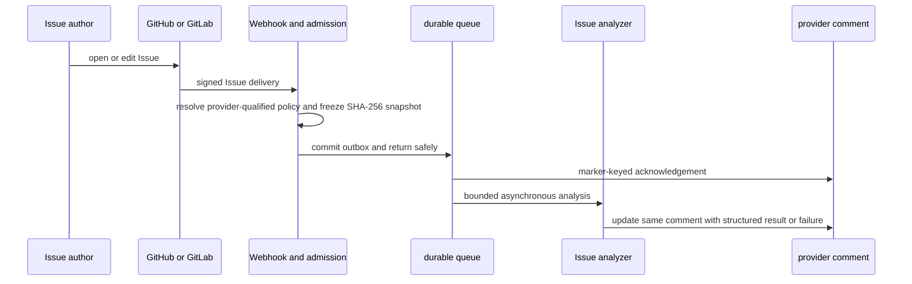

# 23 — Provider Issue 分析与仓库格式治理

> 状态：已实现；真实 GitHub Issue 已完成端到端验证。GitLab.com 与自建 GitLab
> 的外部凭据/回调验收仍需在目标环境单独完成。

## 1. 目标与边界

本能力处理用户在 GitHub Issue 或 GitLab Issue 中提出的问题，而不是把 Issue
当成自由提示词。它让每个 workspace 或仓库声明“一个合格 Issue 应提供哪些
证据”，然后由 Open Review 在同一 Issue 中先确认收到请求、异步分析、再更新
同一个机器人评论。

它解决三件事：

1. 作者创建 Issue 时有与当前仓库策略一致的 Markdown 模板；
2. 管理员可把业务术语、风险标准、验收口径作为受控的仓库规则配置；
3. 每次分析都有不可变配置快照，能解释该次机器人为什么使用该格式。

非目标：不自动把模板直接推送到 provider 仓库、不创建绕过分支保护的提交，
也不把 Issue 内容、HTML 注释或模型输出视为可执行指令。

## 2. 管理入口与作用域

入口为 **Policy → Review settings → Issue triage**，路由为：

```text
/:workspace/review-config/issue-triage
/:workspace/review-config/issue-triage?scope=repository&repository=owner/repository&provider=github
```

策略遵循以下优先级：

```text
provider + normalized API base URL + repository override
  → workspace default
  → built-in engineering default
```

因此同名 `group/project` 在 GitHub、GitLab.com 与某个自建 GitLab 上可拥有不同
策略，避免跨 provider 误继承。保存 workspace 或 repository override 都会创建新
revision；删除 repository override 后立即恢复继承，不会修改历史 revision。

## 3. 格式包

格式包不是单个标题，而是一份完整契约：`必填章节 + 机器人回复章节 + 折叠策略
+ 每节条目上限`。选择预设时这四项会整体更新；随后任何人工细化都会显式切换为
**Custom**，不再假装仍属于一个内置预设。

| 预设 | 面向场景 | 重点证据 |
| --- | --- | --- |
| Engineering | 一般工程改动 | 结果、复现、预期、证据、验收 |
| Bug report | 缺陷 | 复现、实际/预期行为、证据 |
| Feature request | 功能诉求 | 用户结果、影响、非目标、验收 |
| Concise | 小团队快速协作 | 精简结果、预期、验收 |
| Security | 安全问题 | 威胁证据、安全影响、风险 |
| API contract | 接口兼容性 | 请求/响应行为、错误与风险证据 |
| Database | 数据模型与完整性 | 证据、数据影响、恢复风险 |
| Migration | 发布与迁移 | 影响、兼容性、回滚、非目标 |
| Accessibility | 无障碍 | 复现、实际/预期行为、验收 |
| Reliability | 稳定性 | 影响、检测、缓解与恢复 |
| Incident | 事故复盘 | 影响、时间线、检测、缓解 |
| Product | 产品需求 | 用户结果、影响、边界、验收 |
| Performance | 性能问题 | 测量证据、复现、目标行为 |
| Compliance | 合规要求 | 数据/安全影响、风险、验收 |
| Custom | 仓库自定义 | 管理员选择的任意受支持章节组合 |

支持的输入章节有：`outcome`、`reproduction`、`expected_behavior`、
`observed_behavior`、`evidence`、`acceptance_criteria`、`risk`、
`security_impact`、`impact`、`timeline`、`detection`、`mitigation` 与
`non_goals`。机器人可见的结构化回复章节为 `assessment`、`missing_context`、
`acceptance_criteria`、`risk`、`affected_areas`、`next_steps` 和
`provenance`。

## 4. 仓库自定义规则

**Repository formatting requirements** 是管理员输入的可信规则，最大 4,000 个
Unicode 字符。适合存放：

- 仓库专用术语、服务/领域命名；
- 何种日志、监控、复现信息可视为证据；
- 风险分级、回滚和验收的团队口径；
- 机器人回复必须遵守的输出限制。

它会追加到 Issue analyzer 的可信提示词中，但不写入 GitHub/GitLab 的公开模板。
相反，Issue 标题、正文、评论、引用文件和 HTML 注释始终是不可信数据；它们只能
被分析，不能覆盖格式规则、模型路由、权限或发布策略。

管理员还可配置：

- 响应语言：跟随 Issue、English、简体中文、日本語或 Español；
- 次要细节是否折叠；
- 证据中的有效仓库文件路径是否转为 provider 深链；
- 是否在完成评论中请求 👍 / 👎 反馈；
- 每个章节允许的最大项目数（1–10）。

语言影响稳定报告框架、acknowledgement、失败信息和缺失章节提示。文件路径、代码
标识符、SHA 和原始证据保持不翻译。`Follow the Issue language` 只对可可靠识别的
中、日、西文本切换框架；不明确的文本安全回退 English。

## 5. 可复用格式目录

workspace 的 **Format library** 保存经过验证的格式规则包。每个条目包含名称、描述、
revision、创建人、更新时间和 archive 状态。

- 创建、更新、归档要求 Rule Admin、Owner 或 Admin；
- 名称在一个 workspace 的活跃目录中唯一；
- 更新采用 optimistic revision，旧编辑器不能覆盖新版本；
- 应用目录条目只填充本地未保存草稿，仍须保存为 workspace/repository 的显式
  review-config revision；
- 每次变更写入审计记录，归档不删除既有 revision 或运行快照。

这让组织标准和某个仓库的例外能同时存在，并且可分别追溯。

## 6. Provider 模板

编辑器会用当前“必填章节”和语言生成 provider 兼容的 Markdown：

| Provider | 下载内容 | 受保护分支中的目标路径 |
| --- | --- | --- |
| GitHub | classic Issue template（含 YAML front matter） | `.github/ISSUE_TEMPLATE/open-review.md` |
| GitLab | Issue template Markdown | `.gitlab/issue_templates/Open Review.md` |

管理员下载后，应像其他仓库配置一样走 PR/MR、CODEOWNERS 与分支保护提交。模板的
标题、placeholder、GitHub `about`、GitLab 完成提示会跟随已选语言。分析器识别
English、简体中文、日语、西班牙语对应标题别名，因此用户按导出模板填写后不会被
误判为“缺少章节”。

导出是刻意的单向操作：它不要求 App 的 Contents 写权限、不向浏览器暴露 token，
也不执行隐式 provider 写入。未来若增加“创建模板 PR”能力，必须另行加入显式
repository 权限、目标分支、变更预览、幂等 receipt 和审批流。

## 7. 分析运行链路



`opened` 与 `edited` 都会保留 Issue revision；新 revision 不能被旧任务的完成结果
覆盖。acknowledgement、终态评论和失败评论采用同一稳定 marker，因此重投、超时或
浏览器刷新不会创建垃圾评论。失败重试复用原始 Issue 正文、模型路由、提示词和格式
快照；它不读取更新后的 provider 内容，也不能越过 revision/attempt fence。

reaction 反馈只记录“有用/无用”或撤回的可审计状态，绝不再次触发模型调用。GitHub
使用受租户隔离的轮询/reconcile 路径（App 没有 Reaction event 订阅）；GitLab 使用
Emoji Hook。

## 8. 数据、权限与验收

每次 admission 都保存 format policy 的 SHA-256、来源 scope、revision、模型与提示词
快照。界面和 provider comment 都可引用该 provenance；管理员后续改规则只影响未来
Issue。

控制面接口如下，Console 通过同源 BFF 调用，浏览器不会直接携带控制面身份：

```text
GET/POST /v1/tenants/{slug}/issue-format-templates
PUT/DELETE /v1/tenants/{slug}/issue-format-templates/{templateID}
GET/PUT/DELETE /v1/tenants/{slug}/review-config/issue-triage
GET /v1/tenants/{slug}/provider-issues
GET /v1/tenants/{slug}/provider-issues/{analysisID}
POST /v1/tenants/{slug}/provider-issues/{analysisID}/retry
```

已验证的范围包括：格式 allow-list、Custom 指引长度和 trust boundary、目录 revision
冲突与归档、workspace/repository 继承、admission snapshot、英文/中/日/西语言框架、
本地化模板标题识别、失败重试幂等，以及真实 GitHub Issue 的同一评论更新与 reaction
reconcile。

仍需目标环境验收：注册的 GitLab.com OAuth 应用、自建 GitLab deployment token、
真实 GitLab Issue/Emoji/失败重试以及部署 OIDC 身份下的管理员操作。
