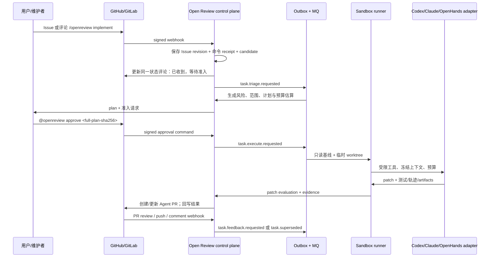

# 26 — Agentic Issue-to-PR 准入与闭环设计

> 状态：P0 控制面、确定性三阶段硬门控、通用判定接口及首个 TypeSafe Jev 适配器、受签名的 adapter handoff/callback 已实现；合成 Issue 已通过一次 Jev 真实 HTTPS 调用和响应校验，真实 provider Issue→Agent→Draft PR/MR 端到端验收尚未完成。Laya、AgentJev、LLM 适配器留待后续。adapter 已具备受限临时 workspace、路径/secret/diff 校验与 GitHub/GitLab Draft PR/MR 发布代码，但尚未取得真实 provider 或多副本 durable-job 的生产验收。范围：GitHub、GitLab 与自建 GitLab 中，受治理地将
> Issue/PR 请求转化为由 Codex CLI、Claude Code CLI 或兼容 Agent 执行的候选 PR。
> 非范围：自动合并、支付/计费、绕开分支保护，或把任意 Issue 正文当作可执行指令。

## 1. 结论

可行，但必须建设为 **Agent 任务控制面**，而不是在 webhook worker 中直接启动
CLI。推荐默认模式是 **plan-first + 人工准入**。P0 不提供自动执行；新仓库没有策略记录时
等价于 `disabled`，`suggest` 不会创建任务，只有显式 `manual` 才允许授权成员创建任务。
`manual` 仓库还可单独启用一个精确 Issue label（默认 `openreview:implement`），让匹配的
用户 Issue 自动创建 **候选任务**；候选仍必须经过确定性硬门控、所选模型判定、源码冻结和 owner/admin 计划批准。
未来即使引入受限自动执行，也必须另设 opt-in 的低风险策略、目录 allowlist 与持续分类证据。无论模式，Agent 都只能
创建候选分支和 PR，合并仍由 GitHub/GitLab 分支保护、CODEOWNERS 与 Open Review
merge gate 决定。

这避免三个常见错误：

1. Issue 的自然语言、评论、引用文件和网页内容属于不可信输入，不能直接进入 shell 或
   作为 system prompt。
2. “成功创建 PR”不是“修复成功”；计划、patch、测试、审查结论与 provider 回执必须
   分开保存。
3. 重试、评论追问、push、PR review 和 Agent 崩溃会同时发生；provider timeline 不能是
   唯一任务状态机。

## 2. 可借鉴的开源模式

| 参考 | 应吸收的模式 | 不直接复用的部分 |
| --- | --- | --- |
| [SWE-agent](https://github.com/SWE-agent/SWE-agent) | 从 Issue 问题陈述启动、Docker/云沙箱、trajectory、patch 提交 | 不让外部 CLI 直接拥有租户权限、分支创建或合并能力 |
| [SWE-agent GitHub App workflow](https://github.com/swerobot/swe-agent/blob/main/README.md) | `/code` receipt、plan mode、进度回写、测试后创建/更新 PR | 其命令本身不足以覆盖企业审批、数据分类、预算与多提供方身份 |
| [OpenHands Software Agent SDK](https://github.com/OpenHands/software-agent-sdk) | 调度/Webhook 历史与 Agent runtime 分离；本地或临时 Docker/Kubernetes workspace | 不将其作为控制面事实来源；Open Review 继续管理租户、策略、审计和 provider writes |
| Open Review 现有实现 | provider webhook ACK、outbox/inbox、run snapshots、Issue revision、工作队列、规则/merge gate | 当前 `review_runs` 只描述“审查”，不能混入写代码 Agent 的尝试、成本和权限状态 |

SWE-agent 的公开流程已展示“任务回执、上下文收集、隔离测试、创建/更新 PR、回写结果”的
实用闭环；其 CLI 文档也明确将代码执行放在 sandbox runtime 中。OpenHands 则明确区分
automation/webhook/run history 与 Agent Server/workspace。上述是架构参考，不复制任何
云服务、商业协议或实现代码。

## 3. 目标链路



外部 webhook 只在签名校验、Issue/评论 revision、审计与 outbox 同事务落库后返回。它不
clone 仓库、不调用模型、不创建分支。任务状态、操作权限、成本和证据由 PostgreSQL
控制面持久化；RabbitMQ 只负责可重建投递。

## 4. 领域模型

新增的顶层对象不是 `review_run`，而是 `agent_task`：

| 对象 | 不变量 / 用途 |
| --- | --- |
| `agent_tasks` | 一个可信意图在一个 Issue/PR revision 上的工作单；包含 provider-qualified repo、base SHA、intent、状态、revision、预算和 actor |
| `agent_task_context_snapshots` | 任务描述、Issue snapshot、仓库说明、规则、模型路由、沙箱 profile、允许工具与 policy SHA；永不被后续编辑改写 |
| `agent_task_plans` | 结构化目标、文件/依赖影响、测试、风险、不可确定项；plan revision 与审批绑定。旧自由文本计划保留；新计划五项分别存储，并渲染为唯一 canonical summary，其 SHA-256 是审批及 adapter 交接的不可变契约。字段或摘要不一致时拒绝读取/执行。 |
| `agent_attempts` | 每次沙箱执行的 lease、runner image digest、adapter version、模型、token/成本、开始/完成、失败码 |
| `agent_workspaces` | 临时隔离环境、base/head SHA、worktree/volume 标识、网络 profile、生命周期；不得存储明文 provider token |
| `agent_artifacts` | patch、diff 摘要、命令清单、测试日志、SBOM/扫描结果、trajectory 的受控引用与 hash |
| `agent_patch_evaluations` | diff budget、路径策略、secret/license/SAST、测试、review gate 与风险结论 |
| `agent_pull_requests` | provider PR/MR URL、分支、head SHA、创建回执、同一 PR 的更新关系 |
| `agent_feedback_cycles` | 每个可信 PR review/命令的原始 revision、分类、是否可执行、消耗预算、产生的 attempt；防止无限循环 |
| `agent_task_policies` | provider-qualified 仓库开关；`disabled`/`suggest`/`manual`、可选 exact label candidate admission 与 revision。无记录即 disabled，P0 禁止自动执行 |
| `agent_task_classifications` | 后续分类器的结构化证据：风险、变更范围、敏感路径、模板完整度、可复现性、置信度与拒绝原因；分类不授予执行 capability |

所有表均有 tenant ID、创建/更新时间、revision、审计事件和稳定 idempotency key。Issue
标题、正文、评论、PR 描述、代码注释、网页链接和模型输出只能存为 **untrusted evidence**；
只有管理员配置、已验证成员命令、冻结 policy 和 provider 安装信息能形成可执行 capability。

## 5. 准入状态机与门控

```text
received → triaging → plan_ready → awaiting_approval → admitted
    → provisioning → executing → evaluating → pr_pending → pr_open
    → feedback_pending → executing (new bounded cycle)
    → succeeded | needs_attention | rejected | cancelled | superseded | failed
```

| 门控 | 通过条件 | 拒绝/暂停时的行为 |
| --- | --- | --- |
| G0 事件真实性 | webhook 签名、安装、repo、Issue/PR revision、成员身份有效 | 只记录安全审计，不创建任务 |
| G1 意图可解析 | 明确 `/openreview implement`，或可信 label/规则；任务与仓库范围可确定 | 回写“需要补充目标/验收标准”，不调用模型 |
| G1.5 仓库开关 | 精确 provider/API base/repository 的策略是 `manual`，成员拥有任务创建角色；可选自动候选必须命中 Owner/Admin 配置的精确 label | `disabled` 或 `suggest` 不创建任务；自动候选只建档，不调用 CLI |
| G2 分类与任务准入 | Issue 模板字段、AC、风险分类、变更预算、代码所有者/路径策略满足 | 分类仅产生 `candidate`；不分配 sandbox、不创建分支 |
| G3 计划批准 | plan SHA 绑定已冻结的 Issue revision 与 source SHA；owner/admin 批准 | 尚未再次读取 provider；审批后的变化必须在 G4/G6 再检查，不能把本门控称为实时 provider 验证 |
| G4 执行环境 | base SHA 存在、安装具备最小写入权限、runner image/adapter allowlist、并发和预算可用；adapter 执行前重新读取 Issue/PR revision | 版本变化时停止，不调用编码 CLI；其他环境失败进入 `needs_attention` |
| G5 Patch 安全 | diff/file/token/time budget、禁止路径、secret/SAST/license、依赖来源、测试策略通过 | 不创建 PR；保留 patch artifact 与明确失败原因 |
| G6 PR 发布 | 分支名由系统生成；发布分支前再读取 Issue/PR revision；head SHA 未漂移；PR body 使用 evidence 模板；provider receipt 已持久化 | 版本变化时不推送分支；provider 模糊失败时按稳定 marker 查找，不重复开 PR |
| G7 反馈再执行 | 评论来自可信角色或匹配指定 command；反馈与 PR head/任务 revision 绑定；剩余 cycle/budget 足够 | 标记 `needs_attention`，而非让任意评论驱动 shell |
| G8 合并 | 现有 GitHub/GitLab branch protection、required check、CODEOWNERS、Open Review gate 全部通过 | Agent 无 merge capability；仅说明阻塞项 |

默认策略：安全、基础设施、身份、支付、迁移、依赖锁文件、CI workflow、生产配置、删除或
大范围重构必须 `plan_ready → awaiting_approval`，并且有人工 owner。P0 的所有任务都必须
人工批准计划；分类器未来只允许把低风险、目录 allowlist 内、变更上限很小且测试命令已注册的
项目标记为“可建议自动化”，不会自行把任务推进到执行。

### 确定性 Judge / Evaluate / Verify 与可插拔判定后端

现有 `deterministic-v3` 的 **Judge / Evaluate / Verify** 是本项目的三阶段规则，不是 TypeSafe **Jev** 模型。规则运行在 provider 重新读取的 snapshot 上：Judge 识别不可信指令与硬策略，Evaluate 评估任务完整度和风险，Verify 绑定安装、仓库策略、Issue revision 与 source SHA。Issue 文本只是证据，不能直接成为 CLI 指令。按以下顺序给出**解释性结论**：

1. **硬拒绝**：策略关闭、注入/密钥外传指令、来源 revision 已变化、仓库未验证。
2. **补充上下文**：问题现象、预期与验收材料不足以形成有界计划。
3. **人工计划**：敏感或跨模块范围、缺少明确验收标准、低置信度或测试不可确定；即使低风险也仍等待 owner/admin 批准。

分类输出包含触发规则、风险信号、快照 SHA、版本和 `Judge/Evaluate/Verify` 三段证据，以及受控的 `next_action`。当前动作只可能是拒绝、补充上下文、捕获 source 或等待计划审批；它不包含“执行”或“合并”。规则已硬拒绝或要求补充上下文时不会调用模型；模型只能维持 `requires_human`、增加审查要求或收紧为 `needs_context`/`rejected`。LLM 不能单独把 `suggest` 变成 `manual`，更不能授予 sandbox、provider 写入或 merge 权限。

仓库策略中的 `decision_backend` 在创建任务时冻结，候选在 source worker 验证 Issue 与 base SHA 后才调用模型；端点与凭据只来自部署环境变量，Issue/仓库文本不能指定网络地址。新建策略默认 `jev`，迁移前的策略和任务保持 `deterministic`，旧客户端更新策略不会暗中切换后端。每次保存策略的审计事件记录所选后端与策略 revision，供后续追溯判定来源。当前 API 只接受 `jev` 和 `deterministic`；其他模型仅是后续扩展目标，不能在 Console 启用。

| 后端 | 实际协议 | 部署条件 |
| --- | --- | --- |
| `jev` | TypeSafe `POST /v1/systemone`，Choice 概率分布 | HTTPS + `AGENT_DECISION_JEV_API_KEY`；未配置时停止准入，绝不静默回退 |
| `deterministic` | 本地纯规则 | 供旧策略及明确选择的离线规则模式使用 |

后续 adapter 可以实现同一 `Backend.Evaluate(Input) -> Signal` 接口：[Laya](https://github.com/NandhaKishorM/laya) 是 Python 推理 SDK，需另加私有服务；[AgentJev](https://github.com/malevrigns/agent-jev) 自带 `/api/evaluate`，但默认只监听本机。两者协议及校准表现不同，后续应各写适配、契约测试和本任务域评测，再开放策略选项；当前版本**未集成、未部署**它们。

模型 `plan` 也仅意味着**可提交人工审批计划**。结构化 Choice 概率需要最高项至少 0.80、领先第二项至少 0.15；否则按不确定处理。这个阈值只是初始防护，并非业务域校准结果；上线前需用真实 Issue 样本测误拒、漏拒和分语种表现。模型超时、无效分布、密钥缺失均 fail closed，不能把当前 adapter 单测误称为 provider 端到端验收。

### P0 已落地的控制面边界

`agent_task_policies`、`agent_tasks`、`agent_task_plans`、`agent_task_interactions`、`agent_task_feedback_cycles` 与
`agent_task_classifications` 已有迁移和控制面 API。GitHub 的普通 Issue comment 与 GitLab 的 Issue Note 已能接受严格的
`@openreview implement`，并使用独立 interaction receipt + outbox 回复；它们不会伪装成
PR review。当前只允许如下有限转换，且每次写入都进入 audit events：

```text
无策略 / disabled / suggest ──> 不创建 Agent 任务
manual + reviewer|admin|owner + explicit command ──> received + source pending
manual + exact opt-in Issue label ──> candidate received + source pending
received + provider-read immutable base SHA ──> source ready
source ready + plan ──> awaiting_approval
awaiting_approval + owner|admin + 精确 plan revision ──> admitted
```

命令或 label-driven webhook 中的 Issue 标题、正文和 labels 会冻结为分类证据 hash，并交给
`deterministic-v3` 硬门控。它会给出 `rejected`、`needs_context` 或 `requires_human`、风险等级、规则置信度
和规则理由；命中 prompt-injection/secret-exfiltration 模式会硬拒绝，缺少足够问题上下文时不会生成计划，
高风险路径（凭据、支付、生产、迁移、部署、CI 等）仍强制人工批准。它不读取 shell、不会执行模型提示中的指令，也不会将“低风险”转化为
执行授权。所选模型判定只作为记录在同一任务 revision 上的附加信号，不能覆盖此硬门控。

自动候选的初始 provider 回复按 task ID 使用稳定 marker 和唯一 outbox key；同一 Issue revision 的不同 webhook delivery 仍保留各自 interaction receipt，但不会刷出第二条候选评论。硬拒绝与缺少上下文分别说明阻断原因，不得把它们写成“即将捕获 source 或批准计划”；显式 Issue 命令沿用相同的状态措辞。独立 PostgreSQL 16 集成测试验证了双 delivery/单回复回执；真实 provider 端的自动候选评论仍待验收。

`agent-task-source-admitter` 使用部署侧 GitHub App/GitLab 凭据先读取当前 Issue，再只读解析默认分支和精确 commit。普通 Issue 的 revision 是 provider、仓库、Issue 编号、标题和正文的规范化摘要；自动候选还将完整 label 集合纳入摘要。因此 bot 回执评论不会让任务失效，而正文修改或移除自动准入 label 会让旧任务停止。source worker 会用 provider 当前内容重做规则分类，并对合格 Issue 调用所选模型，写入
`source_base_ref + source_base_sha` 后才允许创建 plan；直接通过管理 API 创建的任务也必须过同一门控。该 worker 不持有 adapter secret，不 clone、不执行 CLI、
也不创建分支或 PR。读取失败会将任务转为 `needs_attention` 并异步更新原 Issue；它不会以可变分支继续。

临时 provider/Jev 故障后的恢复使用 `POST /agent-tasks/{id}/retry-source`，只接受有任务管理权限的成员、当前任务 revision、`source_state=failed` 且从未创建 plan/attempt 的任务。事务内重新置为 `pending` 并写入新 dedupe key 的 outbox；同一 revision 的重复请求返回冲突。source worker 仍必须重新读取 provider Issue/反馈 Draft PR 与默认分支，并重新运行硬门控和所选模型，不能重用失败前的结果。Issue revision 已变化时继续 fail closed，需从新 revision 创建任务；安装已停用或仓库范围被撤销时拒绝重试。首次成功来源抓取只展示在 Console；重试成功会更新原有的 provider 状态评论，不留过期的“needs attention”。

计划批准后到实际运行之间，Issue 仍可能改变。隔离 adapter 因此在调用 CLI **前**和推送分支**前**再次只读核对 Issue/反馈 Draft PR/MR revision；自动候选还会核对完整 label 集。校验失败即停止，本地 patch 不会发布。这是运行时防旧计划的门控，不等同于跨 provider API 与 Git push 的原子事务；极短的检查后竞态仍需以 provider webhook supersession 与发布后 reconcile 处理，不能宣称为生产级零竞态保证。

批准计划会在同一事务进入 `execution_queued`，写入 `agent.task.execute.requested` outbox，并进入独立的
RabbitMQ quorum 队列。`agent-task-runner` 会创建可恢复的 lease attempt；在没有单独部署 sandbox
adapter 时，它必须以 `agent_executor_not_configured` 进入 `needs_attention`。因此缺省部署不是“已经运行
Codex/Claude/OpenHands”，也不会 clone、创建 branch、push 或创建 PR。受限 adapter 与 provider 来源重读已有实现，
但尚未完成真实 Issue→Agent→Draft PR/MR 的 provider 端到端验收。

attempt 的 worker 必须在 lease 到期前续约；续约失败即失去写入资格。`000083` 还将仓库策略的
`policy_revision`、`max_attempts`（1–3）与 `max_execution_seconds`（60–7200）复制到 task；之后的
策略编辑只能影响新的 Issue revision。每个 attempt 有独立、不可由 heartbeat 延长的 `deadline_at`，续约
被 `min(lease, deadline)` 截断；到期或失联都会进入 `needs_attention` 并请求停止精确 adapter job。
broker redelivery 仅能重领尚未绑定 adapter job 的过期 lease；只要 job 已绑定，即使还没有拿到启动回执，也不允许在同一计划下自动创建第二个编码执行，必须由 reaper 终结原 attempt，再由人核对分支/Draft 并批准新计划。超过 retry 上限的 broker redelivery 同样不会重新运行代码。该 lease/期限机制只
保护同一 immutable task/plan tuple，不把 provider token、工作目录或 CLI 参数写入控制面数据库。

当部署 `AGENT_TASK_ADAPTER_URL` 后，runner 只将 provider-qualified 资源标识、冻结的 base ref/SHA、冻结的计划、固定
任务的冻结 Agent 分支名和 callback 地址交给 adapter。首次任务使用 `agent/<task-id>`；反馈子任务仅继承已完成父任务的同一分支，绝不生成第二个 PR/MR。双方使用 `AGENT_TASK_ADAPTER_SECRET` 的 HMAC
签名。adapter 的 `POST /v1/open-review/tasks` 只预留 job，不启动编码 CLI；runner 先把返回的 job ID 持久绑定到当前 attempt，再发送签名的 `POST /v1/open-review/tasks/{jobID}/start`。adapter 在调用编码 CLI 前还必须向控制面 `POST /v1/agent-adapter/starts`，原子消耗该 attempt 与 job ID 的一次性数据库启动门控（迁移 `000090`）。重复启动、已取消或过期的 lease 都不能再次获取启动权；启动前取消可撤销本地预留。这样极快的终态回调也不会早于控制面的 job 绑定。adapter 的私有单实例卷现在先落盘不可变 submission/Job ID，再返回预留回执；重启可用原 ID 继续未启动的预留，并重投已落盘但未确认的终态回调。`starting`/`started` 状态重启后**绝不重新执行 CLI**，只尝试报告 `needs_attention`。这仍不是多副本 durable work queue；启动授权与本地落盘之间崩溃时，可能只能由 lease reaper 终结原 attempt。
callback 还必须带唯一 delivery ID、adapter job ID 和未过期 lease。`completed` 只能回传 draft
PR URL、固定分支和 head SHA，永远不会自动 merge。adapter 自己负责独立 sandbox、最小化 provider
权限和 patch evaluator；它不能从 Open Review 获取数据库、宿主路径或 provider credential ref。

回调记录在 `agent_task_adapter_events`，同一 `(attempt_id, delivery_id)` 的重投只返回原结果；带不同
payload 的重复 delivery 会被拒绝。回调成功后控制面仅在原 Issue 留下“draft PR ready”及 Console 链接，
明确说明仍需常规 review/merge gate；失败或 `needs_attention` 同样异步回写到原 Issue。控制面不会把
adapter 的自然语言 summary 当作测试、批准或合并证据。

取消是两段式且 fail-closed：控制面事务先将运行 attempt 标为 `superseded` 并撤销 lease，再为每个已经
绑定 `adapter_job_id` 的 attempt 写入高优先级 `agent.task.cancel.requested` outbox。独立取消队列使用
`attempt_id + adapter_job_id` 向 adapter 的 `/v1/open-review/tasks/{job}/cancel` 发出 HMAC 签名、可重投的
停止请求。没有 adapter 时该请求安全确认，因为本地 lease 已无效；adapter 的取消回执不等同于 PR/测试成功。
即使远端停止超时，迟到 callback 也无法越过本地状态机把任务标为完成；adapter 在每次 push/Draft 写入前还会检查控制面 lease。但 provider 写入已开始时，取消与远端 API 不是原子事务，仍可能留下分支或 Draft PR/MR。运营人员需核对并按权限关闭或回收；不能把本地取消回执当作 provider 侧清理成功。

Issue 命令收到后会立即回复“任务已记录、等待计划和审批”，并对触发评论添加确认表情；回复
通过 marker 去重。部署配置了 `OPEN_REVIEW_APP_URL` 时，回复还附带任务详情的稳定 Console
深链接（`/:tenant/agent-work?task=:id`）；该链接失效时 Console 仍展示可用队列，不把整个页面
变为不可用。GitLab 根据 `resource_kind=issue` 发布到 Issue notes，GitHub 使用共享的 Issue
comments API。两者均不创建 review request、review run 或 merge check。

## 6. 执行适配器契约

不把 Codex CLI 或 Claude Code CLI 固定写进业务 worker。定义 `CodingAgentAdapter`：

```text
Prepare(snapshot, workspace) -> AdapterSession
Plan(session, task) -> StructuredPlan
Execute(session, approvedPlan) -> PatchArtifact + Trajectory
Resume(session, feedbackSnapshot) -> PatchArtifact + Trajectory
Cancel(session) -> Receipt
```

第一个版本可实现三个 deployment-owned adapter：

- `codex-cli`: 注册的只读镜像和固定 binary digest；模型/认证仅由 runner secret mount 提供。
- `claude-code-cli`: 相同契约，不将 `ANTHROPIC_API_KEY` 暴露到任务记录、日志或 prompt。
- `openhands`: 作为远程/本地 Agent Server adapter，Open Review 仍保存 task 状态和 provider
  写入回执。

Adapter 输出只接受结构化 result：补丁 hash、受限命令结果、测试引用、消耗、停止原因。模型
文字不能声明“测试通过”或“已创建 PR”；控制面必须从 runner artifact 与 provider receipt
独立验证。

## 7. Sandbox 与凭据边界

1. 每个 attempt 使用短生命周期容器/微虚拟机与独立 git worktree；默认无 Docker socket、无
   host home、无 SSH agent、无 Kubernetes token。
2. checkout 使用一次性、repo-scoped、最小权限凭据；写 PR 的 credential 与 clone credential
　分离，且只由 publisher 使用。Coding executor 不继承 adapter 的 token/HMAC/model-key 环境；
　模型认证必须通过独立的 capability broker/proxy，而不是让 Agent 读取环境变量。
3. 默认 deny egress；包安装、测试服务、内部 registry 通过 repository profile allowlist
   放行。禁止执行来自 Issue/PR/仓库文档的“忽略规则、上传密钥、curl 管道”等指令。
4. 沙箱从冻结 base SHA 开始，Agent 只能写任务冻结的专属 `agent/<task-id>` 分支；反馈子任务只可更新其已验证的原 Draft PR/MR 分支；禁止 force push、
   tag、release、merge、修改其他 PR。
5. 执行前后做 secret scanning、路径/size/diff budget、二进制/生成物限制和授权依赖检查。当前 P0 adapter 在提交和推送前拒绝 Git binary patch、Git 控制文件、环境/密钥文件，以及新增行中的常见高置信度凭据格式；这仍是基础防线，不等同于完整的企业 secret/license/SAST 扫描。
   所有 artifact 加密保存、保留期受 tenant policy 控制。

## 8. 反馈闭环

PR 创建后不是结束。P0 已实现的反馈入口仅是可信成员在该 **Open Review 已创建的 Draft PR/MR** 评论
`@openreview revise <feedback>`；普通 review comment、push、review decision 和任意 Issue 文本都不启动 Agent。

1. Webhook 先验签并校验成员角色、repository-qualified `manual` policy 和 `max_feedback_cycles`（0–3）。事件由 provider delivery 和父 attempt/comment 双键去重。
   反馈子任务的 attempt、执行时长和 cycle 上限取当前仓库策略与父任务冻结上限的较小值；管理员之后调高策略，只影响新建的独立任务，不能扩大已批准任务家族的预算。
2. 控制面仅匹配已经 `completed` 的 Open Review Draft PR/MR attempt、PR/MR number 与其冻结 Agent branch。它创建新的 child task，而不是恢复旧 sandbox；child 继承的是**原 attempt 的 head SHA 与分支名**，不是评论提供的 ref。
3. source-admitter 再读 provider。PR/MR 已不再是 Draft、分支名变化、head SHA 变化或凭据失效时，child 进入 `needs_attention`，不创建计划或执行环境。
4. 反馈子任务仍由确定性 Judge/Evaluate/Verify 门控，必须创建并由 owner/admin 批准一个新 plan。source-admitter 先以只读 Provider API 重新取得原 GitHub Issue comment / GitLab MR note，核对 ID、作者、所属 PR/MR 和指令 SHA-256；编辑、删除或换作者时关闭本轮准入。只有这份重新读取的证据会送到冻结选择的 Jev 后端；模型只能收窄确定性结果，不能产生 plan 或执行授权。冻结的评论绑定随签名任务交接进入隔离 adapter，adapter 在 CLI 启动前和推送前再次核对 Draft head 与同一评论；不匹配则停止。Laya/AgentJev/LLM 仍只是抽象接口，没有部署实现。最终只读核对与 Provider 写入之间仍有非原子竞态，不宣称零竞态保证。
5. adapter 只能更新同一个验证过的 Draft PR/MR；执行、取消和 provider 状态回写都带 child task/attempt 的稳定 marker。它没有 merge capability，详细 trajectory 只在 Console 授权 Evidence 页面可见。

## 9. 队列、恢复与观测

沿用当前 transactional outbox + RabbitMQ quorum queue + inbox claim/release 模型，新增：

| Topic | 优先级 | 幂等键 |
| --- | --- | --- |
| `agent.task.source.resolve.requested` | normal-high | task + source admission |
| `agent.task.triage.requested` | normal | provider issue/PR + revision + intent |
| `agent.task.plan.requested` | normal | task + context snapshot SHA |
| `agent.task.execute.requested` | bounded high | task + approved plan SHA + attempt number |
| `agent.task.evaluate.requested` | high | attempt + patch SHA |
| `agent.task.publish-pr.requested` | high | task + branch + patch SHA |
| `agent.task.feedback.requested` | normal | provider comment/review ID + revision |
| `agent.task.reconcile.requested` | low | task/attempt checkpoint |

长运行任务使用 lease heartbeat、checkpoint 与最大 wall-clock/token/cost 限额；超时进入
`needs_attention`，不能静默重跑。指标至少包括：准入拒绝率、plan 批准率、patch-eval
通过率、PR review 轮数、成功/回滚率、每成功任务成本、卡住任务年龄、sandbox/adapter
失败率、provider 回执歧义次数和 secret-policy 拒绝数。

当前 runner 已实现 heartbeat 失联的最小收敛：每 15 秒（可由
`AGENT_TASK_REAPER_INTERVAL` 调整，最低 5 秒）扫描已过期 lease。它把 attempt 标为
`needs_attention`、写入 Issue/Console 证据，并通过 `agent.task.cancel.requested` 尝试回收
同一个 adapter job；不会因为 lease 过期重新执行代码。当前控制面已强制执行 task 快照的
wall-clock/attempt 上限并将 deadline 放入签名 adapter handoff；token/cost、路径、diff 与网络额度仍须
随实际 sandbox/publisher 一起实现并以 artifact 回执验证。`agent-task-adapter` 现在提供了一个独立的
受签名 HTTP 边界、同一 attempt 的不可变提交指纹校验（不同内容的重试返回冲突）、计划正文 SHA-256 校验、取消、心跳、固定 Codex/Claude profile、临时 Git workspace、路径/secret/diff
预算校验和 GitHub/GitLab Draft PR/MR 发布实现；它必须由部署方构建含固定 executor binary 的镜像并提供
adapter-only repo token，不能把缺省镜像当作已可执行的生产 sandbox。控制面的 `000090` 一次性启动门控能在多副本/重启时拒绝**重复执行**；adapter 的私有持久卷和排他锁在单实例重启后保留预留/启动/终态身份，未确认的终态回调沿用同一 delivery ID 再投。已启动的 CLI 不会跨重启继续。现在 adapter 在首次 push 前持久化精确 commit/patch 检查点：Issue-origin 任务重启后只读核对原 Issue、单个开放 Draft、专属标记与 head SHA；反馈轮次只读核对原始评论未编辑、原 Draft PR/MR 编号、专属标记、分支和新 head SHA。完全匹配且控制面租约仍有效时可补报完成，否则进入 `needs_attention`，不会重跑 CLI、push 或 Draft POST。租约过期、评论变化及缺少精确匹配 Draft 的场景仍需人工核对。此单实例恢复不提供跨节点高可用或隔离恶意 CLI 的能力；多副本与完整 provider publication reconcile 仍需外部 durable Job backend 或 Kubernetes Job receipt，尚未提供生产证据。

控制面另以签名 `publication_checkpoint` 事件保存每次 attempt 的预推送提交/补丁证据；adapter 必须先 fsync 本地回执、再得到控制面接受，才允许首次 provider 写入。Agent Work 将这项证据独立展示为“provider 发布未确认”，不能生成 Draft 链接或将任务判为成功。过期 lease 的重放不能重新续租；完成回执与检查点不一致时拒绝。该可见性不等于过期后的 provider 查证，也不授权重推或重建 Draft。

单实例 Docker adapter 另在共享 checkout volume 根目录取得非阻塞独占锁，**先于**孤儿容器/checkout 清理；清理函数也要求持有对应根目录的锁。即使误把两个实例配置成不同 receipt 目录但同一个 workspace volume，第二实例仍须失败，不能删除第一实例的在运行任务。跨进程测试验证两套 receipt 锁可同时取得而共享 workspace 锁不能；这是误配置防护，不是多副本调度或跨主机租约。

编码 CLI 以独立 Unix 进程组运行，正常退出和取消时会清理同组子进程。可选开发 adapter 现在另外租用与凭据所有者不同的 Linux UID/GID，执行前转交 checkout 所有权、执行后先停进程组并收回私有 checkout；并发任务获得不同 UID。受限能力集、无继承组/能力和 Linux 容器测试证明 CLI 不能读取 adapter 私有凭据文件或父进程环境。此机制仍共享容器 PID/网络命名空间，脱离进程组的进程可能存活并碰到未来复用的 UID；它不是每任务 sandbox。生产环境 adapter 启动仍明确拒绝，直到每任务隔离、模型凭据代理和 provider 写入边界通过独立验收。

开发 adapter 也不会因 Compose 默认 `ENVIRONMENT=development` 静默启动：必须额外显式设置 `AGENT_ADAPTER_ALLOW_UNSANDBOXED_DEVELOPMENT=true`。这一开关仅允许本地验收，不提升上述 UID 隔离为生产级 sandbox。

可选的仓库验证配置只能由部署方提供：用 `docker-compose.agent-verification.yml` 把私有 `0600` JSON 文件挂到 adapter，并与每任务 Docker 沙箱同时启用。配置以 provider、API base、仓库精确匹配；有配置但无匹配项或镜像未按 `sha256:` 固定时，任务在编码前失败，不回退到“未验证”。示例仅用于说明结构，镜像 ID 和命令应由运维审核：

```json
{"version":1,"entries":[{"provider":"gitlab","api_base_url":"https://gitlab.example/api/v4","repository":"team/project","image_id":"sha256:<64 lowercase hex>","argv":["/usr/local/go/bin/go","test","./..."],"timeout_seconds":120}]}
```

adapter 在 Agent 输出完成、patch 首次校验通过后，以另一租用 UID 在无网络、只读根文件系统、无 Docker socket/模型或 provider 凭据的容器中运行该固定 argv。命令失败、超时、输出超限、容器清理失败，或执行后 Git 元数据/补丁发生变化，均停止 push 和 Draft。成功将固定 profile 与输出的 SHA-256/字节数写入 Draft Verification 小节，并随发布检查点、终态回调持久化到精确 attempt；Agent Work 与 Issue 终态回复只展示有界摘要，未配置时明确标注未记录。检查点仍不证明 provider 已接受 Draft，命令成功也不是 CI、SAST 或产品验收。迁移 `000102` 已在隔离 PostgreSQL 完整迁移链及 Agent 状态集成测试中验证；真实 coding Agent→验证命令→Draft 的 provider 验收及完整日志 artifact store 仍未完成。

开发 Codex profile 现有每任务模型访问代理：部署方配置 `AGENT_ADAPTER_CODEX_MODEL_API_BASE_URL`（HTTPS、Responses 兼容）、`AGENT_ADAPTER_CODEX_MODEL_API_KEY` 和固定 `AGENT_ADAPTER_CODEX_MODEL`；这是编码模型凭据，与仅用于 Issue 准入判定的 `AGENT_DECISION_JEV_API_KEY` 不可混用。Codex 的隔离用户级配置只保存本地代理地址及环境变量名，CLI 环境只得到一次任务的随机 capability；adapter 将请求转给固定上游并注入真正的模型密钥，强制固定模型、`store=false`、同步响应、单次输出上限，并拒绝 `previous_response_id` / `conversation` / 服务端 `prompt` 等持久状态入口。任务 CLI 的配置及不可被仓库配置覆盖的命令行参数均关闭 Web Search 与多 Agent；模型代理另以递归工具白名单只允许本地 `function`/`custom` 与其 namespace，拒绝托管 Web Search、Code Interpreter、远程 MCP 及相应 `tool_choice`，防止新版本 CLI 重新声明这些工具。代理还限制每任务最多 24 次请求、每次 256 KiB 输入与 8,192 个请求输出 token、累计 1 MiB 输入和 65,536 个请求输出 token、每次最多 16 MiB 响应；超额及未授权路径、上游重定向均拒绝。安装的 Codex CLI 已对本地 TLS 假上游完成真实协议握手和一次工具调用后携带完整历史的第二轮请求；这不是付费模型的质量、实际 token 计费或真实代码任务验收。Claude profile 在独立模型凭据代理实现前于 adapter 启动时拒绝。当前代理仍与 CLI 共享网络命名空间，未证明生产沙箱隔离、provider 成本上限或真实 Issue→Draft PR 闭环，因此生产写凭据门控不变。Codex 自定义模型提供方的配置字段依据[官方配置参考](https://learn.chatgpt.com/docs/config-file/config-reference)，[官方基础配置](https://learn.chatgpt.com/docs/config-file/config-basic)明确 `web_search = "disabled"`，无服务端存储时重放历史依据[官方会话状态说明](https://developers.openai.com/api/docs/guides/conversation-state)，凭据保持在受信代理一侧依据[官方沙箱安全建议](https://developers.openai.com/api/docs/guides/agents-api/environments/security)。

可选的 `docker-compose.agent-codex.yml` 现在选用 `adapter-codex` 镜像阶段，将 Node 构建镜像固定到 digest、CLI 固定为 `@openai/codex@0.142.1`，构建时和独立非 root UID 启动时均校验实际版本。默认 adapter 镜像仍不带编码 CLI；可选镜像也只能用于显式开发模式，不绕过每任务沙箱的生产拒绝。CLI 安装方式参考 [OpenAI 自托管环境文档](https://developers.openai.com/api/docs/guides/agents-api/environments/self-hosted)。

签名 handoff 现包含冻结的 provider installation ID。单节点开发可让 adapter 从私有 JSON 文件按 `installation_id + provider + api_base_url + repository` 四元组精确选取 repo token 与 clone base；缺项、重复或宽权限文件直接失败，runner/控制面仍不传 token。文件在每次执行前重读，轮换影响后续任务；全局 provider token 仅保留开发兼容入口。Linux UID 分离降低了 CLI 对该文件的直接读取风险，但文件源和共享容器都**不能**作为 SaaS 多租户生产凭据代理或安全验收。

生产凭据代理的协议、授权查询与 GitHub 发放进程已有代码，但当前未部署：adapter 可用独立 HMAC 密钥向私网 broker 请求一次任务凭据；broker 核对数据库中同一 `attempt_id + adapter_job_id` 的一次性启动记录、活跃租约/截止时间、执行中 task、获批 plan 的哈希、当前安装状态与仓库授权范围，然后才调用编码 App 为**一个仓库**发放 Contents/Pull requests 写、Issues 读的临时安装令牌。adapter 会核对响应中的同一四元组且拒绝 HTTP 重定向；静态文件只允许开发环境使用。长任务在本地提交完成、远程发布之前还要通过租约检查重新取令牌，并拒绝更新后的 clone origin 偏离最初准入目标；随后再读 Issue/反馈并检查当前 head。这减少任务起始令牌过期导致推送失败的风险，但不提供令牌撤销或跨 Git push/API 写入的原子性。GitHub 发放器要求部署方显式配置独立编码 App 私钥与逐仓库安装映射，**不会**把审核 App 的安装 ID 猜成编码 App 的安装 ID；缺映射、宽权限回应或 App 权限不足均拒绝。映射文件为 `0600` 私有 JSON，按每次请求重读，版本 1 的单条 `entries` 包含 `tenant_id`、`review_installation_id`、`review_installation_external_id`、`api_base_url`、`repository`、`coding_installation_external_id`、`clone_base_url`。仍需真实 App 安装/授权、生产 TLS 部署、令牌撤销、审计/限流、GitLab 项目级发放及 live Issue→Draft PR/MR 验收；不能把当前协议和本地测试视为 SaaS 生产写凭据边界已经完成。

运行期间每分钟还会扫描**已持久化且未确认**的终态回调并沿原 delivery ID 重投；当前正在执行的 job 不参与此扫描。控制面 lease 已失效时拒绝重投，不能借此复活或重启编码任务。

凭据 broker 现在会在同一 adapter job 的数据库行锁下预留发放序号，最多六次；每次留下 `reserved`、`issued`、`failed` 或 `withheld` 的持久回执，只保存任务、安装、仓库和时间等范围证据，不保存令牌。`issued` 表示 broker 已通过发布前授权复核并准备响应，不证明 adapter 实际收到令牌。GitHub 返回令牌后，broker 在将令牌交给 adapter 前再次核对活跃授权；任务、安装或租约已失效时记录 `withheld` 并拒绝响应。崩溃后遗留的 `reserved` 不自动退还额度，因为无法确定 GitHub 是否已经签发了令牌。这限制重复签发，但**不是**令牌撤销、加密令牌缓存或 provider 侧额度控制；生产仍需这些能力和实测。

一次性本地 GitLab CE 验收可显式设置 `ENVIRONMENT=development`、`AGENT_TASK_ADAPTER_ALLOW_HTTP=true` 和 `AGENT_ADAPTER_GITLAB_ALLOW_HTTP=true`，让 runner/adapter 使用 Docker 私网的 HTTP 回调与 clone 地址。adapter 仅在该显式开发模式允许明文 GitLab clone，且 clone base 必须与冻结的 GitLab API base 同源、路径匹配；GitHub clone 始终要求 HTTPS。真实或共享部署不得开启这两个明文开关，应配置 HTTPS 与隔离的 repository-scoped adapter 凭据。
本地 GitLab Draft MR 的 API 发布、返回 `web_url`、adapter 完成回执及控制面持久化使用相同的 provider-qualified 来源校验；HTTP 结果只在显式开发模式下由 adapter 接受，且 URL 必须与准入的 GitLab API 同源。GitLab 的 Draft 状态依赖 `[Draft]` 标题前缀和返回的 `draft=true` 证据，不能把普通 MR 记为完成。
补丁评估同时覆盖已跟踪改动与 Agent 新建的代码/测试文件：新文件先以 Git intent-to-add 纳入 diff，再接受同一目录 allowlist、文件类型、secret 与 diff 大小预算；越界文件不能因未被 Git 跟踪而绕过检查。这个静态过滤不代替运行时测试、SAST 或真正的进程/网络沙箱。
分支 push 使用 Git 的显式远端租约：Issue-origin 首次发布要求固定 Agent 分支尚不存在；Draft 反馈子任务只允许把该分支从批准时冻结的父 Draft head SHA 更新。远端分支被别人创建或更新时 push 原子拒绝，不能通过一次新的 attempt 静默覆盖旧发布。分支 push 后创建 Draft PR/MR 前，adapter 先按固定源分支查询已有 open Draft；已有单据只有在仓库、Draft 状态、分支和 head SHA 都与本次推送一致时才会复用。创建请求连接断开或返回服务端错误时，同样只按该精确 tuple 核对一次 provider 状态，不重新 POST；已有单据指向别的 SHA 时失败并等待人工处理。这是避免模糊响应造成重复建单的同步核对，不是跨 provider/API 与 Git push 的原子事务，生产仍需 durable publication receipt 与定期 reconcile。
创建的 PR `body` / GitLab MR `description` 还写入由冻结 Agent 分支派生的稳定归属 marker；复用或核对 Draft 时必须同时看到该 marker。仅有相同分支与 SHA 的第三方单据不能被认领为 Open Review 的完成回执；反馈轮次沿用同一 Agent 分支和 marker。

## 10. 与现有 Open Review 的衔接

可直接复用：provider-qualified installation、Issue revision/ACK、review configuration
snapshots、outbox/inbox、工作队列 lease、Model/BYOK 路由、Audit、notification routes、
PR evidence/merge gate、Rule Test Lab/Shadow 的无发布执行模式。

必须新增：Agent task/attempt/workspace/artifact/feedback 数据模型，adapter worker，sandbox
orchestrator，patch evaluator，Agent PR publisher，Console 的 Task detail/Plan approval/Artifact
页面，以及 provider command policy。`review_runs` 与 `agent_tasks` 应通过链接关联，不能互相
替代：前者审查一个 revision，后者尝试改变该 revision。

Agent Work 的任务详情现在只读关联成功发布的 Agent attempt 与同一安装、仓库、PR/MR 编号、Agent 分支及精确 head SHA 的 review run；provider webhook 与 adapter 回执的到达顺序不影响展示。若没有关联 run，页面明确提示检查 webhook 与 Draft 审核策略。此关联不改变 `review_drafts` 等仓库准入规则，也不代表审核通过或允许合并。
隔离数据库集成测试覆盖真实 `Enqueue`：默认 `review_drafts=false` 的 Draft delivery 仅审计跳过，不产生 run；管理员显式打开该配置后，同一 Agent head 的新 delivery 才创建 review run 并出现在任务详情。该测试不等于真实 GitHub/GitLab webhook 或生产授权验收。

## 11. 分阶段交付与验收

1. **P0 — Observe only**：Issue 命令 receipt、候选任务、结构化计划、Console 批准页；无
   sandbox、无写代码。验收：revision supersede、RBAC、prompt injection red-team、审计。
2. **P1 — Human-approved patch**：单 GitHub repo、Codex 或 Claude adapter、临时 sandbox、
   仅创建 draft PR。验收：worker crash/reclaim、预算耗尽、路径禁止、secret scan、provider
   receipt ambiguous recovery。
3. **P2 — Feedback cycle**：可信 PR review 到 bounded re-execution；关联 Open Review finding
   与建议。验收：相同评论去重、旧 head 不执行、循环上限、取消与 supersede。
4. **P3 — GitLab/self-hosted**：provider-qualified GitLab API host、OAuth/App/token 连接、
   自建 runner profile、network egress policy。验收：本地 GitLab CE 与真实 GitLab 各一条
   完整 Issue→draft MR→review feedback 链。
5. **P4 — 受限自治**：只允许可证明低风险的 label/rule，逐步 5%/25%/100% repo rollout；
   每阶段有停止阈值和一键禁用开关。永不开放 Agent 自动合并。

## 12. 建议的初始交互

```text
@openreview implement                      # 记录任务；source 核实后由人工编制待审批计划
@openreview approve <full-plan-sha256>     # 映射为 owner/admin 的账户批准精确计划
@openreview revise <instruction>           # 对当前 Agent Draft PR 产生受限 feedback cycle
@openreview stop                           # 取消未完成任务，保留证据
@openreview status                         # 返回 task、阶段、PR、下一步
```

`implement --draft` 自动执行仍未实现，也不会绕过计划审批。已实现 `implement`、`approve`、
`status`、`cancel`/`stop` 的 Issue 命令边界：`approve` 必须由映射到 workspace owner/admin
的 provider 身份发出，匹配精确 Issue revision、最新待审批计划的完整 SHA-256，并复用 Console
审批的风险分类与高危计划职责分离门控；`status` 只读取精确
Issue revision 的持久化任务/attempt/Draft PR 证据；`cancel`/`stop` 会 supersede 活跃 lease，使
迟到 adapter callback 不能再写入结果。每个命令都回复稳定链接至 Console Task Detail，并说明“当前阶段、
是否有 provider 写入、下一门控及 Owner”。这与现有 Review 评论的快速 ACK、异步完成和可点击证据保持一致。
