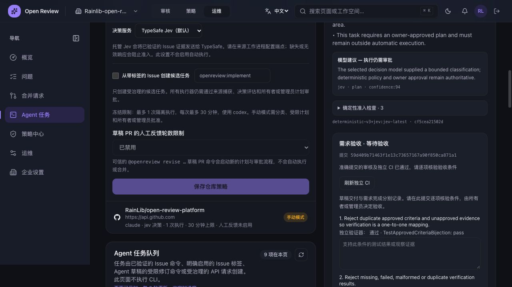
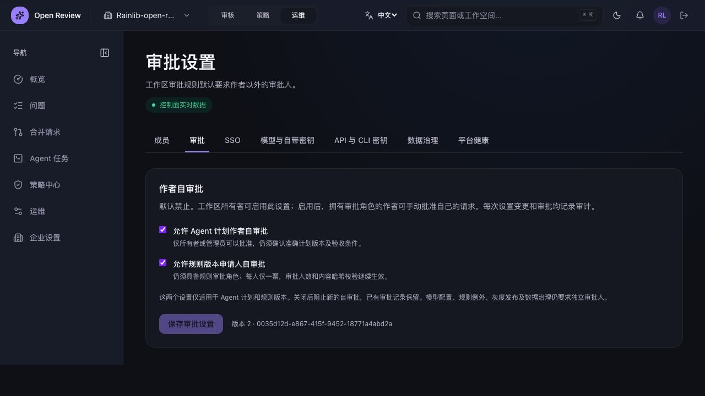

# 核心流程国际化验证（2026-10-08）

本轮先复核当前 Agent 验收回合，再开始 Console 中英文国际化。私有部署不包括购买、支付或商业化流程。源码、单元测试、部署状态和真实业务验收分别记录。

## Agent 验证结论

Issue #27 → Draft #28 的计划、准确版本审批、独立验证、受限修复、交付、要求修改后的反馈子任务，以及新提交再审已有真实记录。最新反馈任务 `752e7811-060b-4bf0-a240-ae391233b8e0` 对应提交 `59d409b71463f1e13c73657167a90f850ca871a1`，再审 `578d526d-d47f-4f75-8db6-1157b945ed4d` 完成且门禁通过，独立 CI 成功。完整回执见 [上一轮记录](31-agent-feedback-revalidation-request.md)。

本轮开始时数据库仍为 `awaiting_acceptance`，`decision` 为空。需求最终接受等待用户决定，Draft 未合并。不能据此声称整个服务所有功能已完成验收；CI 诊断驱动修复、Agent 分支自动 CI、规则 Shadow/Canary/回滚的完整实测、DLQ 恢复、严格主分支保护与其他部署拓扑仍需各自证据。

## 国际化范围

第一批支持 `en` 与 `zh-CN`，沿用 `open-review-ui-language` Cookie 和现有顶栏语言切换。服务端从 Cookie 读取语言，客户端通过同一 Provider 获取语言。语言刷新不修改后端策略、审批权限或审核输出语言。

- Agent 任务队列、执行配置、来源恢复、受限计划与审批、执行历史、验证回执、关联再审、逐项需求验收。
- 工作区自审批设置、规则库与详情、审批队列、策略绑定、Shadow/Canary 控件、例外申请、测试实验室、发现目录与反馈面板。
- 代码平台 Issue 分析列表与详情、创建 Agent 候选入口、保留快照重试。
- 共享设置标签、复制按钮、页面状态提示，以及已覆盖页面的日期和动态状态。

`workflow-copy.ts` 集中管理 882 条明确的界面词条与命名占位符。代码、命令、标识、哈希、签名回执、需求与批准计划正文、Agent/模型输出、用户填写的决定理由保持原文。规则模板的具体指令与来源描述保持其治理内容。

这是一批核心流程页面的国际化补齐，不代表全站所有页面和所有后台消息均已国际化。其他企业设置内容、通知、认证、审查配置和后台任意错误文本仍需后续覆盖；已有页面原先的语言支持继续保留。

## 本地检查

在 `apps/web` 下运行：

```sh
pnpm i18n:check
pnpm test:workflow
pnpm exec tsc --noEmit
OPEN_REVIEW_NEXT_DIST_DIR=.next-i18n-20261008 pnpm build
```

静态检查覆盖 27 个源码文件：未发现漏翻译的静态界面文案、未登记词条、重复词条、占位符不一致或翻译参与任务状态比较。技术命令、品牌和示例输入有明确的豁免列表。此检查不等同于所有动态后台消息已翻译。

35 项测试通过，包含 29 项 Agent/审核回归和 6 项国际化测试。覆盖占位符完整性、未知原文与哈希保留、插值只执行一次、值中 `$&` 与花括号不被重新解释、原型属性隔离、未知语言回退及中文门禁展示不修改原始证据。覆盖范围的 ESLint 与 TypeScript 检查通过，生产构建成功。

Node 源码测试通过 `scripts/register-test-loader.mjs` 使用项目的 `@/` 路径别名；不模拟被测业务模块。

## 部署与浏览器验收

Console 候选版本 `acceptance-20261008-i18n-v2` 已部署，镜像 ID `sha256:09ebd38feab0f797763f5e723c0748de76baa824bebc1fbdc4f196da2c7ff2ba`，容器健康检查与公网 `/api/health` 200。仅更新 Console，后端策略、审批和 Agent 执行服务未在本轮国际化中变更。

首次替换 Console 时遗漏 Compose 基础文件，短暂出现 502 和缺失的 3110 端口。已恢复原有五文件组合：`docker-compose.yml`、`docker-compose.github-app.yml`、`docker-compose.core.yml`、`docker-compose.compact-review.yml` 和私有验收覆盖文件；随后真实登录页与管理页恢复。第二次部署使用完整组合，原可靠性镜像可回退。

真实 Owner 会话在 v1 验证：

| 检查 | 结果 |
| --- | --- |
| Agent 页面英文 → 中文 | 页头、状态、审批、回执标签与需求验收提示显示中文 |
| 中文状态刷新 | 保持中文 |
| 五段冻结计划原文 | 与切换前逐段完全一致 |
| 工作区审批设置 | 中文提示、两个既有自审批开关与版本 2 正常显示，未提交设置 |
| 规则库 | 中文页头、治理标签、发布状态、草稿输入和移除按钮正常显示 |
| 未保存的 Agent 策略输入 | 发现缺陷：35 分钟在语言切换后回到保存的 30 分钟 |

上述输入丢失已在 v2 修复：读取策略的 Effect 不再依赖翻译函数；内部读取错误转成状态码，再在渲染时翻译，避免语言变化触发重新加载与表单覆盖。修复后的本地检查、35 项回归和生产构建通过。

**v2 的真实浏览器输入保留复验尚未完成**：现有组织 SSO 会话在复验前失效，已打开 Casdoor 并请求用户重新登录。规则绑定、测试实验室及 Issue 入口等其余页面的最终浏览器遍历也待该会话恢复。不得把当前健康检查当成这些业务检查已通过。

部署前后数据库验收记录完全一致：同一 `task_id`、`head_sha`、再审 ID、`awaiting_acceptance` 和空决定。本轮没有接受需求、合并 Draft、保存仓库策略或提交新规则。

机器记录见 [validation-summary.json](../../outputs/i18n-20261008/validation-summary.json)。界面截图为 v1 的实际中英文显示验证证据：





## 源码交付检查

双语入口已整理为默认英文 [README.md](../../README.md) 和 [README_CN.md](../../README_CN.md)，包含当前组件职责、持久化消息边界、规则与 Agent 流程、部署和开源贡献指南。两份 README 的 43 个相对链接有效，三组可执行命令一致。

交付前 `go test ./...` 通过（未设置数据库变量，集成测试按约定跳过）。另在新建且可丢弃的 PostgreSQL 16 实例上运行六个实际数据库回归：自审批角色/版本/审计、预检失败不消耗次数、发布确认恢复、完整 Agent 需求验收状态机、规则准确版本预览、历史模型路由默认值；全部通过，发布确认恢复包含十个 fencing/额度子用例。该测试实例已清理，业务数据库未参与测试。35 项前端流程测试与 27 文件国际化检查在交付前再次通过。

本记录与选定收据随源码归档。收据中的基线 SHA、未提交标记和运行状态保留为当时快照；提交源码不代表修复版浏览器复验或最终人工接受已经通过。范围见 [证据索引](../../outputs/README.md)。
