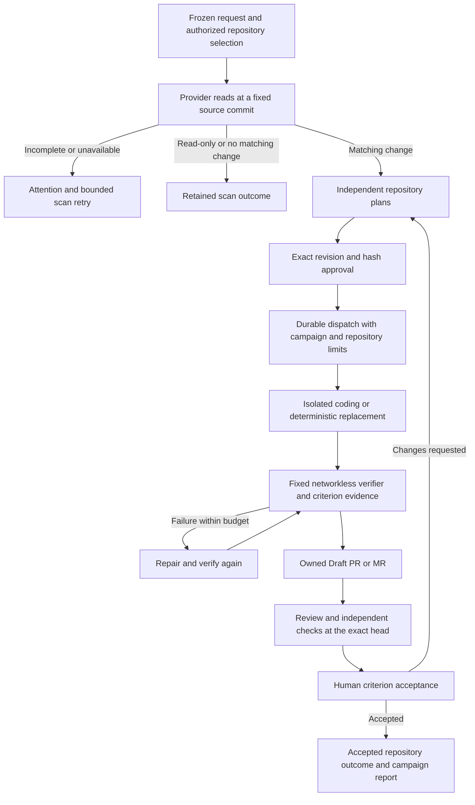

# Multi-repository campaigns

Campaigns coordinate independent repository Agent tasks inside one workspace. Owners and administrators can create, approve and control them; workspace members can inspect retained evidence and export reports. The Console entry is `/{workspace}/agent-campaigns`.

## Operations and prerequisites

- **Read-only check:** search eligible text files using a literal or regular expression. No coding task or provider write is created.
- **Literal replacement:** replace the approved literal in all matched files. Before-content SHA-256 and match counts must still agree. An optional exact match count per repository blocks unexpected results.
- **Documentation update:** prepare an isolated coding task with the supplied requirements and original acceptance criteria. An optional search restricts it to matching repositories.

All operations require an active verified provider installation and an authorized repository inventory. Selecting all repositories requires a synchronized inventory observed within 15 minutes; the selection freezes at creation. The backend supports multiple installations, up to 1,000 repositories, and rejects larger selections without silently truncating them. The current Console selects one installation at a time.

Changes additionally require each repository's Agent policy to be manual, with the complete workflow enabled, criterion evidence required, and independent required checks configured. Operators must install a deployment-owned verifier profile for each repository and enable Draft review in its review configuration. Missing prerequisites remain a failure or pending state, never an acceptance receipt.

GitHub check observation requires both Checks read and Commit statuses read; publishing the platform's own Check Run does not establish either independent CI success or commit-status read access. Existing installations must accept permission additions. Permission recovery re-reads the delivered head without resetting or spending the coding execution budget.

Provider authorization and coding credential configuration must both cover each selected repository. The credential broker's private coding installation map is an explicit repository allowlist; adding a repository to the review App does not populate that map. Keep the exact workspace/review installation/coding installation identities and clone origin in every entry. Credential issuance and refresh failures stop execution and report the `repository_credential` phase. Correct the mapping or provider permission before preparing a bounded retry plan; retain earlier attempts and their original budget.

The adapter's deployment-owned `AGENT_ADAPTER_ALLOWED_PATHS` must also permit the approved write paths. Exact documentation paths and every frozen replacement file are checked before credentials, checkout or coding. Glob documentation scopes retain per-file validation after coding. This operator allowlist and the immutable campaign path scope both apply; approving a plan does not expand either. A scope preflight failure still remains a recorded execution attempt and requires a new approved retry plan within the original budget.

## Lifecycle

The existing Agent workflow handles review failures, diagnosed CI code failures and human change requests. Descendants inherit the campaign's original scope and criteria and share its original branch attempt budget. New repair plans need approval. A campaign cannot create fake provider Issues, widen a replacement patch, or bypass the workspace's default author/approver separation.

Scan claims have a 10-minute lease and a three-attempt limit. Reads use immutable provider commit identities. GitHub truncated trees and GitLab pagination that does not exhaust are incomplete. Limits are 1,000 eligible files, 20 MiB in total, 500,000 bytes per file and 100,000 matches per repository. Binary, symlink and credential paths are excluded and counted; scans are not a proof about those excluded files. Scan receipts retain path/content digests and counts, not source file contents.

Concurrency is configurable from 1 to 10 repositories. Execution claims enforce it in PostgreSQL and prevent overlapping coding on the same repository. Approved queued tasks are redispatched durably when capacity becomes available. Pause prevents new execution leases; existing running work retains its approval. Cancel revokes active task leases and scan claims. A provider write already in flight still needs reconciliation. Retrying a failed execution prepares a new plan revision without resetting attempts; expired or exhausted budgets remain visible.

## Approval and acceptance

Batch approval supplies the campaign revision and each task ID, plan ID, plan revision and plan SHA-256. All pending scans must finish before approval. One invalid or unauthorized plan rejects the complete batch transaction. Individual plan approval follows the same campaign gates.

By default, authors cannot approve their own plans. The workspace Owner's explicit self-approval policy applies equally to single and batch tasks. Changing that option does not replace role checks, revision fences, criterion evidence or the final acceptance decision.

Read-only completed scans and explicit no-match change outcomes can close their repository targets. A matching change closes only when its latest delivered head has the required review/check/verifier evidence and a human acceptance decision. Draft publication, successful coding, cancellation and budget exhaustion do not imply accepted requirements. Merging and deployment remain separate operations.

## API

Authenticated routes under `/v1/tenants/{slug}`:

| Method and path | Contract |
| --- | --- |
| `GET /agent-campaign-repositories?installation_id={uuid}` | Authorized retained inventory; repeat the parameter for multiple installations. |
| `GET /agent-campaigns?cursor={uuid}` | Tenant-scoped keyset history, 50 records per page. |
| `POST /agent-campaigns` | Create from a validated request and idempotency key; replay the identical payload after an uncertain response. |
| `GET /agent-campaigns/{id}` | Frozen request, scan receipts, latest task descendants and live acceptance states. |
| `POST /agent-campaigns/{id}/approve` | Atomically approve the named exact plans at the current campaign revision. |
| `POST /agent-campaigns/{id}/actions` | Revision-bound `pause`, `resume`, `cancel` or `retry_failed`, with an operator reason. |
| `GET /agent-campaigns/{id}/report?format=markdown\|csv\|json` | Timestamped downloadable report; same membership boundary as detail. |

The Console forwards these requests through authenticated server routes. It never supplies provider credentials or executable verifier commands. Migration `000118_agent_campaigns.sql` adds campaign state and immutable scope/policy guards. The provider-prober scans and prepares plans; the existing runner and adapter execute them. Apply migrations before replacing dependent binaries.

## Reports and verification boundaries

Markdown summarizes conclusions, per-repository status and source/task/Draft evidence. Markdown and CSV retain the acceptance reason, fixed-verifier criterion verdict and execution budget, including failed attempts. Accepted decisions also retain the actor and timestamp. CSV supports comparison and escapes formula-like cells, including free-form reasons. JSON retains the detailed task and acceptance evidence. Every format labels Draft delivery, review/checks and human acceptance separately and preserves the request digest and source identities. Reports are timestamped observations, not merge/deployment receipts; refresh them when evidence changes.

Regression coverage includes role/tenant isolation, immutable requests, idempotency, partial and 603-repository inventories, exact batch approval with rollback, bounded concurrency, pause/resume/cancel, stale callbacks, retry without budget reset, scan pagination and partial coverage, deterministic replacement publication, original criteria through three repair triggers, exact-head review/check acceptance, and report export boundaries. Real provider and signed-in browser evidence is recorded separately in `outputs/campaign-20261010/verification.md` when available. Fixture results do not attest deployment or final human acceptance.
