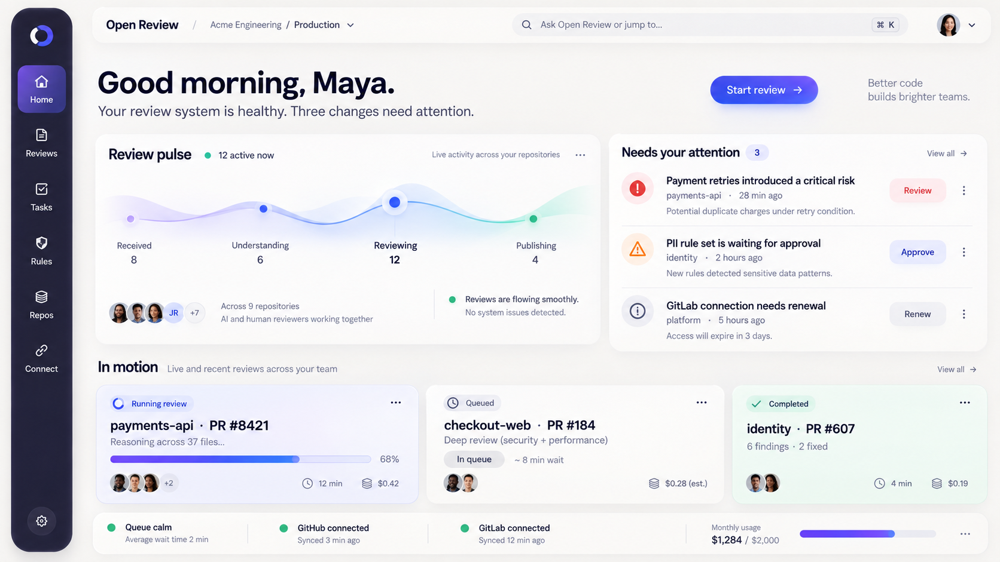
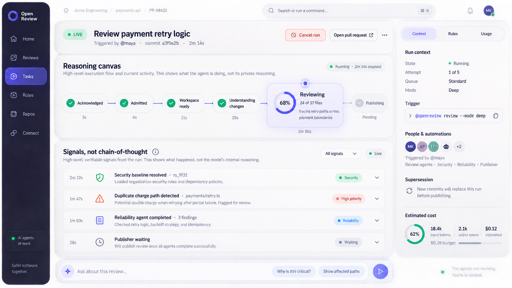
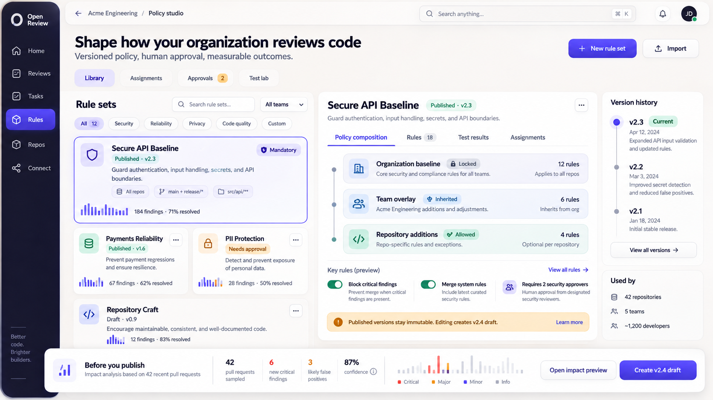

# Iteration 01 — SaaS 化与企业审查平台设计包

> 状态：**待设计评审（Design Review）** 
> 范围：产品、体验、架构、协议和交付门禁；**不包含前端或后端实现** 
> 设计基线日期：2026-09-17

## 1. 目标

本迭代把 Open Review Platform 从“可运行的 OCR 执行壳”设计为一个可独立部署、可 SaaS 化、支持 GitHub/GitLab App 的企业级 AI 代码审查平台。核心目标是：

1. 收到 webhook、评论或 `@openreview` 指令后，先给用户确定性回执，再异步执行。
2. 任务全过程可查询、可订阅、可取消、可重试、可被新提交替代。
3. 将企业规则作为版本化、可审批、可审计、可回滚的产品能力。
4. 用消息队列消峰和隔离故障，但以 PostgreSQL 中的任务状态为业务真相。
5. 支持多租户、权限、额度、用量、审计、密钥托管和数据保留策略。
6. 保持 OpenCodeReview（OCR）为可替换的审查执行引擎，不将 SaaS 逻辑侵入上游项目。

## 2. 设计原则

- **快回执，慢执行**：外部 webhook 只在事件与 outbox 同事务落库后返回 `202`；用户交互回执走高优先级通道。
- **业务真相可恢复**：RabbitMQ 是传输层，不是任务状态数据库；任何 worker 崩溃后均可从 PostgreSQL 恢复。
- **运行时规则不可漂移**：每次审查绑定不可变规则快照和引擎版本。
- **写操作可证明幂等**：每个 provider delivery、任务、评论和 finding 都有稳定幂等键。
- **租户隔离默认开启**：所有业务实体包含 `tenant_id`，权限、额度、密钥和审计均在租户边界内解析。
- **先设计后开发**：视觉设计、交互状态、API 契约和验收标准通过后，才允许进入实现阶段。
- **借鉴模式，不复制实现**：吸收 Kodus 在队列拆分、outbox/inbox、流水线和多 agent 编排上的经验，但保持独立实现、独立命名和独立许可证边界。

## 3. 文档索引

| 文档 | 内容 | 评审人建议 |
| --- | --- | --- |
| [01-product-and-functional-design.md](01-product-and-functional-design.md) | 产品边界、角色、功能、权限和验收标准 | 产品、研发、客户成功 |
| [02-system-architecture.md](02-system-architecture.md) | 控制面、数据面、组件、伸缩和故障边界 | 架构、后端、SRE |
| [03-workflows-and-messaging.md](03-workflows-and-messaging.md) | webhook/评论链路、状态机、MQ、幂等和重试 | 后端、平台、SRE |
| [04-enterprise-rules-design.md](04-enterprise-rules-design.md) | 企业规则继承、审批、快照、测试和 OCR 对接 | 安全、研发效能、产品 |
| [05-data-api-and-event-contracts.md](05-data-api-and-event-contracts.md) | 数据模型、REST、SSE、事件信封和错误模型 | 前后端、集成团队 |
| [06-frontend-design-spec.md](06-frontend-design-spec.md) | 视觉系统、信息架构、页面和全状态规范 | 设计、前端、产品 |
| [07-security-operations-and-saas.md](07-security-operations-and-saas.md) | 身份、密钥、隔离、计量、审计、SLO 和灾备 | 安全、SRE、商务 |
| [08-delivery-plan-and-acceptance.md](08-delivery-plan-and-acceptance.md) | 阶段一/二实施计划、测试门禁、发布与回滚 | 全体 |
| [09-decisions-and-open-questions.md](09-decisions-and-open-questions.md) | 已确认决策与需业务确认的问题 | 决策人 |
| [10-reference-architecture-lessons.md](10-reference-architecture-lessons.md) | Kodus/OCR 可复用经验、明确不照搬的部分与来源 | 架构、法律、安全 |
| [11-review-reporting-design.md](11-review-reporting-design.md) | PR/MR 生命周期评论、Change Contract、证据回执与渲染组件 | 产品、后端、安全、研发效能 |
| [12-notification-control-plane.md](12-notification-control-plane.md) | 钉钉、飞书与 Webhook 通知目标、仓库路由、幂等投递和密钥边界 | 产品、后端、安全、SRE |
| [13-usage-control-plane.md](13-usage-control-plane.md) | 自托管额度、admission 预留、终态结算、仓库归因和不可变用量账本 | 产品、后端、财务、SRE |
| [14-console-v2-design-plan.md](14-console-v2-design-plan.md) | 参考 Kodus 功能但保持独立视觉的 Console V2 全页面清单、Issues 工作台和设计门禁 | 产品、设计、前端、无障碍评审 |
| [15-luminous-spatial-design-system.md](15-luminous-spatial-design-system.md) | Luminous Spatial 视觉 token、Shell、组件、状态、响应式和实现门禁 | 设计、前端、无障碍评审 |
| [16-console-v2-page-state-mockups.md](16-console-v2-page-state-mockups.md) | Console V2 页面族、tab 切换态、异常态与组件化边界 | 产品、设计、前端、无障碍评审 |
| [17-responsive-dark-validation.md](17-responsive-dark-validation.md) | Console V2 1440/1024/390 响应式行为、扩展 Dark 页面与 WCAG token 审计 | 设计、前端、无障碍评审 |
| [18-implementation-coverage-audit.md](18-implementation-coverage-audit.md) | 阶段一/二与 Kodus 功能对齐的当前证据、缺口和下一实现切片 | 产品、架构、前后端、SRE |
| [19-console-v2-detailed-tab-mockups.md](19-console-v2-detailed-tab-mockups.md) | PR、Operate、企业设置、Onboarding 与 Policy 的二级页面、Tab 高保真稿及状态契约 | 产品、设计、前端、无障碍评审 |
| [20-console-v2-remaining-pages-and-state-mockups.md](20-console-v2-remaining-pages-and-state-mockups.md) | 公共/Workspace、执行中心、规则编辑、Models、Audit/Usage 与共享恢复状态的补充高保真稿 | 产品、设计、前端、无障碍、安全评审 |
| [21-console-v2-security-health-cli-tab-mockups.md](21-console-v2-security-health-cli-tab-mockups.md) | SSO、数据治理、平台健康、CLI Reviews 与 API Keys 的二级 Tab、状态机和安全边界 | 产品、设计、前端、后端、安全、SRE |
| [22-console-v2-luminous-apple-tab-mockups.md](22-console-v2-luminous-apple-tab-mockups.md) | 将 Review Config、Policy、PR/Review、Operate 与企业控制面全部二级页面统一为 Luminous Apple 高保真稿 | 产品、设计、前端、无障碍、安全评审 |
| [23-provider-issue-triage-and-format-governance.md](23-provider-issue-triage-and-format-governance.md) | GitHub/GitLab Issue 分析、格式目录、可信规范、版本化继承与 provider 模板导出边界 | 产品、后端、安全、研发效能 |
| [24-core-flow-completion-matrix.md](24-core-flow-completion-matrix.md) | 阶段一/二核心链路、已验证证据、外部验收缺口与完成判定 | 产品、架构、SRE、验收负责人 |
| [25-agent-coding-credential-broker.md](25-agent-coding-credential-broker.md) | 独立编码凭据代理、GitHub/GitLab 配置、信任边界与未完成验收 | 平台、安全、SRE |
| [25-issue-views-and-filter-contract.md](25-issue-views-and-filter-contract.md) | Issues 保存视图、AND/OR 过滤、权限、分页与真实验收契约 | 产品、前后端、安全、验收负责人 |
| [26-agentic-issue-to-pr-governance.md](26-agentic-issue-to-pr-governance.md) | Issue/PR 到受治理 Coding Agent、Sandbox、候选 PR、反馈迭代与自动化门控 | 产品、后端、平台、安全、SRE |
| [27-private-deployment-core-flow-audit.md](27-private-deployment-core-flow-audit.md) | 私有化核心链路审计与证据边界 | 产品、后端、验收负责人 |
| [28-agent-delivery-workflow-closure.md](28-agent-delivery-workflow-closure.md) | Agent 计划、验证、修复、再审与验收首轮闭环 | 后端、平台、验收负责人 |
| [29-agent-recovery-and-criterion-evidence.md](29-agent-recovery-and-criterion-evidence.md) | 人工退回、CI 修复、故障恢复与逐项独立证据 | 后端、平台、验收负责人 |

## 4. 视觉设计稿

### 4.1 AI 审查工作台

重点不是传统 KPI 面板，而是“当前正在发生什么、哪里需要人介入、下一步做什么”。

### 4.2 实时任务执行画布

只展示可验证的运行信号，不暴露模型私有推理；支持取消、替代、上下文查看和实时状态。

### 4.3 企业策略工作室

规则通过组合、继承、影响预览和审批发布来管理，而不是简单 CRUD 表格。

> 图片用于确认视觉方向与信息层级，不代表像素级最终实现。图片中的英文文案是设计占位；实现时进入统一 i18n 词条。

### 4.4 Console V2 — Luminous Spatial

当前优先候选使用明亮、空间化、有限半透明的桌面应用语言。具体 token、组件状态和响应式约束见 [15-luminous-spatial-design-system.md](15-luminous-spatial-design-system.md)。

Dark 主题不是机械反色，使用独立校准的 graphite 表面、文字、selection、focus、代码和 semantic colors：

剩余页面族、tab 切换后的数据语义、onboarding、workspace、企业治理与异常恢复状态见 [16-console-v2-page-state-mockups.md](16-console-v2-page-state-mockups.md)。

PR 详情、连接与通知、企业设置、Onboarding 和 Policy 的二级 Tab 高保真细化稿见 [19-console-v2-detailed-tab-mockups.md](19-console-v2-detailed-tab-mockups.md)。

公共入口、Workspace、Cockpit/Run/CLI、Rule Composer/Test Lab、Models 二级 Tab、Audit/Usage 和共享恢复状态见 [20-console-v2-remaining-pages-and-state-mockups.md](20-console-v2-remaining-pages-and-state-mockups.md)。

SSO、数据治理、平台健康、CLI Reviews 与 API Keys 的所有二级 Tab 和异步恢复状态见 [21-console-v2-security-health-cli-tab-mockups.md](21-console-v2-security-health-cli-tab-mockups.md)。

Review Configuration、Policy、PR/Review、Connections/Notifications 和企业控制面的 Luminous Apple 全量 Tab 重绘与 1:1 实现验收清单见 [22-console-v2-luminous-apple-tab-mockups.md](22-console-v2-luminous-apple-tab-mockups.md)。

核心布局的 1440/1024/390 适配、扩展 Dark 页面和语义色对比度审计见 [17-responsive-dark-validation.md](17-responsive-dark-validation.md)。

## 5. 设计评审门禁

以下项目全部通过后，才允许创建前端实现 PR：

- [ ] 产品负责人确认阶段一/二范围、非目标和命令语义。
- [ ] 设计负责人确认三张核心稿、页面信息架构、组件状态和响应式策略。
- [ ] 架构负责人确认任务状态机、outbox/inbox、队列拓扑和恢复模型。
- [ ] 安全负责人确认身份、租户隔离、密钥、规则来源和审计边界。
- [ ] SRE 确认 SLO、容量、DLQ、恢复、备份和告警方案。
- [ ] 前后端共同确认 API/SSE 契约与错误模型。
- [ ] 决策人关闭所有标记为 P0 的开放问题。

评审结果只能是：

- `APPROVED`：允许进入实现；
- `APPROVED_WITH_CHANGES`：文档修订并再次确认后进入实现；
- `CHANGES_REQUESTED`：禁止开始实现。

## 6. 当前实现与目标架构的关系

当前仓库已有 Casdoor OIDC 边界、GitHub/GitLab webhook 验签、PostgreSQL 任务、临时 checkout、OCR 适配器和 provider publisher 基础。它们作为迁移起点保留，但不代表已经满足本设计：

- 当前数据库轮询/租约 worker 将迁移到“PostgreSQL 权威状态 + RabbitMQ 通知”的混合模型。
- 当前 runner 内耦合的 checkout、OCR 和发布会拆成可恢复阶段。
- OCR 调用会增加可信规则快照输入和版本记录。
- 管理 API 会扩展为任务、规则、集成、用量和审计控制面。
